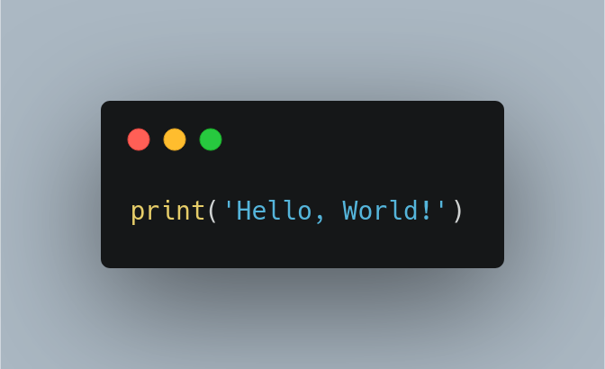

# Leistungsnachweis

Ziel: Eine Problem definieren und dieses mithilfe eines selbstgeschriebenen Programs lösen.

Aufwand: 8-16 Stunden

Resultat:
* Pyhton-Program (gezippter Ordner mit Skripten): `Code.zip`
* Dokumentation zum Programm (4-8 Seiten, ohne Cover, Dateityp PDF oder ePub): `Dokumentation.pdf`

## Termine

27.02.2021: Eingabe Projektvorschlag für Leistungsnachweis  
27.03.2021: Deadline Hochladen Leistungsnachweis

## Inspiration

Hier eine Beispiele>

* Suche nach Begriff in Log-Dateien
* Unterstützung mathematische Berechnungen
* Raspberry Pi LED-Morsecode
* Temperaturdaten lesen und als Kurve darstellen
* LED auf Raspberry Pi ein- und ausschalten
* Daten aus Datenbank lesen und schreiben
* Auf Linux einen Vorgang automatisieren
* Wetter-Informationen abrufen und darstellen
* Tweet von Twitter-Account anzeigen lassen
* Datei auf Dropbox speichern

## Vorlagen

### Projektvorschlag

Der Projektvorschlag wird auf Moodle mitgeteilt und besteht im wesentlichen aus einem Titel und einer kurzen Beschreibung (~100 Wörter)

### Dokumentation

Kapitelübeschriften der Dokumentation:

* **Problemstellung**: Beschreibung des Problems.
* **Vorgehen**: Vorgehen um das Problem zu lösen. Visualisierung mittels Flowchart.
* **Umsetzung**: Wie wurde die Lösung effektiv implementiert? Beschreibung der wichtigsten Programm-Teile
* **Rückblick**: Gab es Problem bei der Umsetzung?
* **Technische Anleitung**: Wie kann man das Program ausführen?

::: tip
Auf <https://carbon.now.sh/> kann man seinen Code einfügen und als Bild darstellen lassen.

:::

## Kriterien

Für jedes Kriterium werden Punkte von 1-10 vergeben. Jedes Kriterium wird mit 1-5 gewichtet.

**Qualität**

Gewichtung: 5

Leitfragen:
* Ist die Struktur des Codes verständlich?
* Sind die Anweisungen dokumentiert?
* Kann ein Laie die Funktion des Programs nachvollziehen?

**Herausforderung**

Gewichtung: 2

* Kann das definiere Problem  auch wirklich nur mit einem Program glelöst werden?
* Ist die Herausforderung dem HF-Niveau entsprechend?
* Ist in der Reflexion ein Lerneffekt sichtbar?

**Inhalt**

Gewichtung: 4

* Wurden die Inhalte aus den Lektionen korrekt angewendet?
* Liegt die Dokumentation in einem angemessen Umfang vor?
* Wurde der Code mit einem Flowchart visualisiert?