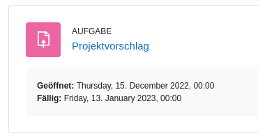

# Leistungsnachweis

Ziel: Die Studierenden definieren ein Problem oder Projekt und lösen dieses mithilfe eines selbst geschriebenen Programms.

Aufwand: 8 Stunden\
Anteil Gesamtnote: 50%

---

### Lernziele

Ich kann ...
* eine Problem oder Herausforderung formulieren.
* zur Programmierung einen Lösungsvorschlag entwickeln.
* den Lösungsvorschlag implementieren.
* die Lösung dokumentieren und den Code sachgemäss kommentieren.

## Durchführung

Der Prozess für den Leistungsnachweis sieht wie folgt aus:
1. Studierende suchen sich eine Problemstellung oder Thema, dass Sie mit einem Python-Programm lösen möchten
2. Die Studierenden formulieren dazu einen Projektvorschlag und laden diesen auf Moodle
3. Der Dozierende gibt ein Feedback und teilt mir, ob der Projektvorschlag den Erwartungen gerecht wird
4. Die Studierenden haben Zeit um den Leistungsnachweis zu erarbeiten und eine Dokumentation zu erstellen
5. Der Dozierende gibt Inputs und kann bei Problemen kontaktiert werden
6. Die Studierenden laden das Resultat auf Moodle hoch
7. Der Dozierende macht eine Bewertung anhand der [Kriterien](#Kriterien)

## Themenwahl

In der Tehmenwahl sind die Studierenden frei. Das ausgewählte Thema soll für den Studierenden eine Herausforderung sein und den individiuellen Fähigkeiten gerecht werden.

Hier einige Ideen für Projekte:

| Titel                                                                                                                                                           | Schwierigkeitsgrad |
| --------------------------------------------------------------------------------------------------------------------------------------------------------------- | ------------------ |
| Covid-Daten mit Python verarbeiten und als HTML-Bericht präsentieren                                                                                            | Mittel             |
| Datei auf Dropbox speichern                                                                                                                                     | Einfach            |
| Daten aus Postgres Datenbank lesen und schreiben                                                                                                                | Einfach            |
| Detektion von Herzfrequenz anhand [EKG-Daten](https://github.com/janikvonrotz/python.casa/blob/main/topic-15/ekg-data.csv)                                               | Mittel             |
| Deutscher [Wordle](https://www.nytimes.com/games/wordle/index.html)-Klon                                                                                        | Schwer             |
| Passwortgenerator gemäss [xkcd-Comic](https://xkcd.com/936/)                                                                                                    | Schwer             |
| Suche nach bestimmten Begriffen in [Log-Dateien](https://raw.githubusercontent.com/elastic/examples/master/Common%20Data%20Formats/nginx_logs/nginx_logs)       | Mittel             |
| Temperaturdaten ploten und Min/Max bestimmen. Daten von [https://sarneraa.huetstock.ch](https://sarneraa.huetstock.ch) können auf Anfrage bereitgestellt werden | Einfach            |
| Textbasiertes Hangman programmieren                                                                                                                             | Mittel             |
| Tweet von Twitter-Account anzeigen lassen                                                                                                                       | Einfach            |
| Wetter-Informationen abrufen und als HTML-Dokument ausgeben                                                                                                     | Einfach            |
| Wort mit LED und Raspberry Pi als Morsecode ausgeben                                                                                                            | Einfach            |
| Textadventure auf der Kommandozeile                                                                                                                             | Mittel             |
| Quiz mit Daten SQLite-Datenbank                                                                                                                                 | Mittel             |
| Währungsrechner mit grafischer Oberfläche                                                                                                                       | Mittel             |
| TicTacToe auf Kommandozeile                                                                                                                                     | Einfach            |

## Projektvorschlag

Der Projektvorschlag wird auf Moodle mitgeteilt und besteht im wesentlichen aus einem Titel, Fragestellung und dem geplanten Vorgehen (max. 200 Wörter / 1500 Zeichen).

Dazu ein Beispiel:

**Titel:**  
TicTacToe-Spiel mithilfe von Python programmieren

**Fragestellung:**  
Ist es möglich, nur mit den im Unterricht «Einführung ins Programmieren» kennengelernten Python-Befehlen ein funktionstüchtiges TicTacToe-Spiel zu programmieren?

**Geplantes Vorgehen:**  
Als erstes wird mit einer Listen-Funktion ein Spielefeld erstellt, bei dem die Kästchen nummeriert  
sind. Die beiden Spieler können anhand der Nummerierung später auf die Kästchen zugreifen, um die  
Position ihres Spielzuges einzugeben.  
Damit gespielt werden kann, muss die gewünschte Kästchen-Nummer des Spielers mit einer  
Nummer der Kästchen überreinstimmen. Ansonsten wird eine Fehlermeldung ausgegeben. Dies wird  
mit einem if/while-Befehl programmiert. Zusätzlich soll der Spieler die Möglichkeit haben das Spiel  
frühzeitig zu unterbrechen und die beiden Spieler, die durch Variablen unterschieden werden, sollen  
nacheinander aufgefordert werden ihren Spielzug zu tätigen. Dies wird ebenfalls mit einem if/while-  
Befehl gemacht.  
Das Spiel soll beendet werden, wenn eine Spieler-Variable entweder senkrecht, waagerecht oder  
diagonal dreimal nebeneinander vorkommt. Dazu muss eine Schleife programmiert werden, die die  
Liste, die als Spielfeld dient, nach jedem Spielzug überprüft.  
Falls ein Sieger feststeht, soll das Programm dem Sieger gratulieren.

## Dokumentation

Kapitelüberschriften der Dokumentation:

* **Einleitung**: Um was geht es in diesem Dokument?
* **Problemstellung**: Beschreibung des Problems.
* **Vorgehen**: Vorgehen um das Problem zu lösen. Visualisierung mittels Flowchart.
* **Umsetzung**: Wie wurde die Lösung effektiv implementiert? Beschreibung der wichtigsten Programm-Teile.
* **Rückblick**: Gab es Problem bei der Umsetzung? Was lief gut und was nicht?
* **Technische Anleitung**: Wie kann man das Program ausführen? Welche Vorbereitungen müssen getroffen werden?

::: tip
Auf <https://carbon.now.sh/> kann man seinen Code einfügen und als Bild darstellen lassen.

Mit [draw.io](https://draw.io) kann man Flowcharts erstellen und so den Code dokumentieren.
:::

Eine Vorlage für ein `.docx` kann [hier heruntergeladen](https://github.com/janikvonrotz/python.casa/raw/main/Dokumentation.docx) werden und eine Vorlage im Markdown-Format gibt es [hier](Dokumentation.md).

## Kriterien

Punkte in eckigen Klammern.

### Kommentar zu ChatGPT

Die Aufgabenstellung wie Sie hier beschreiben wird, könnte mithilfe von [ChatGPT](https://chat.openai.com/chat/) gelöst werden. Das kann ChatGPT so gut, dass man nicht mit Gewissenheit sagen kann, ob die Aufgabe vom einem Studierenden oder ChatGPT gelöst wurde.\
Es spricht grundsätzlich nichts dagegen Aufgaben mit ChatGPT zu lösen. Es wirft aber die Frage auf, was der Wert des Leistungsnachweises ist. Das Ziel des Leistungsnachweises sollte nicht sein ein gutes Ergebnis zu erzielen, sondern zu beweisen, dass man die fachliche Kompetenz, ein Problem mithilfe der Programmierung zu lösen, erlangt hat.\
Der Umgang mit ChatGPT führt direkt zu Frage: Möchte ich lernen (die Kompetenz haben) wie man mithilfe der Programmierung Probleme löst?

### Allgemein

Punkte: 2

* **Projektvorschlag \[1\]**: Der Inhalt des Leistungsnachweis entspricht dem Projektvorschlag.
* **Deadline \[1\]**: Die Abgabe des Leistungsnachweis erfolgte rechtzeitig.

### Dokumentation

Punkte: 9

* **Vollständigkeit \[1\]**: Alle Kapitel gemäss Vorgaben sind enthalten.
* **Formatierung \[1\]**: Die Formatierung des Dokuments enspricht einem professionellen Standard.
* **Sprache \[2\]**: Die Dokumentation ist in korrektem Deutsch formuliert und Fachwörter werden korrekt verwendet.
* **Visualisierung \[3\]**: Der Code ist mithilfe einem Flowchart visualisiert. (Formatierung, Vollständigkeit, Logik)
* **Reflexion \[2\]**: Die konfrontierten Herausforderungen und der entsprechende Lerneffekt sind reflektiert.

### Code

Punkte: 17

* **Kommentare \[2\]**: Die Code-Anweisungen und Blöcke sind sinnvoll und vollständig kommentiert.
* **Struktur \[6\]**: 
	* Der Code ist sinnvoll strukturiert (Module und Funktionen).
	* Die Variablen, Dateien und Ordner sind gemäss ihrer Funktion benannt.
	* Die Formatierung des Codes unterstützt die Lesbarkeit.
* **Authentizität \[2\]**: Der Code ist selber verfasst. Code-Teile von Dritten werden als solche deklariert.
* **Ausführbar \[2\]**: Der Code kann gemäss "Technische Anleitung" ausgeführt werden.
* **Optimiert \[2\]**: Schleifen und Funktionen werden genutzt.
* **Komplexität \[3\]**: Die Problemstellung entspricht HF-Niveau.

## Resulat / Abgabe

Die Dokumentation wird als `.pdf` Datei und der Code als `.zip` Datei in das entsprechende Abgabefenster auf Moodle hochgeladen:

* `Code.zip`: Python-Programm (gezippter Ordner mit Pyton-Dateien)
* `Dokumentation.{pdf,epub,docx}:` Dokumentation zum Programm (4-8 Seiten, ohne Cover)

