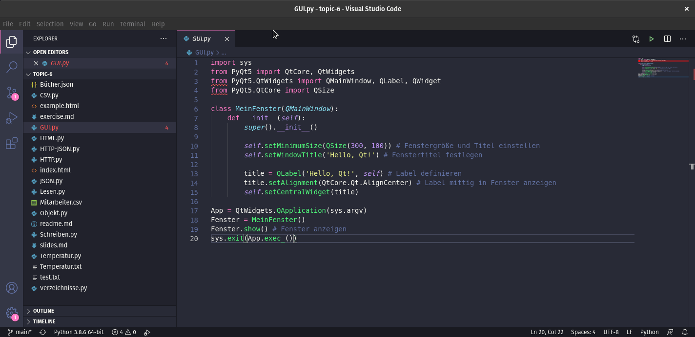

# Fragen und Antworten

Hier werden Fragen und Antworten zum Kurs publiziert.

### Ein Programm mehrmals ausführen

Frage: Wie kann ich ein Programm mehrmals ausführen?

Antwort:

```py
# Programm mehrmals auführen

ausführen = 'Ja'

while(ausführen == 'Ja'):
    print("Programmcode ...")
    
    ausführen = input("Soll das Programm erneut ausgeführt werden? Ja, Nein: ")
```

### Vorlage Dokumetation mit Obsidian

Frage: Wie kann ich eine Dokumentation mit Obsidian erstellen?

Antwort:

```md
# Dokumentation

## Problemstellung

Beschreibung des Problems.

## Vorgehen

Vorgehen um das Problem zu lösen. Visualisierung mittels Flowchart.

![[Flowchart.png]]

## Umsetzung

Wie wurde die Lösung effektiv implementiert? Beschreibung der wichtigsten Programm-Teile.

## Rückblick

Gab es Problem bei der Umsetzung? Was lief gut und was nicht?

## Technische Anleitung

Wie kann man das Program ausführen? Welche Vorbereitungen müssen getroffen werden?
```

### HTML-Dokument erweitern

Frage: Wie kann ich das HTML-Dokument erweitern?

Antwort:

```py
from yattag import Doc

doc, tag, text = Doc().tagtext() # HTML-Funktionen abrufen

liste = ['Banane', 'Apfel', 'Orange']

with tag('html'): # HTML-Dokumente mit den Elementen zusammenstellen
    with tag('body'): # Mit with werden Funktionsaufrufe aneinander gereiht
        with tag('p', id = 'main'):
            text('Beispiel')
        with tag('a', href='https://example.com'):
            text('Linktext')
        with tag('ul'):
            for fruit in liste:
                with tag('li'):
                        text(fruit)
        doc.stag('img', src='https://raw.githubusercontent.com/janikvonrotz/python.casa/main/buch.png')

html = doc.getvalue() # HTML-Code generieren

with open('example.html', 'wt') as file:
    file.write(html)
```

### JSON-HTTP-Response verarbeiten

Frage: Wie kann eine HTTP-Response mit JSON-Inhalt verarbeiten?

Antwort:

```py
url = 'https://raw.githubusercontent.com/janikvonrotz/python.casa/main/topic-6/B%C3%BCcher.json'

import json
import urllib.request

response = urllib.request.urlopen(url)
data = json.loads(response.read().decode('utf-8'))

for book in data:
    print("Title: ", book['title'])
```

### PyQt5 mit Visual Studio Code

Frage: Wie kann `PyQt5` für Visual Studio Code installiert werden?

Antwort:


