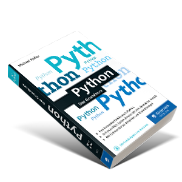

# EidP 
Einführung in die Programmierung

Mit dem Kurs sollen die Grundlagen der Software-Entwicklung vermittelt und das Verständnis für die Computertechnik geschaffen werden.

[◀️Thema 0](./README.md)

---
### Wer bin ich?

* Name: Janik von Rotz
* Wohnort: Sarnen
* Beruf: Wirtschaftsinformatiker

---
### Geschäftlich

* <https://www.mint-system.ch/>
* Prozesse optimieren mit Open Source Software
* Die Brücke zwischen Technik und Geschäft schlagen

---
### Gemeinnützig

* Open Source Software
* [CH Open](https://www.ch-open.ch/)
* [Odoo Community Association](https://odoo-community.org/)

---
### Warum unterrichte ich?

* Alles wird digitalisiert -> Wir brauchen Kontrolle
* Ideen und Konzepte vermitteln
* Digitale Themen vereinfachen

---
### Ziele

* Abstraktes Denken
* Elementare Bausteine Programmierung
* Programmcode interpretieren
* Anwenden in der Praxis

---
### Erwartungen

* Bereitschaft zum Probieren
* Aufmerksam im Unterricht
* Anwesenheit ist geregelt

---
### Unterlagen

Ihr findet alles unter <https://python.casa/>.

---
### Prüfungen

* 2 Wissensprüfungen
* 1 Leistungsnachweis
* 3 Noten
* Details unter [Prüfungen](exam.md)

---
### Feedback

Das ist die vierte Durchführung.

Feedback immer am Ende des Unterrichts oder per mail an <hi@janikv.ch>.
