# Slides Thema 1
## Einführung Programmiersprache

[◀️ Thema 1](./README.md)

⚡[Anwesenheit bestätigen](https://moodle.medizintechnik-hf.ch/mod/attendance/manage.php?id=8024)

📖 Kapitel 1 Hello, World!

---
### Lernziele

Ich kann ...
* Python installieren und aufrufen.
* Skripte erstellen und ausführen.
* den Vorgang der Kompilierung an einem Beispiel erklären.

---
### Der Computer ist einfach

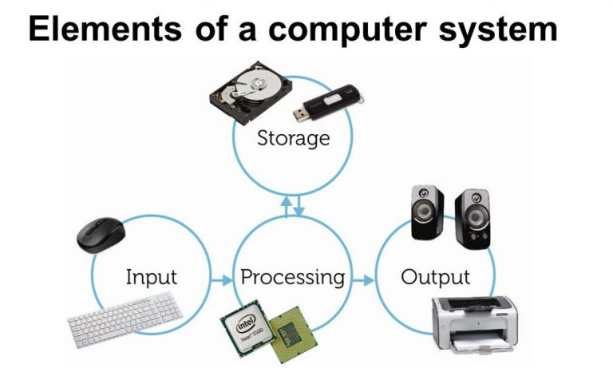

---
### Warum braucht es Programmierung?

Der Computer führt unsere Anweisungen aus. Damit der Computer die Anweisungen versteht, müssen die Anweisungen in einer Programmiersprache verfasst werden.

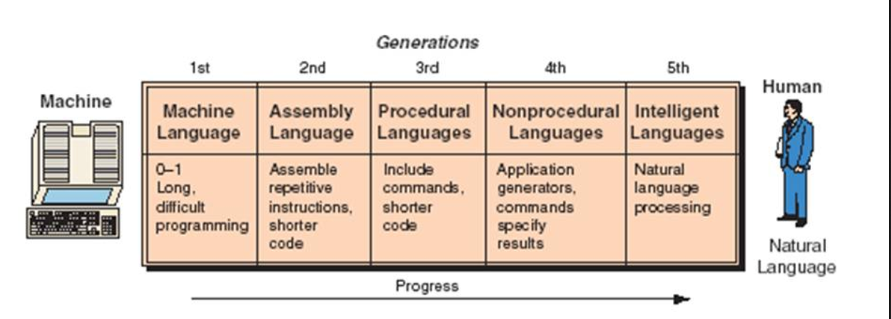

---
### Begriffe der Programmierung

Umso schwieriger die Begriffe:
* Programmiersprache
* Syntax
* Anweisung
* Programmcode / Quellcode
* Deklarieren
* Variable
* IDE
* Debugger

---
### Programmiersprache

> Eine Programmiersprache ist eine formale Sprache zur Formulierung von Datenstrukturen und Algorithmen, d. h. von Rechenvorschriften, die von einem Computer ausgeführt werden können

---
### Anteile der Programmiersprachen

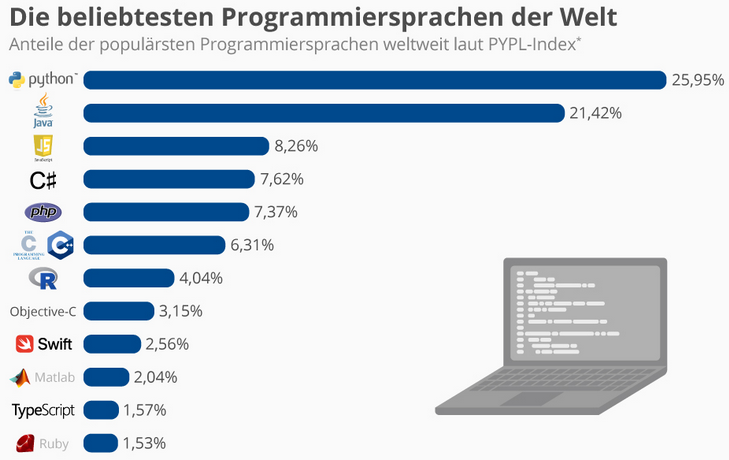

---
### Programmiersprache Python

<iframe src="https://giphy.com/embed/Wvfq2yFumK61W" width="280" height="280" frameBorder="0" class="giphy-embed" allowFullScreen></iframe>

* 1991 entwickelt
* Einfache Syntax und gute Lesbarkeit
* Universell anwendbar und Plattform unabhängig
* Beliebt in den Naturwissenschaften

---
### Installation Python

🎬 Installation via [Python Download](https://www.python.org/downloads).

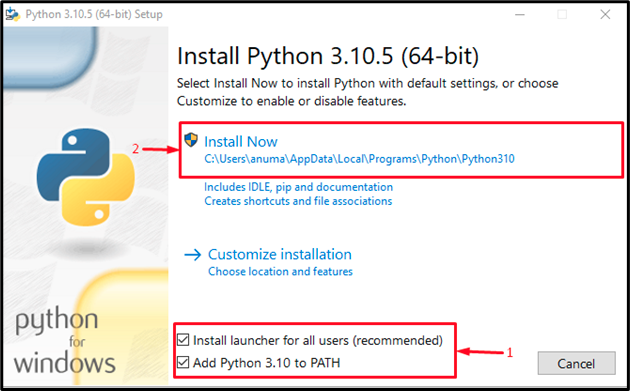

Videos:
* [Python3 auf Windows 10 installieren](https://www.youtube.com/watch?v=hr1P_F7Vp9Y)  
* [Python3 auf MacOS installieren](https://www.youtube.com/watch?v=1xMT1Tzskrg)

⚡Aufteilung in Gruppen/Breakout-Rooms ⏱️ 10 Minuten

Ziel: Jeder hat Python installiert.

---
### Terminal

Wir machen unsere erste Schritte in der Python-Shell.

> Keine Angst vor dem Terminal

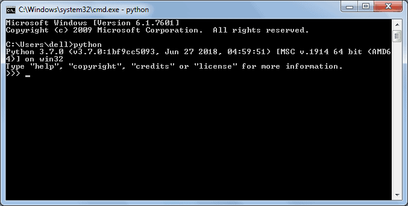

---
### Terminal starten

🎬 Auf MacOS: <kbd>cmd</kbd> + <kbd>leertaste</kbd> drücken, `Terminal` eingeben und `enter` drücken

🎬 Windows: <kbd>windows</kbd> + <kbd>r</kbd> drücken, `powershell.exe` eingeben und `enter` drücken

---
### Python-Shell starten

Wir starten nun die Python-Shell.

🎬 `python` im Terminal eingeben.

> Wir arbeiten mit Python 3.6 und höher.

Alternativ `C:\Program Files\Python\python.exe` öffnen oder nach *Python Shell* suchen und starten.

---
### Anweisung interaktiv ausführen

🎬 Anweisung eingeben und mit <kbd>enter</kbd> bestätigen:

```python
print('Hello, World!')
```

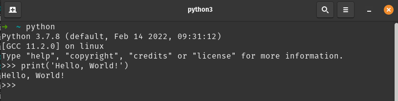

---
### Anweisung

> Programmzeile mit Instruktionen, die vom Computer ausgeführt werden.

---
### Weitere Shell-Befehle

🎬 Anweisung eingeben:

```python
name='Michael'
print('Hallo ' + name + '!')
```

---
### Variable deklarieren

Links Name des Speichers und Rechts der Wert.

```python
irgendwas = 'Ein Text'
```

Hier wird die Variable `irgendwas` mit dem Wert `'Ein Text'` deklariert.

---
### Syntax

> Unter Syntax versteht man allgemein ein Regelsystem zur Kombination elementarer Zeichen zu zusammengesetzten Zeichen in natürlichen oder künstlichen Zeichensystemen.

---
### Programmcode herunterladen

Wir laden ein Programmcode herunter und speichern ihn in einem Ordner.

🎬 Folgende Punkte erledigen:

* Projektordner und Unterordner `Thema1` erstellen
* Datei-Link [HelloWorld.py](https://raw.githubusercontent.com/janikvonrotz/python.casa/main/topic-1/HelloWorld.py) öffnen

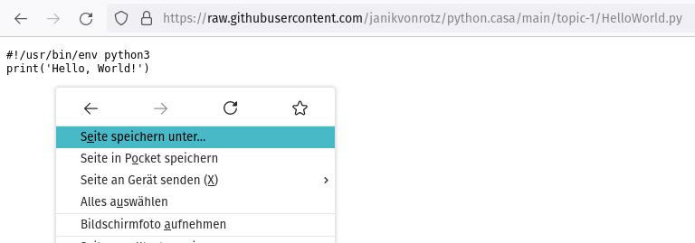

* Rechtsklick auf die Seite machen und *Seite speichern unter...* wählen
* Speichern als `HelloWorld.py` im neuen Ordner

---
### Programmcode

> Quelltext, auch Quellcode oder unscharf Programmcode genannt, ist in der Informatik der für Menschen lesbare, in einer Programmiersprache geschriebene Text eines Computerprogrammes.

---
### Terminal vorbereiten

Im Unterordner das Terminal starten.

🎬 Folgende Punkte erledigen:

* Ordner `Thema1` im Explorer/Finder öffnen
* Windows: In Adressleiste `powershell.exe` eingeben und mit `enter` bestätigen

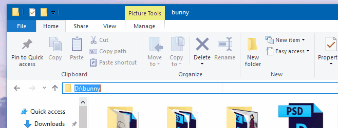

* MacOS: In Finder Rechtsklick auf den Ordner machen und Terminal in Ordner starten.

---
### Programmcode ausführen

🎬 Programm in Terminal ausführen 

```bash
python HelloWorld.py
```

ℹ️ Unter MacOS und GNU/Linux muss das Programm mit `chmod +x ./HelloWorld.py` ausführbar gemacht werden.

---
### Shebang

```python
#!/usr/bin/env python3
```

Was hat es mit der ersten Zeile auf sich?

GNU/Linux und MacOS: -> `python`

Windows: `.py` -> `python.exe`

---
### Installation IDE

IDE=Integrierte Entwicklungsumgebung  

🎬 Folgende Punkte erledigen:
* Installieren Sie [Visual Studio Code](https://code.visualstudio.com/) auf ihrem Computer

Video: [Visual Studio Code installieren](https://www.youtube.com/watch?v=fuM8hJMyDeg)

⚡Aufteilung in Gruppen/Breakout-Rooms ⏱️ 10 Minuten

Ziel: Jeder kann die IDE starten.

---

### Ordnern öffnen

🎬 Folgende Aktionen ausführen:
* Starten Sie die IDE
* Wählen Sie *Datei > Ordner öffnen...*
* Suchen wählen Sie den Ordner `Thema1` aus.

🙋 Was ist der Unterschied zwischen Ordner und Arbeitsbereich?

---
### Aufforderungen bestätigen

Die folgenden Aufforderung können Sie bestätigen:

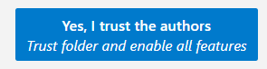

Diese Aufforderung installiert die Python-Erweiterung von Visual Studio Code:

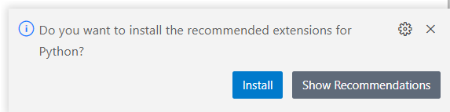

Diese wird benötigt damit Visual Studio Code die Syntax von Python versteht.

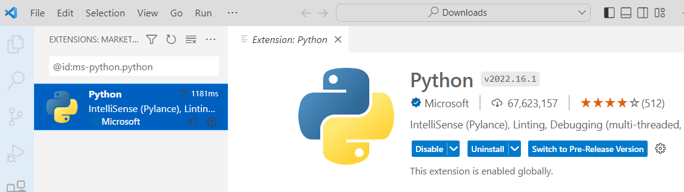

---

### Python Interpreter bestimmen

Stellen Sie sicher, dass VSCode den Python-Interpreter erkannt hat (siehe blaube Leiste).

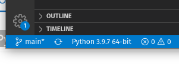

---

### Skript öffnen

🎬 Folgende Aktionen ausführen:
* Das Skript `HelloWorld.py` in der IDE öffnen
* Den Ausgabe-Text ändern und speichern
* Das Skript mit der IDE oder dem Terminal ausführen

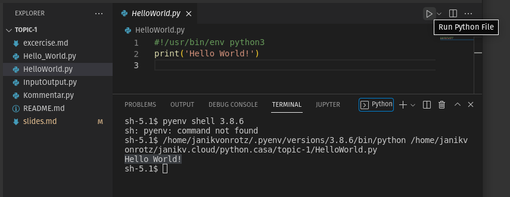

Output auf Windows:


---

### Was läuft hier?

* Quellcode wird direkt vom Interpreter (Python) ausgeführt
* Programmcode wird kompiliert
* Program wird als C-Code ausgeführt

---

### Wichtige Tastaturkürzel

Mit der Tastatur ist man immer schneller.

<kbd>ctrl</kbd>+ <kbd>shift</kbd> + <kbd>p</kbd>: VSCode-Befehle aufrufen

<kbd>ctrl</kbd> + <kbd>p</kbd>: Datei anzeigen

<kbd>ctrl</kbd> + <kbd>,</kbd>: Einstellungen öffnen

---

### Was passiert beim kompilieren?

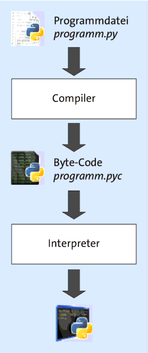

---
### Anweisungen ein- und mehrzeilig

Ist normalerweise Einzeilig.

```python
print('abc')
print('efg')
```

Mehre Anweisungen auf einer Zeile:

```python
a=1; b=2; c=3
```

---

### Blockelemente

Sprachelemente über mehrere Zeilen.

```python
if xxx:
    anweisung1a
    anweisung1b
else:
    anweisung2a
```

Anweisungen müssen eingeruckt sein.

---

### Input

Python kann mit `input` Eingaben entgegennehmen.

```python
name = input('Geben Sie Ihren Namen an:')
print('Ihr Name lautet:', name)
```

---

### Kommentare

Kommentieren direkt im Code.

```python
# ein Kommentar
print('abc')  # noch ein Kommentar
```

---

### ChatGPT

Die Nutzung von ChatGPT ist empfohlen, aber nur im Ausmass?

> Möchte ich Programmieren lernen oder erleben?


---

### Aufgaben

Lösen Sie die [Aufgaben](excercise1.md#aufgaben) und besprechen Sie die Wiederholungsfragen.

⚡Aufteilung in Gruppen/Breakout-Rooms ⏱️ 10 Minuten

---

### Review

🎯 Wurden die [Lernziele](#lernziele) erreicht?

⚡ Feedback zu den Zielen einholen.

---

### Quellen

[^1]: <https://de.statista.com/infografik/16544/anteile-der-populaersten-programmiersprachen-weltweit/>
