## Versionskontrolle mit Git

[Thema 10](./README.md)

⚡[Anwesenheit bestätigen](https://moodle.medizintechnik-hf.ch/mod/attendance/manage.php?id=6139)

---

### Was ist Versionskontrolle?

> Eine Versionskontrolle ist ein System, das zur Erfassung von Änderungen an Dokumenten oder Dateien verwendet wird.

- Verwaltet viele Code-Zeilen
- Dokumentiert jede Änderung im Code
- Synchronisiert mit anderen Entwicklern
- Führt Änderungen im Code zusammen

---

### Begriffe / Baumstruktur

Das Schreiben von versioniertem Code kann man sich wie das Wachstum eines Baumes vorstellen. Dazu ein paar Begriffe:

* **Branch**: Verzweigung eines Astes
* **Merge**: Äste die zusammenwachsen
* **Commits**: Abschnitt im Baum
* **Tags**: Markierungen in den Ästen
* **Fork**: Kopie des gesamten Baumes
* **Master**: Der Hauptstamm
* **Head**: Die Baumkrohne
* **History**: Verlauf des Wachstum


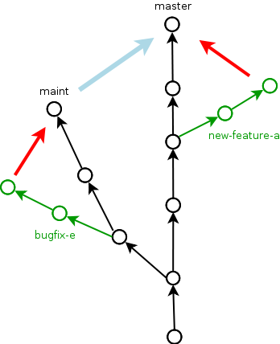

---

### Git

Die bekannteste und meistverwendete Versionskontrolle ist **git**.

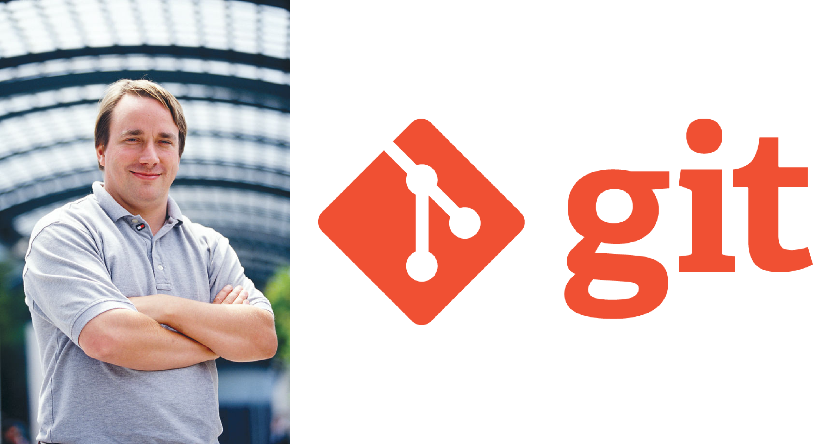

🤔 Wer ist diese Person?

---

### It's going to hurt

Git zu lernen ist nicht schwierig. Git zu verstehen aber schon.

---

### Arbeit mit git

Was man mit git normalerweise macht:
1. **Inititalisierung**: Git Projekt erstellen
2. **Stagen**: Dateien in den Index aufnehmen
3. **Committen**: Zustand der Dateien festhalten
4. **Pushen**: Änderungen hochladen
5. **Pullen**: Änderungen herunterladen
6. **Mergen**: Änderungen zusammenführen

---

### Ziel von git

Versionsstand von Software-Code mit mehreren Mitarbeitenden (Contributors) synchron halten.

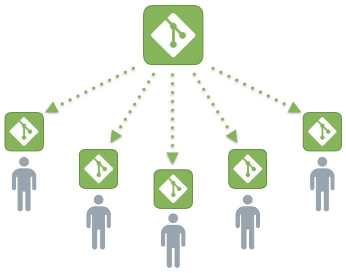

---

### Git Arbeitsbereiche

Bei der Arbeit mit gibt, gibt es verschiedene Arbeitsbereiche:
* **Workspace**: Lokaler Ordner mit Code
* **Index**: Interne Liste mit Dateien die verfolgt werden
* **Stage**: Erfasste Änderungen in Dateien
* **Local Repository**: Zustand des lokalen Codes
* **Remote Repository**: Zustand des gesamten Codes

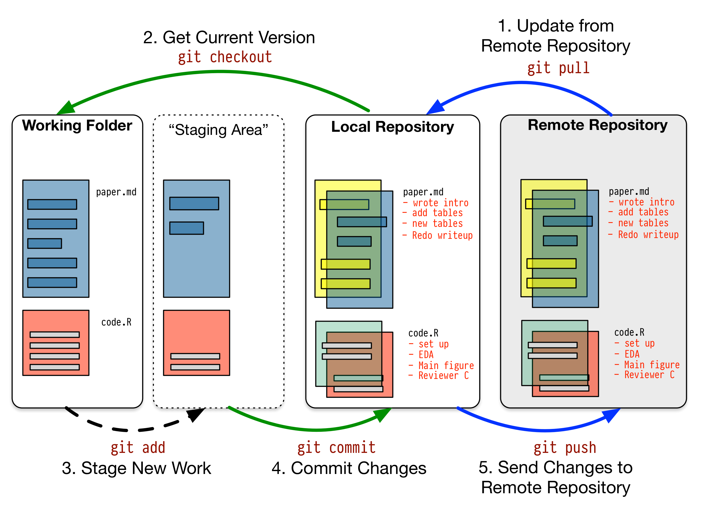

---

### GitHub

Auf <https://github.com/> kann man das *Remote Repository* verwalten. Hier ein paar Beispiele:

* <https://github.com/torvalds/linux>: Linux Betriebssystem
* <https://github.com/pallets/flask>: Python Flask
* <https://github.com/nasa>: Organisation der NASA

Es gibt weitere Plattformen wie <https://gitlab.com/> oder selber hosten <https://gitea.io/>.

---

### GitHub Account erstellen

🎬 Erstellen sie einen Account auf [GitHub](https://github.com/signup).

Wir werden den Account zu einem späteren Zeitpunkt brauchen.

---

### Git installieren

Nun installieren wir git auf dem Computer.

🎬 Öffnen sie <https://git-scm.com/>, laden sie git herunter und installieren sie die Software. Verwenden sie die empfohlenen Einstellungen.

<iframe width="560" height="315" src="https://www.youtube.com/embed/hPNs2x6zsPY" title="YouTube video player" frameborder="0" allow="accelerometer; autoplay; clipboard-write; encrypted-media; gyroscope; picture-in-picture" allowfullscreen></iframe>

---

### Git und VSCode

VSCode sollte git automatisch erkennen.

---

### VSCode vorbereiten

🎬 Führen sie diese Aktionen aus:
* Neuer Ordner `Thema 10` erstellen
* Ordner mit VSCode öffnen
* Datei `main.py` mit diesem Code anlegen:

```python
print('Hello git!')
```

---

### Beispiel mit VSCode und git

Die folgenden Beispielen zeigt wie man mithilfe von VSCode mit git arbeitet. Dabei gilt es zu beachten, dass im Hintergrund immer auf der Kommandozeile die git-Befehle abgesetzt werden.

VSCode macht die Arbeit mit git "einfacher". Zu jedem Beispiel wird wenn möglich der entsprechende git-Befehl aufgeführt.

---

### Git konfigurieren

🎬 Starten sie ein neues Terminal und geben sie die folgenden Befehle ein. Natürlich müssen sie einen eigenen Benutzernamen und E-Mail defineiren.

```bash
git config --global user.name "janikvonrotz"
git config --global user.email "contact@janikvonrotz.ch"
```

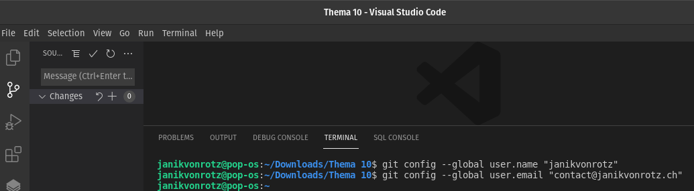

---

### Repository initialisieren

🎬 In VSCode klicken sie auf die Versionskontrolle und initialisieren das Repo.

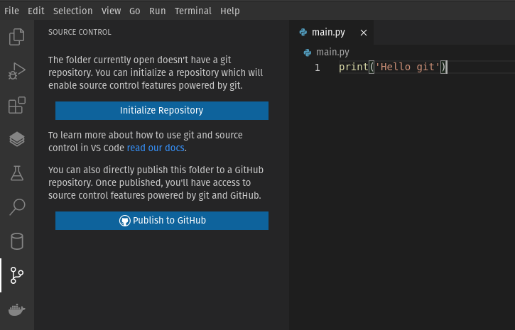

ℹ️ Der Terminal-Befehl ist `git init`

---

### Datei stagen

Git hat die Datei `main.py` erkannt und bietet an die Datei zu stagen.

🎬 Stagen sie die Datei `main.py` wie folgt:

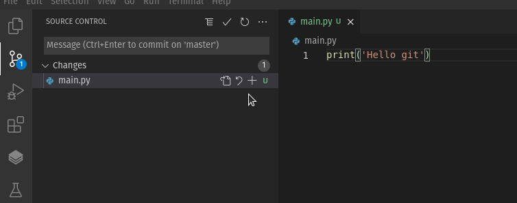

ℹ️ Der Terminal-Befehl ist `git add main.py`

---

### Datei comitten

Änderungen in der Stage kann man comitten. Dazu braucht es eine Nachricht.

🎬 Comitten sie die Änderungen wie folgt:

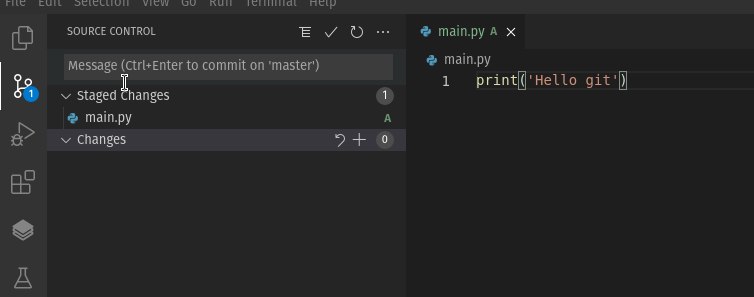

ℹ️ Der Terminal-Befehl ist `git commit -m "init main"`

---

### Datei ändern und vergleichen

🎬 Ändern sie die Ausgabe in `main.py` zu `'Git is great!'` und vergleichen sie die Datei:

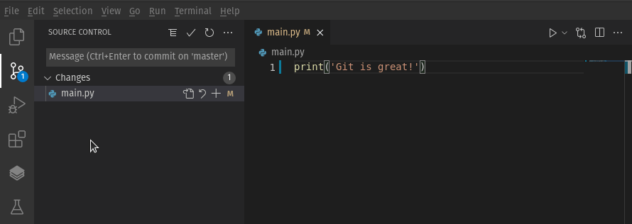

ℹ️ Der Terminal-Befehl ist `git diff`

---

### Änderung committen

🎬 Stagen und comitten sie die Änderung mit der Nachricht `changed output`.

ℹ️ Der Terminal-Befehl ist `git commit -a -m "changed output"`

---

### History anzeigen

Die History umfasst alle Commits.

🎬 Öffnen sie ein Terminal und geben sie `git log` ein.

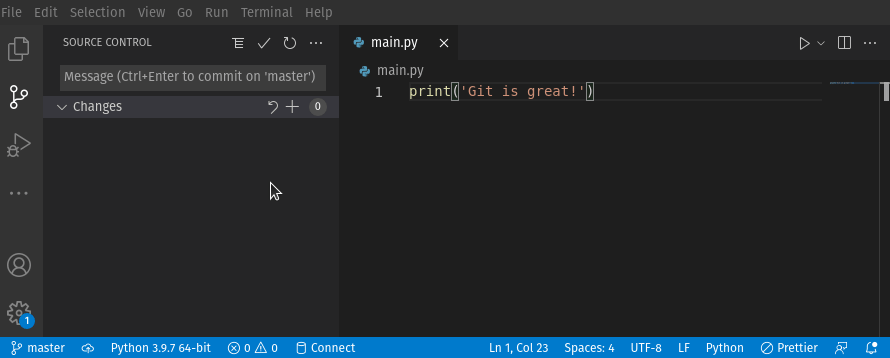

ℹ️ Zum schliessen der Ansicht drücken sie `q`.

---

### Referenz eines Commits

Jeder Commit ist über einen Hash referenziert.

In diesem Beispiel hat der Commit mit Nachricht `init main` den Hash `14b3b432a7318eede6d09e3aad62b2f417a28b37`.

---

### Commit auschecken

🎬 Kopieren sie den Hash ihres `init main` Commits und geben sie im Terminal `git checkout $HASH` ein:

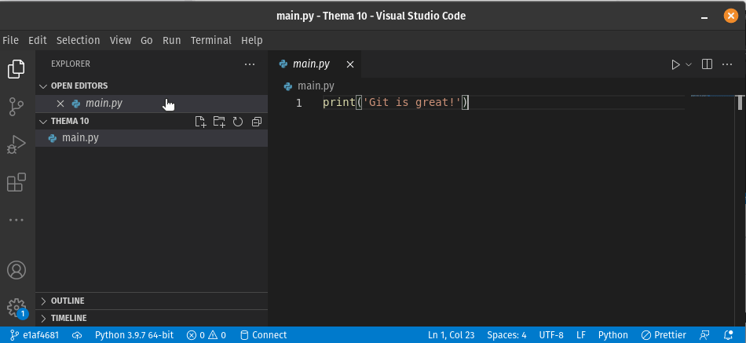

Nun sollte die vorhergehende Version der Datei `main.py` angezeigt werden.

---

### Master auschecken

🎬 Wechseln sie wieder zurück zum `master`:

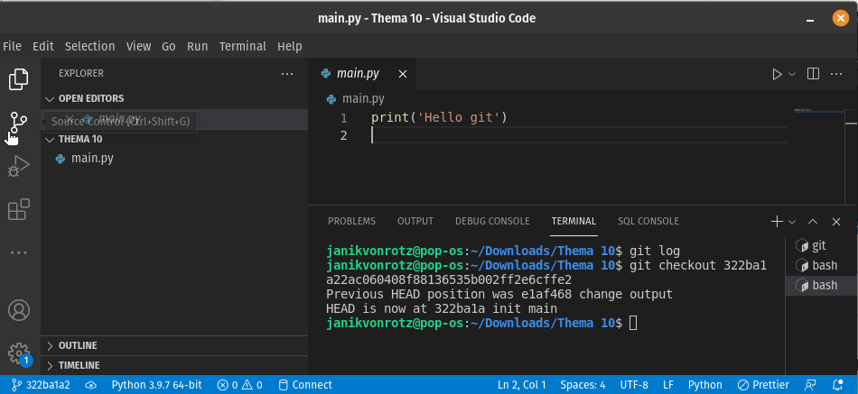

ℹ️ Der Terminal-Befehl ist `git checkout master`

---

### Pause

⚡Wir machen eine Pause ⏱️ 15 Minuten

---

### Repository veröffentlichen

Nun möchten wir die Änderungen auf GitHub publizieren.

🎬 Drücken sie <kbd>ctrl</kbd>+ <kbd>shift</kbd> + <kbd>p</kbd> wählen `Publish to GitHub`. Anschliessend befolgen sie den Dialog:

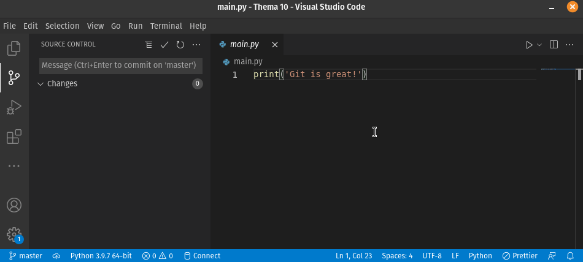

ℹ️ Die Aktion kann auf dem Terminal nur bedingt ausgeführt werden.

---

### Änderung auf GitHub erstellen

🎬 Fügen sie gemäss Vorschlag auf GitHub die Datei `README.md` hinzu:

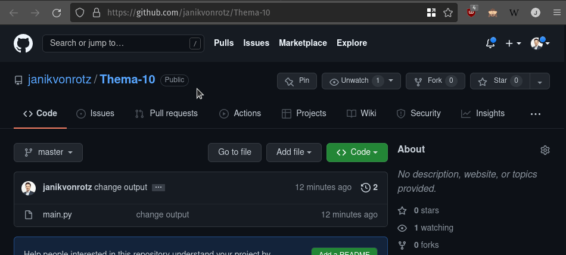

---

### Fetchen und pullen

Damit die Änderung lokal verfügbar wird, muss zuerst *gefetched* und anschliessend *gepullt* werden.

🎬 Führen sie diese Aktion aus:

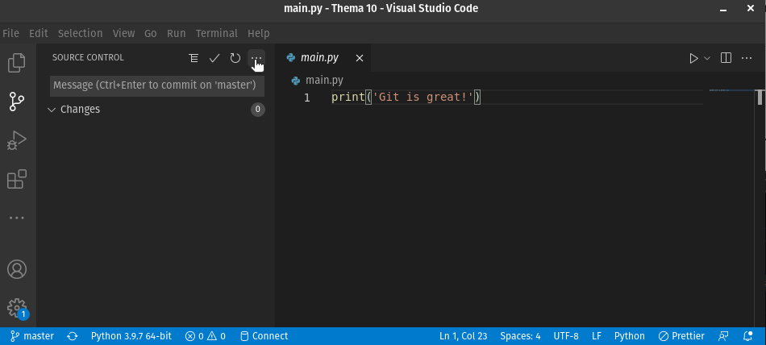

ℹ️ Die Terminal-Befehl sind `git fetch` und `git pull`

---

### Änderung pushen

🎬 Passen sie den Text im `README.md`, committen und pushen sie die Änderung:

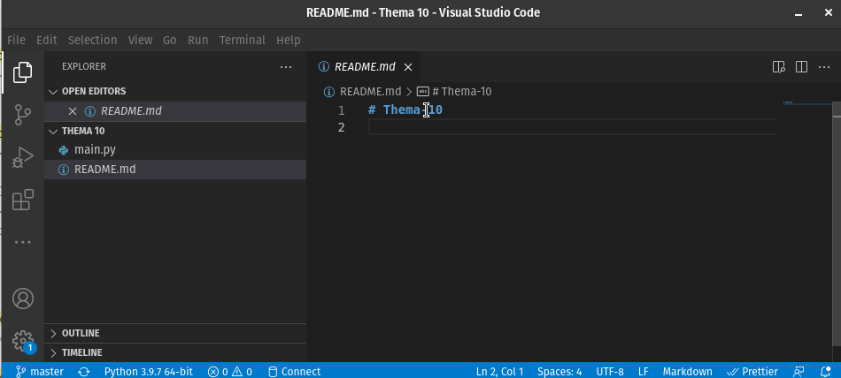

ℹ️ Der Terminal-Befehl ist `git push`.

---

### Zur Erinnerung

Hier nochmals der git Workflow:


---

### Aufgaben 1

Lösen sie die ersten zwei Aufgaben.

⚡Aufteilung in Gruppen/Breakout-Rooms ⏱️ 10 Minuten

Ziel: Aufgabe 10.1 und 10.2 gelöst.

---

### Restliche Zeit

* Arbeit an Leistungsnachweis

---

### Abschluss

Ich möchte mich herzlich für die Teilnahme am Kurs und tolle Mitarbeit bedanken.

Für Feedback bin ich dankbar und zu Python-Fragen immer erreichbar.
