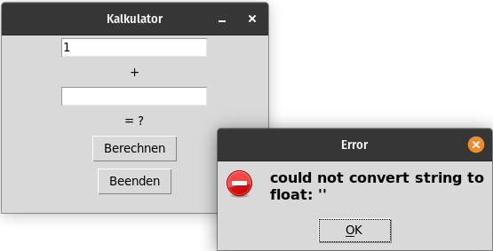

# Übungen Thema 11

## Aufgaben

Aufgaben zum Thema.

### Aufgabe 11.1: Fenster anpassen

Verwenden Sie den Code von [gui.py](https://github.com/janikvonrotz/python.casa/blob/main/topic-11/gui.py) und passen Sie ihn wie folgt an:

* Bennen Sie den Titel des Fenster auf `Kalkulator` um.
* Ändern Sie den Text des `change_button` auf `Berechnen`.
* Ersetzen Sie die Funktion `button_action` mit dieser:

```python
def button_action(x=1, y=2):
	anweisungs_label.config(text=f'Sie Summe von {x} und {y} ist {x+y}')
```

* Ändern Sie den Text des `anweisungs_label` auf `Was ergibt 1 + 2?`.

Führen Sie das Programm aus.

⭐ [Fenster anpassen.py](https://github.com/janikvonrotz/python.casa/blob/main/topic-11/Fenster%20anpassen.py)

### Aufgabe 11.2: Fenster fixieren

Verwenden Sie den Code oder Lösung aus der Aufgabe 1.1. In dieser Aufgabe möchten Sie die Grösse des Fenster ändern und die Breite der der Zellen im Koordinatensystem festlegen. Dazu verwenden Sie diesen Code:

```python
fenster.geometry('300x200')
rows = 9
columns = 9
for i in range(rows):
    fenster.rowconfigure(index=i,weight=1)
for i in range(columns):
    fenster.columnconfigure(index=i, weight=1)
```

Fügen Sie diesen Code nach Zeile 7 ein.

Damit die Elemente in der Mitte platziert werden, verwenden Sie diesen Code:

```python
# Elemente mit Grid laden
anweisungs_label.grid(row=1, column=4, pady=10, padx=10)
change_button.grid(row=2, column=4, pady=10, padx=10)
exit_button.grid(row=3, column=4, pady=10, padx=10)
```

Führen Sie das Programm aus.

⭐ [Fenster fixieren.py](https://github.com/janikvonrotz/python.casa/blob/main/topic-11/Fenster%20fixieren.py)

### Aufgabe 11.3: Eingabefelder erstellen

Verwenden Sie den Code von Aufgabe 11.2 und ersetzen Sie Teile aus dem Code mit den folgenden Teilen.

Die Funktion berechnet die Summe aus Eingabefelder:

```python
# Funktion für Button
def button_action():
    x = float(zahl1.get())
    y = float(zahl2.get())
    label2.config(text=f'= {x+y}')
```

Die Elemente bestehen aus diesen Definitionen:

```python
# Button und Labels erstellen
zahl1 = Entry(fenster, width=20)
label1 = Label(fenster, text='+')
zahl2 = Entry(fenster, width=20)
label2 = Label(fenster, text='= ?')
change_button = Button(fenster, text='Berechnen', command=button_action)
exit_button = Button(fenster, text='Beenden', command=fenster.quit)
```

Die Positionierung wird neu gemacht:

```python
# Elemente mit Grid laden
zahl1.grid(row=0, column=4, pady=0, padx=10)
label1.grid(row=1, column=4, pady=0, padx=0)
zahl2.grid(row=2, column=4, pady=0, padx=10)
label2.grid(row=3, column=4, pady=0, padx=0)
change_button.grid(row=4, column=4, pady=0, padx=0)
exit_button.grid(row=5, column=4, pady=0, padx=10)
```

Führen Sie das Programm aus und testen Sie es mit verschiedenen Eingaben.

⭐ [Eingabefelder erstellen.py](https://github.com/janikvonrotz/python.casa/blob/main/topic-11/Eingabefelder%20erstellen.py)

### Aufabe 11.4: Fehler in Messagebox

Verwenden Sie die Lösung aus Aufgabe 11.3 als neuer Code. Vielleicht haben Sie es festgestellt, wenn die Eingabefelder leer sind, stürtzt das Programm ab. Das möchten wir nun verbessern.

Wir erinnern uns an die `try` und `except` Statements und möchten nun die Fehlermeldung in einer Messagebox ausgeben.

Importieren Sie dazu die Messagebox:

```python
from tkinter import messagebox
```

Anschliessend passen Sie die Methode folgendermassen an:

```python
# Funktion für Button
def button_action():
    try:
        x = float(zahl1.get())
        y = float(zahl2.get())
        label2.config(text=f'= {x+y}')
    except BaseException as error:
        messagebox.showerror(message=error, title='Error')
```

Führen Sie das Programm aus und machen Sie ungültige Eingaben.



⭐ [Fehler in Messageboxn.py](https://github.com/janikvonrotz/python.casa/blob/main/topic-11/Fehler%20in%20Messagebox.py)