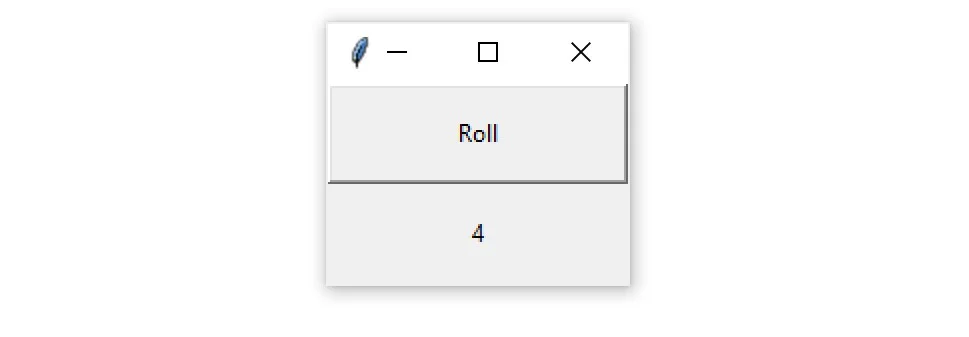
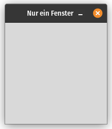
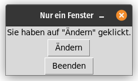
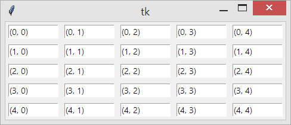
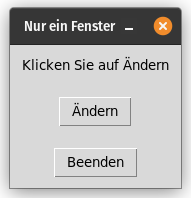
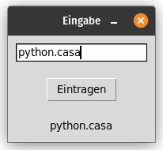
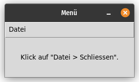
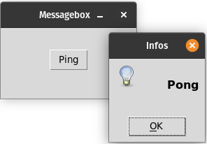

# Slides Thema 11
## Grafische Benutzeroberfläcche

[◀️ Thema 11](README.md)

⚡[Anwesenheit bestätigen](https://moodle.medizintechnik-hf.ch/mod/attendance/manage.php?id=8024)

📖 Kapitel 18 Grafische Benutzeroberflächen

---

### Lernziele

Ich kann ...
* mit Python eine grafische Oberfäche anzeigen.
* auf dem GUI Felder und Buttons platzieren.
* Eingaben auf einem GUI verarbeiten.

---

### Grafische Benutzeroberfläche

Die Grafische Benutzeroberfläche (GUI) ermöglicht eine einfachere Interaktion mit Programmen.



---

### Tkinter

Tkinter ist eine vorinstallierte Standardbibliothek mit der man GUIs erstellen kann.

🎬 Führen Sie diese Aktionen aus:
* Neuer Ordner `Thema11` erstellen
* Ordner mit VSCode öffnen
* Datei `gui.py` anlegen

---

### Tkinter Fenster

🎬 Fügen Sie diesen Code hinzu:

```python
from tkinter import *

# Ein Fenster erstellen
fenster = Tk()

# Den Fenstertitle festlegen
fenster.title('Nur ein Fenster')

# Fenster anzeigen und Eingabe abwarten
fenster.mainloop()
```

---

### Tkinter Fenster anzeige

🎬 Führen Sie das Programm aus.

Sie sollten ein Fenster sehen, solange das Progamm läuft oder bis das Fenster geschlossen wird.



---

### Funktionen für Elemente

Wir können auf dem Fenster Elemente wie Buttons, Labels und Eingabefelder platzieren.

Diese Elemente können wir mit Python-Funktionen verbinden.

---

### Button und Labels

🎬 Fügen Sie die folgenden Funktionen und Elemente vor der Anweisung `fenster.mainloop()` hinzu:

```python
# Funktion für Button
def button_action():
    anweisungs_label.config(text='Sie haben auf "Ändern" geklickt.')

# Button und Labels erstellen
change_button = Button(fenster, text='Ändern', command=button_action)
exit_button = Button(fenster, text='Beenden', command=fenster.quit)
anweisungs_label = Label(fenster, text='Klicken Sie auf Ändern')

# Elemente in Reihenfolge laden
anweisungs_label.pack()
change_button.pack()
exit_button.pack()
```

---

### Elemente-Klassen

Die Klassen `Button` und `Label` wurden aus der `tkinter` Bibliothek importiert.

Die Konstruktoren erwarten eine `Fenster`-Objekt, einen Text und beim Knopf eine Funktion.

---

### Elemente laden

Mit der `.pack()`-Methode werden die Elemente in das Fenster geladen.

Die Reihenfolge der Elemente wird gemäss der Reihenfolge der Anweisungen geladen.

---

### Button und Labels anzeigen

🎬 Führen Sie das Programm `gui.py` aus und Klicken Sie auf den Button *Ändern*.



---

### Elemente platzieren

Statt `pack` zur Platzierung der Elemente können Sie auch `gird(row=1, column=1, pady=10, padx=10)` verwenden. Damit platzieren Sie die Elemente in einem Koordinatensystem.



Der erste Wert ist `row` und der zweite Wert `column`. Mit `pady` und `padx` definieren Sie zusätzliche Abstände.

---

### Elemente mit Grid platzieren

🎬 Ersetzen Sie die `pack`-Methoden mit den folgenden `grid`-Methoden:

```python
# Elemente mit Grid laden
anweisungs_label.grid(row=1, column=1, pady=10, padx=10)
change_button.grid(row=2, column=1, pady=10, padx=10)
exit_button.grid(row=3, column=1, pady=10, padx=10)
```

⭐ [gui.py](https://github.com/janikvonrotz/python.casa/blob/main/topic-11/gui.py)

---

### Elemente mit Grid anzeigen

🎬 Führen Sie das Programm wieder aus.



---

### Aufgaben 1

Lösen Sie die [Aufgaben](excercise11.md#aufgaben) 11.1 und 11.2.

⚡Aufteilung in Gruppen/Breakout-Rooms ⏱️ 10 Minuten

---

### Eingabe in GUI

Mit `input` kann der Benutzer eine Eingabe machen. Dasselbe funktioniert auch auf einem GUI mit einem Eingabe feld.

🎬 Erstellen Sie eine neue Datei `eingabe.py` mit diesem Inhalt:

```python
from tkinter import *
fenster = Tk()
fenster.title('Eingabe')

def button_action():
    text = eingabe.get()
    ausgabe.config(text=text)

eingabe = Entry(fenster, width=20)
button = Button(fenster, text='Eintragen', command=button_action)
ausgabe = Label(fenster, text='')

eingabe.pack(padx=10, pady=10)
button.pack(padx=10, pady=10)
ausgabe.pack(padx=10, pady=10)

fenster.mainloop()
```

---

### Eingabefeld

🎬 Führen Sie das Programm aus, machen Sie eine Eingabe und drücken Sie auf *Eintragen*.



Mit der `get`-Methode kann der Text aus dem Eingabefeld ausgelesen werden und mit der `config`-Methode können die Elemente angepasst werden.

---

### Menü hinzufügen

Sie können "ganz einfach" eine Menüleiste dem Fenster hinzufügen.

🎬 Erstellen Sie eine neue Datei `menü.py` mit diesem Inhalt:

```python
from tkinter import *
fenster = Tk()
fenster.title('Menü')

# Menüleiste erstellen 
menuleiste = Menu(fenster)
# Menüeintrag erstellen 
datei_menu = Menu(menuleiste, tearoff=0)
# Menüaktion hinzufügen
datei_menu.add_command(label='Schliessen', command=fenster.quit)
# Menüeintrag an Menüleiste übertragen
menuleiste.add_cascade(label='Datei', menu=datei_menu)
# Menüleiste in Fenster laden
fenster.config(menu=menuleiste)          

label = Label(fenster, text='Klick auf "Datei > Schliessen".')
label.pack(padx=30, pady=30)

fenster.mainloop()
```

---

### Fenster mit Menü anzeigen

🎬 Führen Sie das Programm und die angezeigte Anweisung aus.



---

### Messagebox hinzufügen

Bei einem Fehler können Sie eine Nachricht in einer Messagebox ausgeben.

🎬 Erstellen Sie eine neue Datei `messagebox.py` mit diesem Inhalt:

```python
from tkinter import *
from tkinter import messagebox
fenster = Tk()
fenster.title('Messagebox')

def ping():
	nachricht = """
    Pong
    """
	messagebox.showinfo(message=nachricht, title='Infos')

button = Button(fenster, text='Ping', command=ping)
button.pack(padx=30, pady=30)

fenster.mainloop()
```

Damit die Messagebox im Programm verfügbar ist muss Sie explizit mit `from tkinter import messagebox` importiert werden.

### Messagebox anzeigen.

🎬 Führen Sie das Programm und klicken Sie auf den Button.



---

### Aufgaben 2

Lösen Sie die [Aufgaben](excercise11.md#aufgaben) 11.3 und 11.4.

⚡Aufteilung in Gruppen/Breakout-Rooms ⏱️ 10 Minuten

---

### Review

🎯 Wurden die [Lernziele](#lernziele) erreicht?

⚡ Feedback zu den Zielen einholen.

---