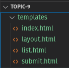
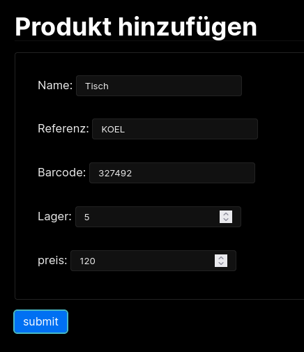

# Slides Thema 12
## Webapplikation mit Python Flask

[◀️ Thema 12](README.md)

⚡[Anwesenheit bestätigen](https://moodle.medizintechnik-hf.ch/mod/attendance/manage.php?id=8024)

---

### Lernziele

Ich kann ...
* die 3-Tier Architektur von Webapplikationen erläutern.
* eine Webapplikation mit Python entwickeln.
* GET- und POST-Methoden mit einem Webserver verarbeiten.
* eine grafische Oberfläche mit einem HTML-Template erstellen.

---

### Was ist eine Webapplikation?

* Applikation im Browser
* Verwendet HTML, CSS und JavaScript
* Keine Installation auf Client-Computer

---

### 3-Tier Architektur

Die Architektur von Webapps in 3 Schichten:

1. Präsentation (Client)
2. Logik (Anwendung)
3. Datenhaltung (Datenbank)

---

### Was ist Python Flask?

[Python Flask](https://flask.palletsprojects.com/)  ist eine Framework zur Entwicklung von Webapplikation mit Python.

---

### Architektur Flask

Für Python Flask sieht die Architektur so aus:


---

### VSCode vorbereiten

🎬 Führen Sie diese Aktionen aus:
* Neuer Ordner `Thema12` erstellen
* Ordner mit VSCode öffnen
* Datei `db.py` anlegen
---

### Flask installieren

🎬 Installieren Sie das Package `flask` mit dem *Pip Manager*.


Auf der Kommandozeile können Sie das mit `pip install flask` erledigen.

---

### Datenbank erstellen

🎬 Ergänzen Sie `db.py` und führen Sie das Skript aus.

```python
import os, sys, sqlite3
if os.path.exists('lager.db'):
    os.remove('lager.db')
connection = sqlite3.connect('lager.db')
cursor = connection.cursor()
sql = """CREATE TABLE IF NOT EXISTS lager(
    id INTEGER PRIMARY KEY,
    name TEXT,
    referenz TEXT ,
    barcode TEXT,
    lager INTEGER,
    preis REAL)"""
cursor.execute(sql)
sql = "INSERT INTO lager VALUES(1, 'Holztisch', 'E-COM06', '601647855633', 3, 147)"
cursor.execute(sql)
sql = "INSERT INTO lager VALUES(2, 'Bürostuhl', 'E-COM06', '601647855634', 1, 70.50)"
cursor.execute(sql)
sql = "INSERT INTO lager VALUES(3, 'Abfalleimer', 'E-COM06', '601647855649', 5, 43)"
cursor.execute(sql)
connection.commit()
connection.close()
```

Im selben Ordner wir die Datei `lager.db` erstellt.

---

### Templates erstellen

🎬 Erstellen seinen Ordner `templates` mit diesen leeren Dateien:
* `index.html`
* `layout.html`
* `list.html`
* `submit.html`



---

### Was ist ein Template?

Python Flask verwendet [Jinja](https://jinja.palletsprojects.com) als *Template Engine*. Eine Template Engine macht folgendes:


Wir verwenden Jinja um die Ansicht der Webapp zu generieren.

---

### Layout Template erstellen

🎬 Füllen Sie das `layout.html` mit diesem Inhalt aus:

```html
<!doctype html>
<html>

<head>
    <meta charset="UTF-8">
    <meta name="viewport" content="width=device-width, initial-scale=1.0">
    <title>Webapplikation Lager</title>
    <link rel="stylesheet" href="https://fonts.xz.style/serve/inter.css">
    <link rel="stylesheet" href="https://cdn.jsdelivr.net/npm/@exampledev/new.css@1.1.2/new.min.css">
</head>

<body>
    <header>
        <h1>Webapplikation Lager</h1>
        <nav>
            <a href="/">Home</a>
        </nav>
    </header>

    
</body>

</html>
```

Es handelt sich hierbei um ein einfaches HTML-Dokument. Sie können die Datei `layout.html` im Browser öffnen.

--- 

### Jinja Blockelemente

Ihnen ist sicher der Inhalt `` aufgefallen. Alles was mit `` oder `}}` endet sind Jinja-Variablen. Damit steuern Sie die Verarbeitungslogik der Daten.

---

### Index Template erstellen

🎬 Füllen Sie das `index.html` mit diesem Inhalt aus:

```html


<h1>Aktionen</h1>
<p><a href="/insert">Produkt hinzufügen</a></p>
<p><a href="/list">Produkte auflisten</a></p>

```

Dieses Template verwendet das `layout.html` als Vorlage.

---

### List Template erstellen

🎬 Füllen Sie das `list.html` mit diesem Inhalt aus:

```html


<h1>Produktliste</h1>
<table>
  <thead>
    <td>ID</td>
    <td>Name</td>
    <td>Referenz</td>
    <td>Barcode</td>
    <td>Lager</td>
    <td>Preis</td>
  </thead>
  
  <tr>
    <td>{{row[0]}}</td>
    <td>{{row[1]}}</td>
    <td>{{row[2]}}</td>
    <td>{{row[3]}}</td>
    <td>{{row[4]}}</td>
    <td>{{row[5]}}</td>
  </tr>
  
</table>

```

Damit werden die Inhalte aus der Datenbank in einer Tabelle aufgelistet.

---

### Submit Template erstellen

🎬 Füllen Sie das `submit.html` mit diesem Inhalt aus:

```html


<h1>Produkt hinzufügen</h1>

<blockquote>
    Nachricht: {{ message }}
</blockquote>

<form action="{{ url_for('insert') }}" method="POST">
    <fieldset>
        <label for="name">Name:</label>
        <input required type="text" name="name"/><br><br>
        <label for="referenz">Referenz:</label>
        <input required type="text" name="referenz"/><br><br>
        <label for="barcode">Barcode:</label>
        <input required type="text" name="barcode"/><br><br>
        <label for="lager">Lager:</label>
        <input required type="number" name="lager"/><br><br>
        <label for="preis">Preis:</label>
        <input required type="number" name="preis"/>
    </fieldset>
    <input type="submit" value="submit" />
</form>

```

Mit diesem Formular erstellen Sie neue Inhalte in der Datenbank.

### Python-Flask App erstellen

🎬 Erstellen Sie die Datei `app.py` mit diesem Inhalt:

```python
from distutils.log import error
from flask import Flask, render_template, request, redirect, url_for, send_file
import sqlite3
app = Flask(__name__)

@app.route('/')
def index():
    return render_template('index.html')

@app.route('/insert', methods=['POST', 'GET'])
def insert():
    message=""
    if request.method == 'POST':
        name = request.form['name']
        referenz = request.form['referenz']
        barcode = request.form['barcode']
        lager = request.form['lager']
        preis = request.form['preis']
        connection = sqlite3.connect("lager.db")
        cursor = connection.cursor()
        sql = "INSERT INTO lager(name,referenz,barcode,lager,preis) VALUES('%s', '%s', '%s', %s, %s)" % (name,referenz,barcode,lager,preis)
        print(sql)
        cursor.execute(sql)
        connection.commit()
        connection.close()
        message="Produkt hinzugefügt."
    return render_template("submit.html", message=message)

@app.route('/list')
def list():
    connection = sqlite3.connect("lager.db")
    cursor = connection.cursor()
    sql = "SELECT * FROM lager"
    cursor.execute(sql)
    data = cursor.fetchall()
    print(data)
    return render_template("list.html", data=data)

if __name__ == '__main__':
   app.run(debug = True)
```

Die Elemente werden nun erläutert.

---

### Was ist eine Route?

Mit der folgenden Anweisung verbindet Python-Flask die Anfrage des Browser mit einer Antwort.

```python
@app.route('/')
def index():
    return render_template('index.html')
```

Schickt der Browser ein HTTP-Request für `/` auf wird das Template `index.html` verarbeitet und zurückgegeben.


---

### GET und POST

Man unterscheidet bei HTTP-Requests zwischen GET und POST. Eine Route kann beides verarbeiten.

```python
@app.route('/insert', methods=['POST', 'GET'])
def insert():
```

Bei GET liefert man ein HTML-Dokument als Antwort und bei POST nimmt man Daten entgegen und verarbeitet diese.


---

### Webapp starten

Nun sind wir bereit um die Python Flask Webapplikation zu starten.

🎬 Führen Sie die Datei `app.py` aus.


Öffnen Sie die Adresse <http://127.0.0.1:5000/> in ihrem Browser.


---

### Webapp in Unterordner starten

Wenn Sie die `app.py` in einem Unterordner im Arbeitsbereich von VSCode haben. Können Sie einen Rechtsklick auf die Datei machen und `Run Python File in Terminal` ausführen. VSCode navigiert dann zuerst in den Unterodner.

Oder Sie navigieren zur Ausführung in den Unterordner, beispielsweise mit `cd Thema12` und starten anschliessend die App mit dem Befehl `python app.py`.

```zsh
➜  python.casa git:(main) ✗ cd topic-12 
➜  topic-12 git:(main) ✗ python app.py 
 * Serving Flask app 'app'
 * Debug mode: on
WARNING: This is a development server. Do not use it in a production deployment. Use a production WSGI server instead.
 * Running on http://127.0.0.1:5000
Press CTRL+C to quit
 * Restarting with stat
 * Debugger is active!
 * Debugger PIN: 605-689-980
```

---

### Webserver gestartet

Wenn Sie folgenden Ausschnitt im Browser sehen, haben Sie erfolgreich einen Python Flask Webserver gestartet und eine Webapplikation bereitgestellt.


---

### Produkt hinzufügen

🎬 Klicken Sie auf *Produkt hinzufügen*, füllen Sie das Formular aus und klicken auf *submit*



---

### Produkte auflisten

🎬 Navigieren Sie auf die Starteseite und wählen Sie *Produkte auflisten*.

Wird das erfasste Produkt angezeigt?

---

### Aufgaben 1

Lösen Sie die [Aufgaben](excercise12.md#aufgaben) 12.1 und 12.2.

⚡Aufteilung in Gruppen/Breakout-Rooms ⏱️ 10 Minuten

---

### Xlsx-Export

Damit Sie die Daten in einer Datenbank analysieren können, braucht es einen Export.

Wir haben gelernt wie Sie einen Export in eine .csv-Datei machen, dasselbe Vorgehen können Sie auch für .xlsx-Dateien verwenden.

In [Aufgaben 2](#Aufgaben%202) werden Sie einen entsprechenden Export programmieren.

---

### CRUD-Operationen

Haben wir alle CRUD-Operationen implementiert?

✅ Create
✅ READ
🚫 Update
✅ Delete

Es fehlt noch die Operation um Produkte zu aktualisieren.

---

### Daten in Formular laden

Damit die Daten im Webformular bearbeitet werde können, muss ein bestimmter Datensatz geladen werden.

Sie brauchen also folgendes.
* Eine Route um das Produkt zu bearbeiten `/edit/<id>`
* Ein neues Template zur Bearbeitung des Produkts
* Eine weitere Route zum Speichern der Bearbeitung `/save`

---

### Route mit Parameter

Über die URL des Browser können Parameter an die Route übergeben werden.

```python
@app.route('/edit/<id>')
def edit(id):
    connection = sqlite3.connect("lager.db")
    cursor = connection.cursor()
    sql = f"SELECT * FROM lager WHERE id = {id}"
    cursor.execute(sql)
    data = cursor.fetchall()
    return render_template("edit.html", data=data[0])
```

---

### Aufgaben 2

Lösen Sie die [Aufgaben](excercise12.md#aufgaben) 12.3 und 12.4.

⚡Aufteilung in Gruppen/Breakout-Rooms ⏱️ 10 Minuten

---

### Vollstände Webapplaktion

Die komplette Applikation 

⭐ [Complete](https://github.com/janikvonrotz/python.casa/blob/main/topic-12/Complete)

---

### Review

🎯 Wurden die [Lernziele](#lernziele) erreicht?

⚡ Feedback zu den Zielen einholen.

---