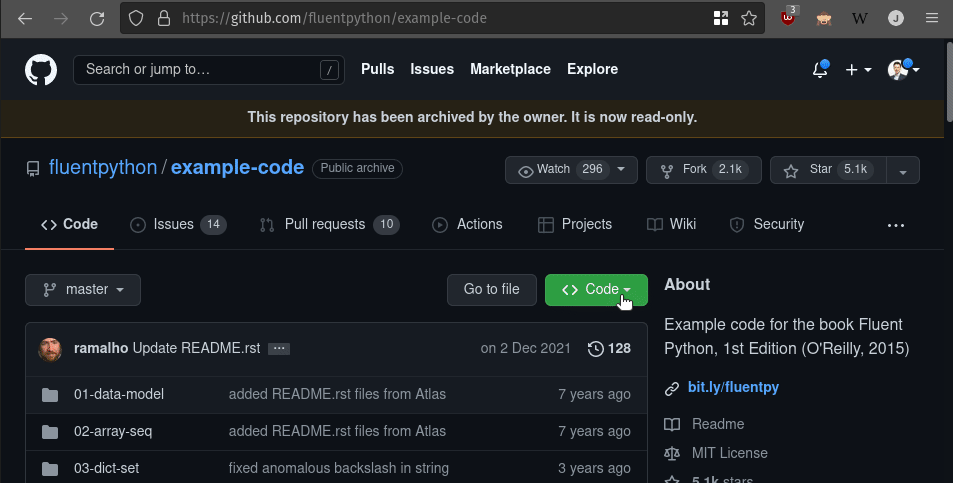
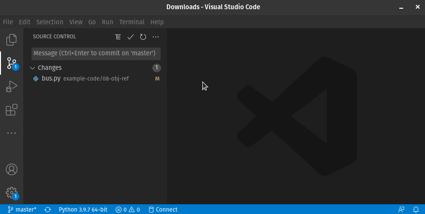

# Übungen Thema 13

## Aufgaben

Aufgaben zum Thema.

### Aufgabe 10.1: Projekt auschecken

Auf GitHub haben Sie das vielversprechende Repository <https://github.com/fluentpython/example-code> entdeckt und möchten nun den Code lokal ausführen. Kopieren Sie die HTTPS-Url und klonen Sie das Projekt mit VSCode.



Suchen Sie das Programm `bus.py` mithilfe der Suchfunktion <kbd>ctrl</kbd> + <kbd>p</kbd>. Fügen Sie dem Programm den Code unten an und führen Sie das Beispiel aus:

```python
bus1 = Bus(['Alice', 'Bill', 'Claire', 'David'])
print(bus1.passengers)
bus1.pick('Bob')
print(bus1.passengers)
```

Haben Sie das Programm verstanden?

### Aufgabe 10.2: Branch erstellen

Erstellen Sie einen Branch `my-example` und comitten Sie die gemachten Änderungen.



Wie wechseln Sie zwischen dem Branch `master` und `my-example`?

### Aufgabe 10.3: Branch zusammenführen

Wechseln Sie zum `master` Branch und *mergen* Sie den `my-example` branch. Geben Sie dazu diesem Befehl auf dem Terminal ein: `git merge my-example -m "merge my example"`.

Schauen Sie sich die Datei `bus.py` an. Sind ihre Änderungen jetzt auf dem `master` Branch vorhanden?