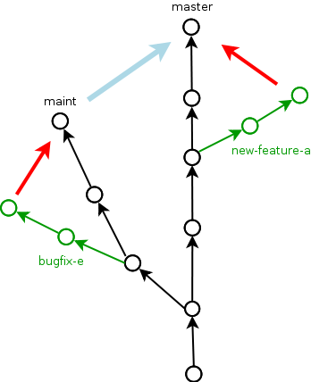
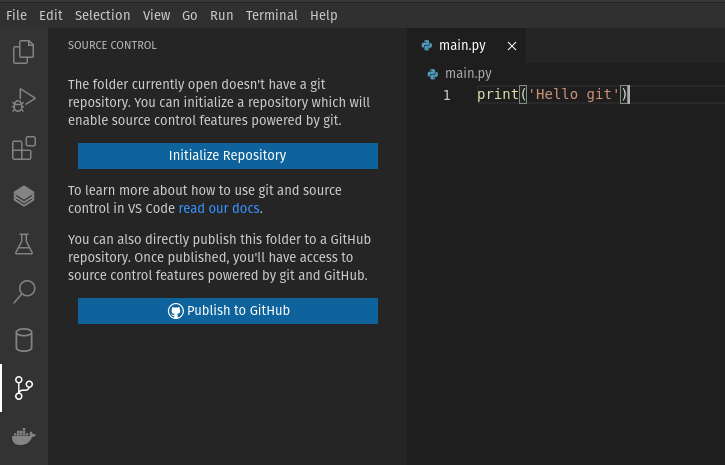
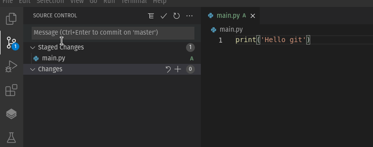
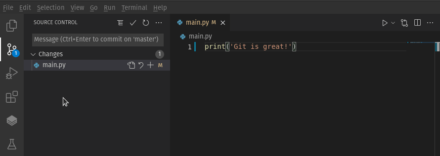
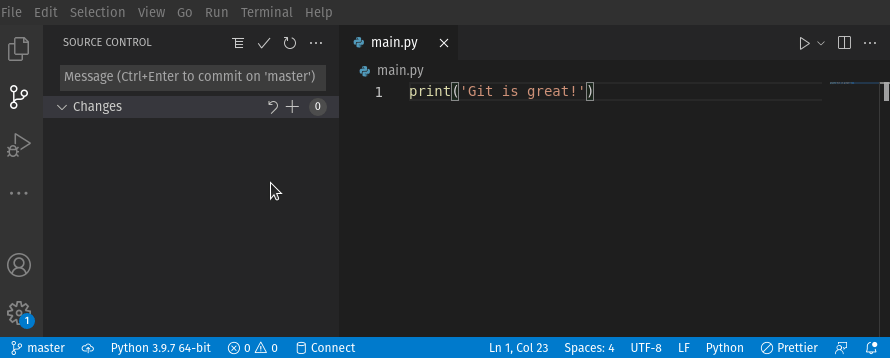
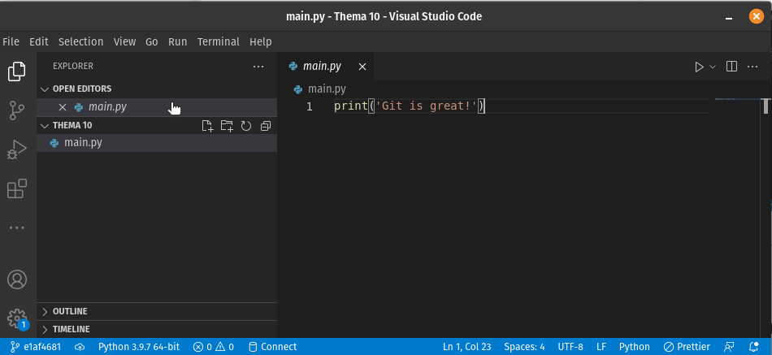
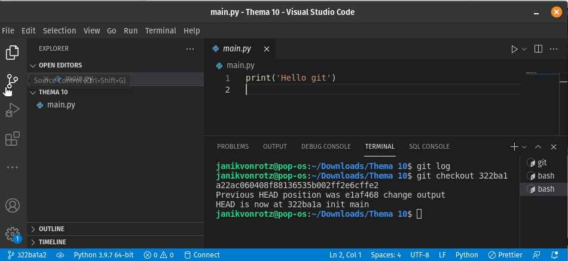
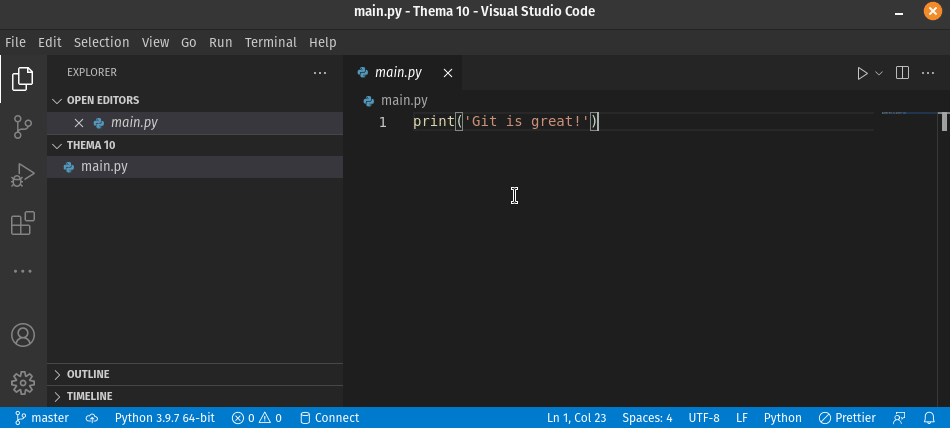

# Slides Thema 13
## Versionskontrolle mit Git

[◀️ Thema 13](README.md)

⚡[Anwesenheit bestätigen](https://moodle.medizintechnik-hf.ch/mod/attendance/manage.php?id=8024)

---

### Lernziele

Ich kann ...
* die Begriffe der Versionskontrolle erklären.
* mit Git die Änderungen an Programm-Code dokumentieren.
* mithilfe von Git mit einem Remote-Repository synchronisieren.
* besteheender Code mit Git auf die lokale Entwicklungsumgebung laden.

---

### Was ist Versionskontrolle?

> Eine Versionskontrolle ist ein System, das zur Erfassung von Änderungen an Dokumenten oder Dateien verwendet wird.

- Verwaltet viele Code-Zeilen
- Dokumentiert jede Änderung im Code
- Synchronisiert mit anderen Entwicklern
- Führt Änderungen im Code zusammen

---

### Begriffe / Baumstruktur

Das Schreiben von versioniertem Code kann man sich wie das Wachstum eines Baumes vorstellen. Dazu ein paar Begriffe:

* **Branch**: Verzweigung eines Astes
* **Merge**: Äste die zusammenwachsen
* **Commits**: Abschnitt im Baum
* **Tags**: Markierungen in den Ästen
* **Fork**: Kopie des gesamten Baumes
* **Master**: Der Hauptstamm
* **Head**: Die Baumkrohne
* **History**: Verlauf des Wachstum



---

### Git

Die bekannteste und meistverwendete Versionskontrolle ist **git**.


🤔 Wer ist diese Person?

---

### It's going to hurt

Git zu lernen ist nicht schwierig. Git zu verstehen aber schon.

---

### Arbeit mit git

Was man mit git normalerweise macht:
1. **Inititalisierung**: Git Projekt erstellen
2. **Stagen**: Dateien in den Index aufnehmen
3. **Committen**: Zustand der Dateien festhalten
4. **Pushen**: Änderungen hochladen
5. **Pullen**: Änderungen herunterladen
6. **Mergen**: Änderungen zusammenführen

---

### Ziel von git

Versionsstand von Software-Code mit mehreren Mitarbeitenden (Contributors) synchron halten.


---

### Git Arbeitsbereiche

Bei der Arbeit mit gibt, gibt es verschiedene Arbeitsbereiche:

* **Workspace**: Lokaler Ordner mit Code
* **Index**: Interne Liste mit Dateien die verfolgt werden
* **Stage**: Erfasste Änderungen in Dateien
* **Local Repository**: Zustand des lokalen Codes
* **Remote Repository**: Zustand des gesamten Codes


---

### GitHub

Auf <https://github.com/> kann man das *Remote Repository* verwalten. Hier ein paar Beispiele:

* <https://github.com/torvalds/linux>: Linux Betriebssystem
* <https://github.com/pallets/flask>: Python Flask
* <https://github.com/nasa>: Organisation der NASA

Es gibt weitere Plattformen wie <https://gitlab.com/> oder selber hosten <https://gitea.io/>.

---

### GitHub Account erstellen

🎬 Erstellen Sie einen Account auf [GitHub](https://github.com/signup).

Wir werden den Account zu einem späteren Zeitpunkt brauchen.

---

### Git installieren

Nun installieren wir git auf dem Computer.

🎬 Öffnen Sie <https://git-scm.com/>, laden Sie git herunter und installieren Sie die Software. Verwenden Sie die empfohlenen Einstellungen.

<iframe width="560" height="315" src="https://www.youtube.com/embed/hPNs2x6zsPY" title="YouTube video player" frameborder="0" allow="accelerometer; autoplay; clipboard-write; encrypted-media; gyroscope; picture-in-picture" allowfullscreen></iframe>

---

### Git und VSCode

VSCode sollte git automatisch erkennen.

---

### VSCode vorbereiten

🎬 Führen Sie diese Aktionen aus:

* Neuer Ordner `Thema 13` erstellen
* Ordner mit VSCode öffnen
* Datei `main.py` mit diesem Code anlegen:

```python
print('Hello git!')
```

---

### Beispiel mit VSCode und git

Die folgenden Beispielen zeigt wie man mithilfe von VSCode mit git arbeitet. Dabei gilt es zu beachten, dass im Hintergrund ie git-Befehle immer auf der Kommandozeile ausgeführt werden.

VSCode macht die Arbeit mit git "einfacher". Zu jedem Beispiel wird, wenn möglich, der entsprechende git-Befehl gezeigt.

---

### Git konfigurieren

🎬 Starten Sie ein neues Terminal und geben Sie die folgenden Befehle ein.  Definieren Sei einen eigenen Benutzernamen und E-Mail defineiren.

```bash
git config --global user.name "Mitchel Admin"
git config --global user.email "mitcheladmin@example.com"
```


---

### Repository initialisieren

🎬 In VSCode klicken Sie auf die Versionskontrolle und initialisieren das Repo.



ℹ️ Der Terminal-Befehl ist `git init`

---

### Datei stagen

Git hat die Datei `main.py` erkannt und möchte die Datei "stagen".

🎬 Stagen Sie die Datei `main.py` wie folgt:


ℹ️ Der Terminal-Befehl ist `git add main.py`

---

### Datei comitten

Änderungen in der Stage können Sie "comitten". Dazu braucht es eine Nachricht.

🎬 Comitten Sie die Änderungen wie folgt:



ℹ️ Der Terminal-Befehl ist `git commit -m "init main"`

---

### Datei ändern und vergleichen

🎬 Ersetzen Sie den Inhalt von `main.py` mit

```python
print('Git is great!')
```

🎬  Vergleichen Sie die Änderung der Datei:



ℹ️ Der Terminal-Befehl ist `git diff`

---

### Änderung committen

Git hat offensichtlich die Änderung erkannt und möchte sie aufzeichnen.

🎬 Stagen und comitten Sie die Änderung mit der Nachricht `changed output`.

ℹ️ Der Terminal-Befehl ist `git commit -a -m "changed output"`

---

### History anzeigen

In der Git History sind nun 2 Commits.

🎬 Öffnen Sie ein Terminal und geben Sie `git log` ein.



ℹ️ Zum schliessen der Ansicht drücken Sie `q`.

---

### Referenz eines Commits

Jeder Commit ist über mit einem Hash referenziert.

Im vorhergeheenden Beispiel hatte der Commit mit Nachricht `init main` den Hash `14b3b432a7318eede6d09e3aad62b2f417a28b37`.

---

### Commit auschecken

🎬 Kopieren Sie den Hash ihres `init main` Commits und geben Sie im Terminal `git checkout $HASH` ein:



Nun sollte die vorhergehende Version der Datei `main.py` angezeigt werden.

---

### Master auschecken

🎬 Wechseln Sie wieder zurück zum `master`:



ℹ️ Der Terminal-Befehl ist `git checkout master`

---

### Pause

⚡Wir machen eine Pause ⏱️ 15 Minuten

---

### Repository veröffentlichen

Nun möchten wir die Änderungen auf GitHub publizieren.

🎬 Drücken Sie <kbd>ctrl</kbd>+ <kbd>shift</kbd> + <kbd>p</kbd> wählen `Publish to GitHub`. Anschliessend befolgen Sie den Dialog:



ℹ️ Die Aktion kann auf dem Terminal nur bedingt ausgeführt werden.

---

### Änderung auf GitHub erstellen

🎬 Fügen Sie gemäss Vorschlag auf GitHub die Datei `README.md` hinzu:


---

### Fetchen und pullen

Damit die Änderung lokal verfügbar wird, muss zuerst *gefetched* und anschliessend *gepullt* werden.

🎬 Führen Sie diese Aktion aus:


ℹ️ Die Terminal-Befehl sind `git fetch` und `git pull`

---

### Änderung pushen

🎬 Passen Sie den Text im `README.md`, committen und pushen Sie die Änderung:


ℹ️ Der Terminal-Befehl ist `git push`.

---

### Zur Erinnerung

Hier nochmals der git Workflow:


---

### Aufgaben 1

Lösen Sie die ersten zwei Aufgaben.

⚡Aufteilung in Gruppen/Breakout-Rooms ⏱️ 10 Minuten

Ziel: Aufgabe 10.1 und 10.2 gelöst.

---

### Review

🎯 Wurden die [Lernziele](#lernziele) erreicht?

⚡ Feedback zu den Zielen einholen.

---