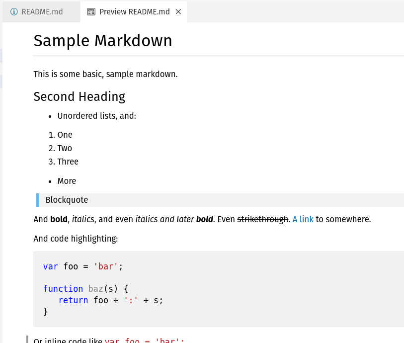
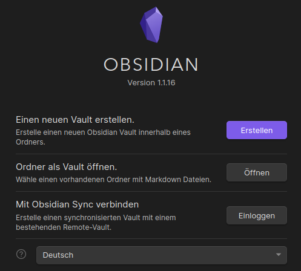

# Slides Thema 14
## Dokumentation mit Markdown

[◀️ Thema 14](README.md)

⚡[Anwesenheit bestätigen](https://moodle.medizintechnik-hf.ch/mod/attendance/manage.php?id=8024)

---

### Lernziele

Ich kann ...
* Markdown-Dokumente erstellen.
* die Markdown-Syntax anwenden.
* Markdown-Erweiterungen verstehen.
* mit Obsidian Markdown-Dateien vearbeiten und verlinken.

---

### Was ist Markdown?

Markdown ist eine vereinfachte Auszeichnungssprache.

Ein Ziel von Markdown ist eine leicht lesbare Ausgangsform bereits vor der Konvertierung.

---

### Beispiel eines Markdown-Dokument

Markdown-Dokumente sind Text-Dateien mit der Dateiendung `.md`.

```markdown
Markdown Lernen
===============

## Einleitung

**Markdown** ist eine vereinfachte Auszeichnungssprache.
```

🤔 Für was stehen die Spezialzeichen `=, #, *`?

---

### Mardown als HTML-Dokument

Markdown kann in HTML umgewandelt werden.

```html
<h1 id="markdown-lernen">Markdown Lernen</h1>
<h2 id="einleitung">Einleitung</h2>
<p><strong>Markdown</strong> ist eine vereinfachte Auszeichnungssprache.</p>
```

ℹ️ Diese Website ist volltständig in Markdown geschrieben.

### README erstellen

🎬 Führen Sie diese Aktionen aus:

* Neuer Ordner `Thema14` erstellen
* Ordner mit VSCode öffnen
* Datei `README.md` mit diesem Code anlegen:

`````markdown
# Sample Markdown

This is some basic, sample markdown.

## Second Heading

 * Unordered lists, and:
  1. One
  1. Two
  1. Three
 * More

> Blockquote

And **bold**, *italics*, and even *italics and later **bold***. Even ~~strikethrough~~. [A link](https://markdowntohtml.com) to somewhere.

And code highlighting:

```js
var foo = 'bar';

function baz(s) {
   return foo + ':' + s;
}
```

Or inline code like `var foo = 'bar';`.

Or an image of bears


The end ...
`````

---

### HTML-Vorschau anzeigen

🎬 Machen Sie einen Rechtsklick auf die Datei `README.md` und wählen Sie *Open Preview*.




---

### Live-Vorschau

🎬 Schiebt das Vorschau-Fenster auf die rechte Seite und bearbeitet das Markdown-Dokument.

---

### Bilder einfügen

Die Anzeige von Bilder ist etwas umständlicher als gewohnt.

🎬 Führen Sie diese Aktionen aus:

* Laden Sie das Bild des Bären herunter: <https://placebear.com/200/200>
	* Rechtsklick auf Bild machen und *Grafik speichern unter* wählen
* Speichern Sie die Datei in denselben Ordner wie `README.md`
* Erstetzen Sie `` mit ``

In der Vorschau sollte das Bild immer noch erscheinen.

---

### Syntax

Es gibt verschiedene Markdown-Syntaxen.

Eine gute Übersicht zur Basis-Syntax bietet: <https://www.markdownguide.org/basic-syntax/>

---

### Erweiterte Syntaxen

Auf derselben Seite findet man eine Liste von weiteren Syntaxen: <https://www.markdownguide.org/extended-syntax/>

---

### Tabelle erstellen

Wenn Github-Flavored-Markdown (GFM) unterstützt wird, können Sie in Markdown-Tabellen erstellen.

🎬 Kopieren Sie den folgenden Code in die `README.md` Datei:

```markdown
| Syntax      | Description |
| ----------- | ----------- |
| Header      | Title       |
| Paragraph   | Text        |
```

---

### Dokumentation mit Markdown

Warum sollte man Dokumente / Dokumentationen mit Markdown erstellen?

* Text-Dateien können immer gelesen werden.
* Es braucht keine zusätzliche Software (Word, Adobe, ...)
* Die Inhalte können als Website publiziert werden

---

### Notizen mit Obsidian

Diese Website wird mit <https://obsidian.md/>.

Obsidian ist eine Knowledge Base, die aber im wesentlichen die Bearbeitung und Verknüpfung von Markdown-Dateien erlaubt.

---

### Obsidian testen

Dieselbe `README.md` Datei können Sie mit Obsidian bearbeiten.

🎬 Führen Sie diese Aktionen aus:

* Obsidain herunterladen und installieren
* Obsidian starten und *Order als Vault öffnen*



* Den Ordner `Thema14` auswählen und öffnen


---

### Verlinkung erstellen

Mit Obsidian können Sie Dateien verlinken.

🎬 Führen Sie diese Aktionen aus:

* Fügen Sie am Ende von `README` den Text `[[About]]` ein
* Halten <kbd>ctrl</kbd> gedrück und klicken Sie auf `[[About]]`

Obsidian erstellt das Dokument `About`. Sie können das Dokument bearbeiten.

---

### Graph-Ansicht öffnen

🎬 Wählen Sie auf der Linken Seite *Graph-Ansicht öffnen*.


Die Verlinkung zwischen dem Dokument `README` und `About` wird visualisiert.

🎬 Erstellen Sie weitere Links und Dokumente.

---

### Was kann mich mit Obsidian?

* Komplexe Dokumentationen schreiben.
* Wikis für das Unternehmen erstellen.
* Persönliche Projekte planen und ausführen.

Es gibt noch weitere Alternativen wie <https://joplinapp.org/>, <https://logseq.com/>

---

### Review

🎯 Wurden die [Lernziele](#lernziele) erreicht?

⚡ Feedback zu den Zielen einholen.

---