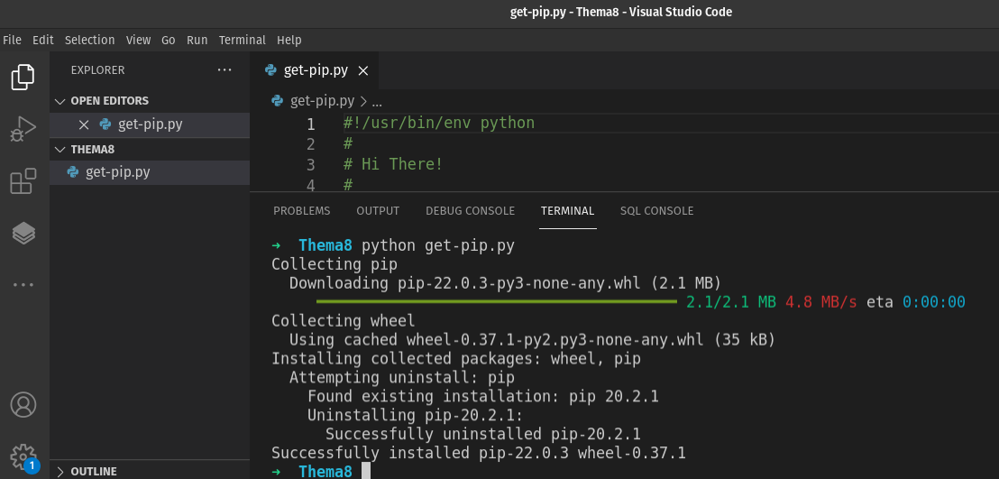
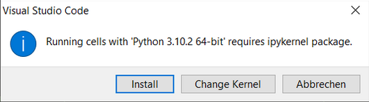
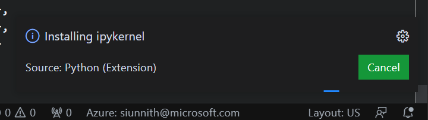
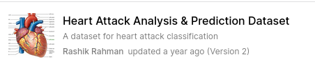

# Übungen Thema 15

## Aufgaben

Aufgaben zum Thema.

Alle Erklährungen und Aufgaben sind im [`ExerciseNotebook.ipynb`](https://raw.githubusercontent.com/janikvonrotz/python.casa/main/topic-15/ExerciseNotebook.ipynb) Jupyter Notebook. Um dieses Notebook zu öffnen und den Inhalt auszuführen wird die Visual Studio Code Jupyter Notebook Extension sowie weitere Python Pakete benötigt. 

Befolgen Sie die nächsten Schritte um die Programmierumgebung bereitzustellen.

### Aufgabe 14.0: pip installieren

Dieser Teil ist optional. Um Python-Pakete zu installieren, verwenden wir die VSCode-Erweiterung *Pip Manager*. Besser aber wäre die eigenständige Installation von pip. Führen Sie die folgenden Aktionen aus, wenn Sie pip für die Kommandozeile installieren möchten.

* Laden Sie die Datei `get-pip.py` unter diesem Link <https://bootstrap.pypa.io/get-pip.py> herunter
* Speichern Sie die Datei in einem Ordner und öffnen Sie diesen mit VSCode
* Starten Sie ein Terminal im Ordner
* Geben Sie `python get-pip.py` ein und installieren Sie pip mit Enter

* War die Installation erfolgreich, können Sie mit dem Befehl `pip install cowsay` die Installation von Python Paketen testen.

::: tip
Falls der `pip`-Befehl im Terminal nicht funktioniert, versuchen Sie es mit `pip3`
:::

### Aufgabe 14.1:  Programmierumgebung aufsetzen

**Jupyter Notebook installieren**

* Öffne Visual Studio Code
* Öffne den Extension Manager (<kbd>ctrl</kbd>+<kbd>shift</kbd>+<kbd>x</kbd>)
* Suche nach `Jupyter` im Suchfeld
* Jupyter Installieren
* Visuals Studio Code neustarten

**Pandas, plotly.express und skelarn Paket installieren**

* Öffne Visual Studio Code
* Öffne den Extension Manager (<kbd>ctrl</kbd>+<kbd>shift</kbd>+<kbd>x</kbd>)
* Suche nach `Pip Manager` im Suchfeld
* Pip Manager Installieren
* Pip Manager öffnen (Neues Symbol auf der linken Seite in Visual Studio)
* Das in der Sidebar ersichtliche "+" Symbol klicken, `pandas` eingeben und mit Enter-Taste installieren
* Das in der Sidebar ersichtliche "+" Symbol klicken, `plotly-express` eingeben und mit Enter-Taste installieren
* Das in der Sidebar ersichtliche "+" Symbol klicken, `scikit-learn` eingeben und mit Enter-Taste installieren
* Das in der Sidebar ersichtliche "+" Symbol klicken, `matplotlib` eingeben und mit Enter-Taste installieren

### Aufgabe 14.2:  Dateien herunterladen und ausführen

Um im Jupyter Notebook fortzufahren müssen folgende Dateien aus dem Python.casa Kurs heruntergeladen werden:

* [`ExerciseNotebook.ipynb`](https://raw.githubusercontent.com/janikvonrotz/python.casa/main/topic-15/ExerciseNotebook.ipynb)
* [`heart.csv`](https://raw.githubusercontent.com/janikvonrotz/python.casa/main/topic-15/heart.csv)

Speichern Sie Dateien mit <kbd>ctrl</kbd> + <kbd>s</kbd>, wenn Sie im Browser angezeigt werden.  Legen Sie die Dateien in einem Ordner ab und öffnen Sie diesen Visual Studio Code.

🎬 Nun können Sie dem gemäss dem Inhalt des Jupyter Notebooks fortfahren.

::: tip
Falls VSCode nach der Erweiterung `ipykernel` fragt, kann man den Dialog mit *Installieren* bestätigen.

:::

### Alternative bei Installationsproblemen

Falls es nicht möglich ist die Programmierumgebung aufzusetzen, kann das ExerciseNotebook.ipynb in einer Browser basierten Jupyter Umgebung ausgeführt werden.

Dabei muss folgendermassen vorgegangen werden
* Öffne [https://www.kaggle.com/code](https://www.kaggle.com/code)
* Klicke *+ New Notebook*
* Klicke auf *+ Add Data* oben rechts
* Suche nach `Heart Attack Analysis & Prediction Dataset` im Suchfenster oben rechts

* Klicke auf *Add* um das Datenset hinzuzufügen, dabei schliesst sich das Fenster
* Kicken Sie *File > Import Notebook > Browse File* und wählen Sie die `` Datei aus (Diese muss vorher heruntergeladen werden)
* Anschliessend *Import* klicken

🎬 Nun können Sie dem gemäss dem Inhalt des Jupyter Notebooks fortfahren.
