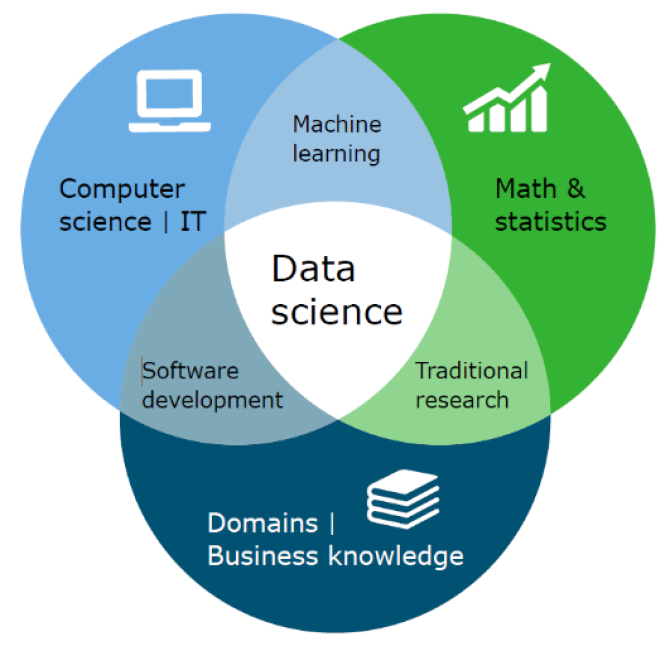
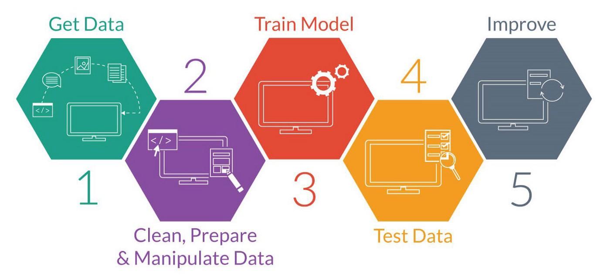
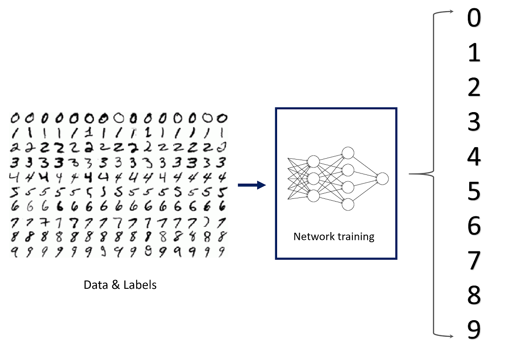
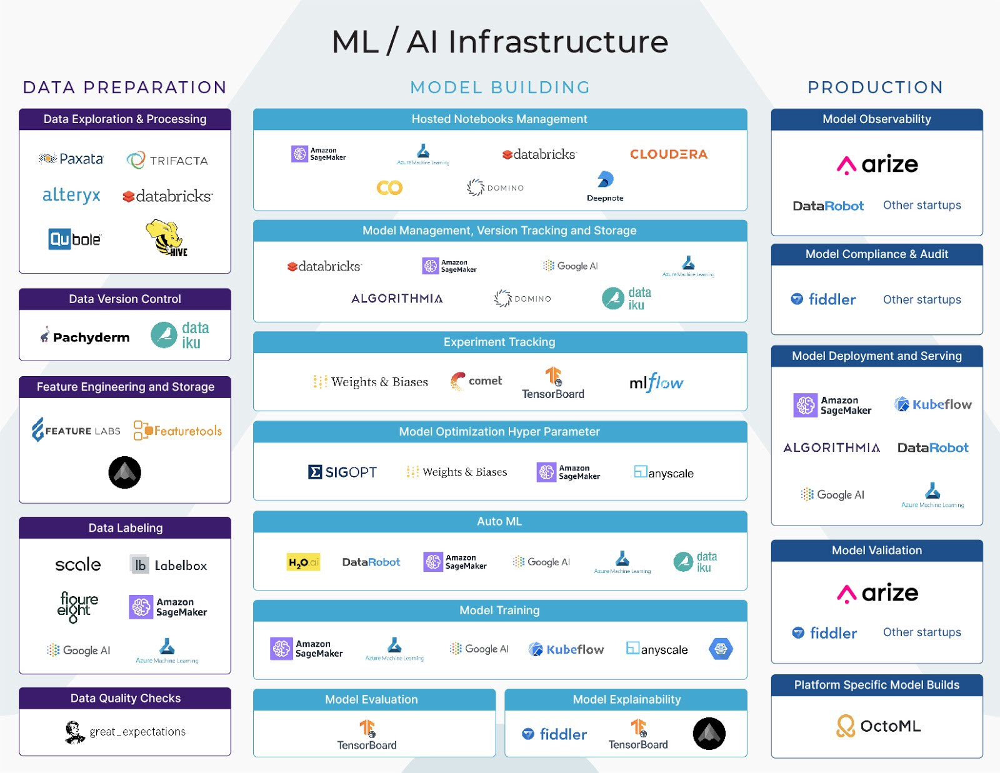

# Slides Thema 15
## Jupiter-Notebooks, Pandas und Plotly

[◀️ Thema 15](README.md)

⚡[Anwesenheit bestätigen](https://moodle.medizintechnik-hf.ch/mod/attendance/manage.php?id=8024)

---

### Sebastian von Rotz

**Hintergrund**:

* Gelernter Chemielaborant
* Bachelor in Biotechnologie
* Master in Data Science

**Aktuelle Tätigkeiten**:

Securecell AG (Medtech / Biotech)
* 60% Applikationsspezialist für Software im Biotechnologie Bereich

ZHAW LSFM
* 40% Wissenschaftlicher Assistent in Fachgruppe Bioprozesstechnologie

♻️ Bioinformatik, Bioprozesstechnologie, Data Science, Software

---

### Ausblick

Themen für die heutigen Lektonen:

* Relevanz *Data Science* Werkzeuge in der Medizintechnik
* Aufsetzen, Bearbeitung und Ausführung von Jupyter Notebooks
* Implementierung der Pandas und Plotly-express Python Pakete
* Laden, Inspizierung, Visualisierung von Daten
* Machine Learning Modell (*AI*) anwenden auf Medizin Technik relevantes Datenset

🎯 Überblick über Anwendung von Datenwissenschaften im Gesundheitsbereich. Jupyter Notebook als Programmierumgebung kennenlernen

---

### Daten im Gesundheitsbereich

Die meisten Daten im Gesundheitsbereich werden natürlich rund um einen Patienten erfasst. Dabei können die art der Daten sehr divers sein[^1] :

* **Physiologisch** (Butdruck, Sauerstoffsättigung,...)
* **Omics-Big Data** (Genom Sequenzierung, Protein Analysen,...)
* **Bildgebend** (Mikroskopie, MRI, X-Ray,...)
* **Logistik** (Spital Mngmt, Temperatur Sensoren)

---

### Quelle der Daten

Nicht nur sind die Daten Typen sind divers, so auch sind die Quellen welche diese erfassen[^2]:

* **Medizintechnische Geräte**
* **Wearables** (Sensoren am Patienten, Smartwatches,...)
* **IoT Sensoren** (Temperatur, Gaszusammensetzung,...)
* **Datenerfassung** von Spitalpersonal

---

### Ziele der Datenwissenschaften im Gesundheitsbereich

**Personalisierung**

Besonders anfallende Daten rund um den Patienten sind von Interesse, da diese es erlauben patientenspezifische Voraussagen Im Kontext der Diagnoistik, Krankheitsverläufe und personalisierter Medizin zu etablieren.

**Voraussage**

Dabei sollen Softwareprodukte und Geräte entwickelt werden welche es erlauben Krankheiten zu detektieren und Krankheitsveräufe vorauszusagen.

**Innovation**

Neue Innovationen vorallem im Bereich computergestützte Modelle zur Predikitiven Diagnostik (Bsp. Herzinfarkt Risiko abschätzen, Automatisches Screenen von Tumoren)

---
### Relevanz in der Medizintechnik

Trend zu Datengetriebenen Diagnose und Monitoring Systemen. Heisst Geräte werden vernetzter und *smarter* und die Hauptkomponente ist ein Modell welches automatisch Daten auswertet.

Beispiele für datengetriebene medizintechnische Systeme:
* IoT in Healthcare
* Remote Monitoring von Patienten
* Automatisches Auswerten von CT-Scans

ℹ️ Ein datengetriebenes Produkt kann sowohl eine Software sein wie auch ein Gerät welches Daten aufzeichnet und diese mittels eines Algorithmus auswertet[^5].
* Software -> Automatische Bildauswertung (Screenen von Lebererkrankung)
* Gerät -> Sensor für physiologische Daten welcher Wahrscheinlichkeit und Verlauf einer Krankheit prediktiert (Smartwatch)

---

### Herausforderungen für datengetriebene Medizintechnik Produkte

Um datengestützte Modelle und datengetriebene Medizinaltechnische Produkte zu etablieren müssen einige Herausforderungen überwunden werden.

* Hohe regulatorische Anforderungen
* Aufreinigung von Daten ist mit grossem Aufwand verbunden
* Kombination von verschiedenen Datenquellen
* Verschiedene Patientendatenbanken (Kantonal)
* Big Data Handhabung

ℹ️ Besonders regulatorische Anforderungen bilden eine grosse Hürde für Datengetriebene Produkte[^3] (Bsp. Black Box Modell wie neuronale Netzwerke)

---

### Data Science im Allgemeinen

Datenwissenschaft (Data Science) ist ein interdisplinäres Fachgebiet zwischen Informatik, Mathematik und einer weiteren Domäne (Biologie, Medizin, Elektronik).

Dabei werden wissenschaftliche Methoden, Algorithmen und Prozesse verwendet um Wissen und Einglick aus strukturierten und unstrukturierten Daten zu gewinnen. Verwertbare Erkenntnisse werden dann wieder als Produkt angewandt

---

### Herangehensweise im Data Science Bereich

Das grundlegende Vorgehen ist immer gleich[^4] :
* Daten erfassen
* Daten bereinigen und vorbereiten
* Ein Modell trainieren
* Das Modell auswerten
* Das Modell weiter optimieren und einsetzen

ℹ️ Grösster Teil der Arbeit findet in der Aggregation und Aufarbeitung statt

---

### Beispiel: Erkennung von handgeschriebenen Zahlen

Neuronales Netzerk (Modell) trainieren mit Bilder von handgeschriebenen Zahlen (Daten)[^6] : 
* Bilder von handgeschribenen Zahlen erfassen
* Bilder mit der korrekten Zahl *labeln*
* Model trainieren (Ziel korrektes Label voraussagen)
* Model optimieren

---

### Datensatz und Modell

Grundsätzlich benötigt man 2 Komponenten:
* **Datensatz**
* **Modell**

Der Datensatz erlaubt es ein Modell auf automatische weise zu trainieren, das Modell erlaubt es dann aufgrund der Daten voraussagen und Prediktionen zu treffen.

---

### Werkzeuge im Data Science Bereich

Es gibt eine schier unüberblickbare Anzahl an Werkzeugen im Data Science Bereich.

Grundlegend werden aber meistens Werkzeuge in den folgenden Kategorien verwendet:
* **Datenverarbeitung**: Daten Datensatz speichern und manipulieren
* **Machine Learning Modell**: Modell trainieren und optimieren
* **Visualisierungen**: Daten und Modell visualisieren

---

### Werkzeuge welche in diesem Kurs verwendet werden

* **Programmierumgebung**: Jupyter Notebook
* **Datenverarbeitung**: Pandas
* **Visualisierungen**: Pandas und Plotly.express
* **Machine Learning Modell**: sklearn
* **Datensatz**: Heart-Attack von Kaggle.com[^7]

---

### Jupyter Notebooks
Quelle[^9]

* Sind *Python Skripte* mit der Datei Endung `.ipynb`
* Kann als ein Dokument angesehen werden welches Text und Codezeilen beinhaltet
* Ein Notebook ist in 2 verwschiedene Zellen aufgebaut:
	* Text Zelle: Text kann in Markdown Syntax geschrieben werden
	* Code Zelle: Code kann in einer Programmiersprache wie Python geschrieben werden

ℹ️ Jupyter Notebooks eignes sich besonder für Data Science Projekte, da Sie eine geordnete Liste an Ein-und Ausgangs Zellen beihnalten, welche Text wie auch Code beinhalten können. Dies wiederspiegelt die Struktur eine typischen Data Science Prozesses.

---

### Pandas 
Quelle[^10]

Um Datensätze einfacher zu handhaben werden diese mittels eines Datenanalyse und Manipulations Werkzeugs bearbeitet. Eines der bekanntesten Werkzeuge is Pandas.

* Daten werde in Dataframes gespeichert
* Das Dataframe kann auf einfache weise manipuliert werden
* Weiter sind diese Dataframes of ein strukturierter Datenbaustein für weitere Applikationen

ℹ️ Ein Dataframe kann man sich wie eine Excel Tabelle vorstellen, also mit Zeilen, Kolonnen und entsprechenden Werte in den jeweiligen Zellen.

---

### Plotly-express 
Quelle[^11]

Das `plotly.express` Python Paket beinhaltet Funktionen um Grafiken und Visualisierungen zu erstellen und ist Teil der Plotly Bibliothek

* Es können über 30 verschieden Arten von Visualisierungstypen erstellt werden
* Die struktur erlaubt aus auf einfache weise zwischen den typer zu wechseln (Bsp. *Line Plot* zu *Scatter Plot*)

ℹ️ Es gibt eine Vielzahl and Visualisierungsprogrammen in Python, jede mit entsprechenden Vor-und Nachteilen.

---

### Datensatz
Quelle[^12]

In der nachfolgenden Übung wir das *Heart Attack Analysis & Prediction Dataset* verwendet. Dies ist ein Trainingsdatenset um Modelle zu entwickeln welche es erlauben aufgrund physiologischen Daten (**13 Parameter**) das Risiko eines Herzinfarktes zu klassifizieren (**1 Output**).

ℹ️ Das Datenset wurde von der Universität California Irwine aggregiert und bereitgestellt. Die UCI hat eine grosse Sammlung an Datensets[^13]

---

### Aufgaben 1

Lösen Sie die ersten zwei Aufgaben.

⚡Aufteilung in Gruppen/Breakout-Rooms ⏱️ 30 Minuten

Ziel: Aufgabe 8.1 und 8.2 gelöst.

---

### Quellen

[^1]: [Integrating Data Science into Medical Device Development](https://www.medtechintelligence.com/feature_article/integrating-data-science-into-medical-device-development/)\
[^2]: [IoT in Healthcare Market Worth $534.3 Billion By 2025 | CAGR: 19.9%](https://www.grandviewresearch.com/press-release/global-iot-in-healthcare-market)\
[^3]: [Regulatorische Anforderungen an Medizinprodukte mit Machine Learning](https://www.johner-institut.de/blog/regulatory-affairs/regulatorische-anforderungen-an-medizinprodukte-mit-machine-learning/)\
[^4]: [ML Vorgehen](https://www.langton.cloud/machine-learning-model-training-over-time/)\
[^5]: [Software und Gerät](http://starfishmedical.com/blog/medical-device-artificial-intelligence/)\
[^6]: [MNIST](https://towardsdatascience.com/image-classification-in-10-minutes-with-mnist-dataset-54c35b77a38d)\
[^7]: [Heart Attack Data](https://towardsdatascience.com/26-datasets-for-your-data-science-projects-658601590a4c)\
[^9]: [JupyterNotebook](https://jupyter.org/)\
[^10]: [Pandas](https://pandas.pydata.org/)\
[^11]: [Plotly-express](https://plotly.com/python/plotly-express/)\
[^12]: [Dataset Heart Attack](https://www.kaggle.com/rashikrahmanpritom/heart-attack-analysis-prediction-dataset)\
[^13]: [UCI](https://archive.ics.uci.edu/ml/datasets/Heart+Disease)
