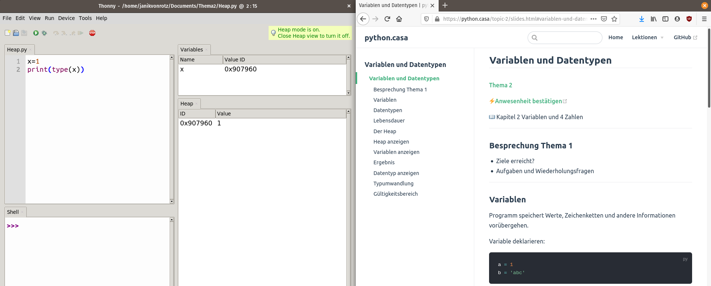

# Thema 2 - Variablen und Datentypen

Umfang ⏱️: 2 Lektionen

[Alle Unterlagen anzeigen](https://github.com/janikvonrotz/python.casa/tree/main/topic-2)

## [Slides](slides.md)

[Hier](slides.md) geht es zu den Slides.

## [Übungen](excercise.md)

[Hier](excercise.md) geht es zu den Übungen.

## Ankündigungen

**Rückblick + Prüfung + Vorbereitung**

Liebe Studentinnen und Studenten

Am vorletzten Freitag haben wir zusammen Python installiert und die ersten Schritte im Programmieren gemacht. Auch wenn die Übung mit dem Terminal nicht funktioniert hat, konnten am Ende alle mit der Entwicklungsumgebung ein Pthyon-Skript ausführen. Wir haben unsere Ziele erreicht.

Damit eine Abschlussnote zum Kurs erstellt werden kann, braucht es zwei Semesternoten. Ich habe deshalb geplant eine Wissensprüfung durchzuführen und eine Leistungsnachweis einzufordern. Die Details dazu findet hier: <https://python.casa/exam.html>. Ich werde alles am Freitag erläutern.

Wir sehen uns am Freitag. Als Vorbereitung könnt ihr das Video [Python3-Einstieg #2 - Variablen](https://youtu.be/X_g7TheTouM) anschauen.

Lieber Gruss

Janik

<!--
**Rückblick + Unterrichtsform + Vorbereitung**

Liebe Studentinnen und Studenten

Am letzten Freitag haben wir zusammen Python installiert und die ersten Schritte im Programmieren gemacht. Auch wenn die Übung mit dem Terminal nicht funktioniert hat, konnten am Ende alle mit der Entwicklungsumgebung ein Python-Skript ausführen. Wir haben unsere Ziele erreicht.

Für das Thema 2 möchte ich an der Unterrichtsform eine Anpassung vornehmen. Es ist sicher verwirrend, wenn ich zwischen den Folien, der Website und der IDE (Visual Studio Code) hin und her wechsle. Für den kommenden Unterrichtsblock möchte ich herausfinden, ob es besser ist, wenn ihr auf der linken Seite eures Bildschirms die IDE geöffnet habt und auf der rechten Seite die Slides von der Website. Dazu ein Beispiel wie das aussehen könnte:

Zoom wäre dann lediglich dazu da, dass ihr meine Stimmen bzw. Anweisungen hört. Ich begleite auch durch die Slides und wir geben fortlaufend unseren Python-Code ein.

Als Vorbereitung könnt ihr das Video [Python3-Einstieg #2 - Variablen](https://youtu.be/X_g7TheTouM) anschauen.

Ich werde das ganze am Freitag nochmals erläutern. Bis dann.

Lieber Gruss

Janik
-->

## Meta

Ziele:
* Variablen
* Basisdatentypen

Kompetenzen: Die Studierenden ...
* können die Notwendigkeit von Variablen erkennen
* können Variablen sinnvoll einsetzen
* kennen die Eigenschaften der verschiedenen Basisdatentypen
	* Numerischen Datentypen
	* Sequentielle Datentypen
	* Zuordnende Datentypen

Didaktische Umsetzung:
* Einführung Variablen Deklaration und Initialisierung
* Selbständige Übungen

Vernetzung:
* Labview
* Eingebette Systeme
* Computernetzwerke

Querverweis Rahmenlehrplan:
* Prozess 11: Systems Engineering Entwurf eines Konzeptes
* Prozess 12: Systeme projektieren
