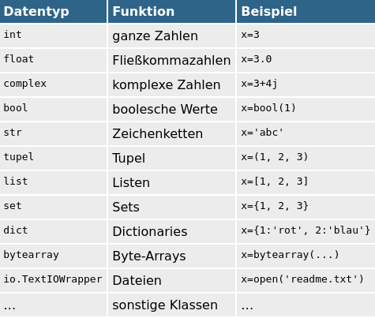
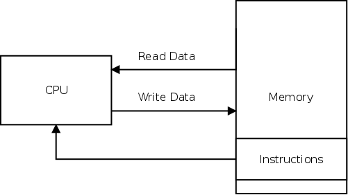
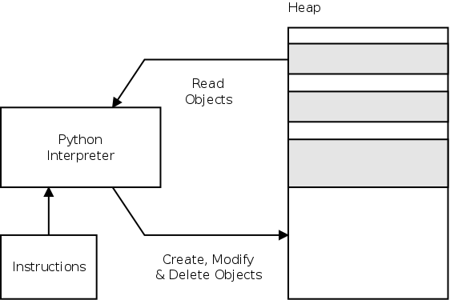
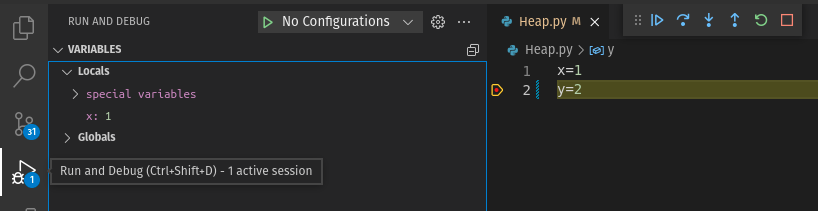

# Slides Thema 2
## Variablen und Datentypen

[◀️ Thema 2](./README.md)

⚡Anwesenheit bestätigen

📖 Kapitel 2 Variablen, 3 Operatoren und 4 Zahlen

---
### Lernziele

Ich kann ...
* Variablen deklarieren und verwenden.
* verschiedene Datentypen und ihre Eigenschaften erläutern.
* je nach Situation den optimalen Datentypen wählen.
* grundlegende mathematische Berechnungen ausführen.

---

### Besprechung Thema 1

* Ziele erreicht?
* Aufgaben und Wiederholungsfragen

---
### Variable

> Eine Variable ist ein Name für eine Leerstelle in einem logischen oder mathematischen Ausdruck.

---

### Variablen

Programm speichert vorübergehend Werte, Zeichenketten und andere Informationen.

Variable deklarieren:

```python
a = 1
xyz = 'abc'
```

---
### Gültige Variablennamen

Normalerweise bestehen Variablennamen aus lauter Kleinbuchstaben. 

```python
einLangerName = 3        # OK
ein_langer_name = 4      # auch OK
länge=3                  # OK, aber unüblich
so gehts nicht = 5       # Fehler: Leerzeichen sind nicht erlaubt.
so-gehts-auch-nicht = 6  # Fehler: Als einziges Sonderzeichen ist _ erlaubt.
```

---
### Datentyp

> Der Datentyp gibt an, von welcher Art die Daten sind, die mit ihm beschrieben werden (Datenvereinbarung), und welche Operationen auf diesen ausgeführt werden können.

---
### Datentypen

Es gibt verschiedene Typen zum Speichern von Daten.



---
### Lebensdauer

Variablen leben bis zum Programmende.

Beim Start eines Programms wird es in den Arbeitsspeicher (Memory) geladen



---
### Der Heap

Im sogenannten Heap speichert Python die Werte der Variablen



---
### Fensterdarstellung wechseln 1

Für den weiteren Verlauf des Unterrichts arbeiten wir mit der IDE und der Website gleichzeitig. Dazu wechseln wir die Fensterdarstellung.

---
### Fensterdarstellung wechseln 2

🎬 Folgende Aktion ausführen:
* IDE öffnen und das Fenster auf die linke Seite schieben
	* Windows: <kbd>windows</kbd> + <kbd>←</kbd> drücken
* [python.casa - Thema 2 Slides](https://python.casa/topic-2/slides.html#fensterdarstellung-wechseln-1) öffnen und auf die rechte Seite schieben
	* Windows: <kbd>windows</kbd> + <kbd>→</kbd> drücken

---
### Skript mit Variablen erstellen

🎬 Folgende Aktionen in der IDE ausführen:
* Neues leeres Skript erstellen
* Datei im neuen Ordner `Thema2` als `Heap.py` speichern
* Diesen Inhalt einfügen:

```python
x=1
y=2
z=3
```

---
### Debugger

---
### Debugger starten

🎬 Folgende Aktionen in der IDE ausführen:
* Klicken Sie links neben der Zeilennummer 2 um einen *Breakpoint* zu setzen
* Starten Sie den Debugger via *Run and Debug*



---
### Datentyp anzeigen

Variablen haben keinen Typ, aber deren Wert.

🎬 Im Programm `Heap.py` diesen Code anfügen und ausführen.

```python
print(type(x)) # Ausgabe: <class 'int'>
```

---
### Aufgaben 1

Lösen Sie die [Aufgabe](excercise2.md#aufgaben) 2.1.

⚡Aufteilung in Gruppen/Breakout-Rooms ⏱️ 10 Minuten

---
### Typumwandlung automatisch

Bei Berechnungen wandelt Python automatisch den Typ um.

🎬 Datei `Umwandlung.py` erstellen, Code eingeben und ausführen.

```python
a = 2 # int
b = 2.4 # float
c = a*b # auch float
print(c) # 4.8
```

---
### Typumwandlung manuell

Im Normalfall müssen Typumwandlungen explizit festgelegt werden.

🎬 Datei `Umwandlung.py` mit Code erweitern und ausführen.

```python
s = 'abc' # str
x = 3 # int
s = s + str(x)
print(s) # Ergebnis 'abc3'
```

---
### Gültigkeitsbereich

Ist eine Variable einmal definiert, kann Sie weiterverwendet werden.

```python
if 1: # das ist immer erfüllt
    x=1 # daher wird diese Zuweisung ausgeführt
print(x) # ok, Ausgabe 1
```

```python
if 0: # das ist nie erfüllt
    x = 1 # daher wird diese Zuweisung nicht ausgeführt
print(x) # Fehler: name 'x' is not defined
```

---
### Zahlen

Python ...
* hat einen nahezu unendlich grossen Zahlenraum
* unterstützt komplexe Zahlen
*  kann Zufallszahlen generieren

---
### Operatoren


---
### Gleicheit

Mit dem `=` macht man eine Zuweisung. Zur Prüfung der Gleicheit braucht es `==`.

```python
print(1 == 1) # Ausgabe: True
```

---
### Restwert

Der `%`-Operator macht eine Division und gibt es Restwert zurück.

```python
7 % 3 # Ausgabe: 1
```

ℹ️  Der Modulo-Operator ist in jeder Programmiersprache verfügbar.

---
### Zuweisung mit Operation

Bestimmte Operatoren kann man zusammennehmen.

```python
a = 1
a = a + 1
```

```python
a = 1
a += 1
```

---
### Division

Gewöhnliche Division liefert immer Fliesskommazahlen.

```python
print(2/3, 6/3) # Ausgabe: 0.6666666666666666 2.0
```

Für ganzzahlige Division `//` verwenden.

```python
print(2//3, 6//3) # Ausgabe: 0 2
```

🎬  Führen Sie die Divisionen aus.

---
### Runden

🎬  Zum Runden die Funktion `round` verwenden.

```python
print(round(1.5)) # Ausgabe: 2
print(round(1.4)) # Ausgabe: 1
```

ℹ️ Mit `help(round)` erfahren Sie mehr zur Funktion.

---
### Zufallszahl generieren

> Die Vertrauenswürdigkeit jeder Verschlüsselung basiert auf der Korrektheit von Zufallszahlen.

Zusätzliche Funktionen können mit `import` importiert werden.

```python
from random import randint
print(randint(0, 7))
```

🎬  Generieren Sie eine Zufallszahl von 1 bis 10.

---
### Boolsche Werte

Boolsche Werte kennen zwei Zustände.

🎬  Führt das folgende Skript aus:

```python
a = True
b = 7==8
c = not 0
d = int(False)
print(a,b,c,d)
```

---
### Aufgaben 2

Lösen Sie die [Aufgaben](excercise2.md#aufgaben) 2.2 bis 2.5 und besprechen Sie die [Wiederholungsfragen](excercise2.md#wiederholungsfragen).

⚡Aufteilung in Gruppen/Breakout-Rooms ⏱️ 10 Minuten

---
### Review

🎯 Wurden die [Lernziele](#lernziele) erreicht?

⚡ Feedback zu den Zielen einholen.
