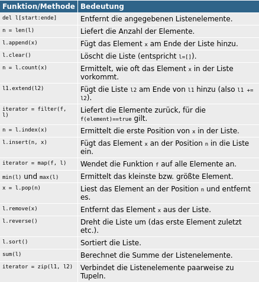

## Kontrollstrukturen und Listen

[Thema 4](README.md)

⚡[Anwesenheit bestätigen](https://moodle.medizintechnik-hf.ch/mod/attendance/manage.php?id=6139) und Webcam einschalten.

📖 Kapitel 7 Listen, Tupel, Sets und Dictionairies  
📖 Kapitel 8 Verzweigungen und Schleifen

---
### Rückblick

Besprechung der Wiederholungsfragen.

---
### Ausblick

Thema 4:
* Listen, Tupel, Sets und Dictionaries
* Verzweigungen und Schleifen

Thema 5:
* Funktionen
* Flowcharts

ℹ️ In diesem Thema werden Funktionen gezeigt.

---
### Listen, Tupel, Sets und Dictionaries

* Mehrere Variablen als Daten speichern
* Aufzählungen verarbeiten

---
### Übersicht Aufzählungstypen

* **Listen**: Wichtigster und flexibelster Datentyp
* **Tupel**: Verwendung für zusammengehörende Daten
* **Sets**: Ungeordnete Menge ohne Doppelgänger
* **Arrays**: Spielt eine untergeordnete Rolle

---
### Listen

* Kann einen bliebigen Datentyp aufnehmen
* Formulierung mit `[]`-Klammern

---
### Thonny vorbereiten

🎬 Führen sie diese Aktionen aus:
* Neuer Ordner `Thema4` erstellen
* Neue Datei in Ordner `Listen.py` erstellen

---
### Liste deklarieren

Wir erstellen eine einfache Liste und geben das dritte Element aus.

🎬 In der IDE ausführen:

```py
lst = [1, 2.3, 'abc', 'efg', 12]
print(lst[2]) # Ausgabe: abc
```

---
### range-Funktion

Mit der Range-Syntax Reihenfolgen definieren.

🎬 In der IDE ausführen:

```py
lst = list(range(10, 101, 10))
print(lst) # Ausgabe: [10, 20, 30, 40, 50, 60, 70, 80, 90, 100]
```

---
### Umwandlung Zeichenkette

🎬 Zeichenketten können einfach in Listen umgewandelt werden.

```py
lst = list('Hello, World!')
print(lst) # ['H', 'e', 'l', 'l', 'o', ',', ' ', 'W', 'o', 'r', 'l', 'd', '!'
```

---
### List Comprehension

* Ein elegantes Konzpet zum verarbeiten von Listen.
* Form: `[ausdruck for x in liste]`

🎬 Fügen sie diesen Code an:

```py
[print(s) for s in lst]
```

ℹ️ Schleifen sind Verarbeitungsmethoden für Listen.

---
### Funktionen zur Verarbeitung

Die wichtigsten Funktionen und Methoden zur Bearbeitung von Liste:



---
### Listenelemente hinzufügen

🎬 Führen sie diese Aktionen aus:
* Erstellen sie die Datei `Funktionen.py`
* Schreiben sie diesen Code:

```py
lst = list(range(10, 101, 10))
lst.extend([110]) # Fügt eins oder mehre Elemente hinzu
lst.pop(2) # Entfernt element an der zweiten Position
lst.remove(80) # Entfern einen bestimmten Eintrag
print(lst)
```

---
### map-Funktion

Mit `map` kann eine Funktion auf jedes Listenelement angewendet werden.

🎬 Fügen sie diesen Code an:

```py
def double(x):
    return x*2

print(list(map(double,lst)))
```

ℹ️ Der Rückgabewert von `map` ist ein Iterator und muss zur Ausgabe in eine Liste umgewandelt werden.

---
### reduce-Funktion

Mit `reduce` wird eine Funktion auf jedes Listenelement (x) und auf das Resultat des Vorgänger (y) angewendet. 

🎬 Fügen sie diesen Code an:

```py
from functools import reduce
def sum(x,y):
    return x+y

print(reduce(sum,lst))
```

---
### filter-Funktion

Mit `filter` werden alle Listenelemente zurückgegeben, die eine Bedingung erfüllen. 

🎬 Fügen sie diesen Code an:

```py
def IstGrösserAls(x,y=100):
    return (x > y)

print(list(filter(IstGrösserAls, lst)))
```

---
### Listen sortieren

Elemente einer Liste werden nicht automatisch sortiert.

🎬 Führen sie diesen Code aus:

```py
lst = list('Hello, World!')
lst.sort()
print(lst) # [' ', '!', ',', 'H', 'W', 'd', 'e', 'l', 'l', 'l', 'o', 'o', 'r']
```

---
### Pause

⚡Wir machen eine Pause ⏱️ 10 Minuten

<iframe src="https://giphy.com/embed/Q6joirtIBHUsw" width="280" height="280" frameBorder="0" class="giphy-embed" allowFullScreen></iframe>

---
### Tupel

*  Ist eine unveränderliche liste
*  Formulierung mit `()`-Klammern

---
### Tupel deklarieren

🎬 Führen sie diese Aktionen aus:
* Erstellen sie die Datei `Tupel.py`
* Schreiben sie diesen Code:

```py
t = (12, 73, 3)
print(t)
```

---
### Tupel Anwendungsfälle

Mit Tupel sind Zuweisungen und Vergleiche mit mehreren Variablen möglich.

🎬 Fügen sie diesen Code an:

```py
(a, b, c) = (1, 2, 3)
if (a, b, c) == (1, 2, 3):
    print('Vollständige Übereinstimmung')
```

---
### Sets

*  Ungeordnete Liste ohne Doppelgänger
*  Formulierung mit `{}`-Klammern

---
### Sets deklarieren

🎬 Führen sie diese Aktionen aus:
* Erstellen sie die Datei `Sets.py`
* Schreiben sie diesen Code:

```py
s = {1,2,3,3}
print(s)
```

---
### set-Methoden

Im Vergleich zu Listen gibt es weitere Methoden zur Bearbeitung eines Sets.

🎬 Fügen sie diesen Code hinzu:

```py
s.add(4)
s.remove(2) # Entfernt Element
s.discard(2) # Gibt keinen Fehler aus, auch wenn Element bereits entfernt ist.
print(s)
```

---
### Dictionaries

* Elementaufzählungen mit einem Schlüssel zur Verwaltung
*  Formulierung mit `{key: value}`

---
### Dictionaries deklarieren

🎬 Führen sie diese Aktionen aus:
* Erstellen sie die Datei `Dict.py`
* Schreiben sie diesen Code:

```py
key = "Blau"
value = '#FFFF00'
d = {'Rot': '#FF0000', key: '#0000FF', "Gelb": value}
print(d)
```

---
### keys und values Methoden

🎬 Fügen sie diesen Code hinzu:

```py
print(d.get('Gelb')) # Ausgabe: #FFFF00
print(d.values()) # dict_values(['#FF0000', '#0000FF', '#FFFF00'])
print(d.keys()) # dict_keys(['Rot', 'Blau', 'Gelb'])
```

---
### Arrays

* Bei vielen Programmiersprachen haben Arrays eine zentrale Bedeutung
* Arrays sind nicht so flexibel wie Listen, Sets und Dictionairies

---
### Aufgaben 1

Lösen sie die ersten zwei Aufgaben.

⚡Aufteilung in Breakout-Rooms ⏱️ 10 Minuten

Ziel: Aufgabe 4.1 und 4.2 gelöst.

---
### Verzweigungen und Schleifen

* **Verzweigungen**: Abhängig von Bedingungen Codeteile ausführen
* **Schleifen**: Code mehrfach ausführen solange Bedingung erfüllt ist

---
### if-Verzweigung

Syntax sollte leicht verständlich sein:

```
if bedingung1:
    block1
elif bedingung2:
    block2
elif bedingung3:
    block3
else:
    block4
```

---
### if-Kurzschreibweise

Die if-Anweisung kann auf einer Zeile definiert werden.

```
x = wert1 if bedingung else wert2
```

ℹ️ In anderen Programmiersprachen gibt es dafür den [*Ternary Operator*](https://developer.mozilla.org/en-US/docs/Web/JavaScript/Reference/Operators/Conditional_Operator)

---
### if-Beispiel

🎬 Erstellen und führen sie die Datei `if.py` mit diesem Inhalt aus:

```py
antwort = input("Möchtest du Feierabend: ")

if antwort in ["Ja", "ja", "jep"]:
    print("Sehr gut!")
else:
    print("Ich glaube dir nicht!")
```

---
### for-Schleife

Die Syntax:

```
for var in elemente:
    anweisungen
```

---
### for mit Zeichenkette

🎬 Erstellen und führen sie die Datei `for.py` mit diesem Inhalt aus:

```py
for c in 'abc':
    print(c)
```

---
### for mit Listen, Tupel und Sets

🎬 Fügen sie diesen Code hinzu:

```py
for c in 'abc':
    print(c)
    
for i in (17, 87, 4): 
    print(i, end=' ') # end Paramter verhindert Zeilenumbruch
```
---
### for mit Dictionaries

Bei Schleifen mit Dictionaries enthält die Variable den Schlüssel.

🎬 Fügen sie diesen Code hinzu:

```py
dict = {'a':12, 'c':78, 'b':3, 'd':43}
for k in dict:
    print(k,dict[k])
for k,v in dict.items():
    print(k,v)
```

---
### while-Schleife

Die Syntax:

```
while bedingung:
    anweisungen
```

---
### while-Beispiel

🎬 Erstellen und führen sie die Datei `while.py` mit diesem Inhalt aus:

```py
i=1
while i<5:
    print(i)
    i+=1
# Ausgabe: 1 2 3 4
```

---
### Aufgaben 2

Lösen sie die nächsten zwei Aufgaben.

⚡Aufteilung in Gruppen/Breakout-Rooms ⏱️ 10 Minuten

Ziel: Aufgabe 4.3 und 4.4 gelöst.

---
### Pause

⚡Wir machen eine Pause ⏱️ 10 Minuten

<iframe src="https://giphy.com/embed/Q6joirtIBHUsw" width="280" height="280" frameBorder="0" class="giphy-embed" allowFullScreen></iframe>

---
### Review

🎯 Ziele erreicht?
*  Aufzählungstypen `[]`, `()`, `{}` und `{key: value}` sind bekannt
*  Die Anwendung von Verzweigungen und Schleifen ist verstanden
*  Listen und Schleifen können kombiniert werden