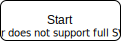

## Funktionen

[Thema 5](readme.md)

⚡[Anwesenheit bestätigen](https://moodle.medizintechnik-hf.ch/mod/attendance/manage.php?id=4479) und Webcam einschalten.

📖 Kapitel 9 Funktionen

---
### Funktionen

Wir haben Funktionen bereits kennengelernt, beispielsweise `len`. 

Funktionen helfen uns:

* Rendundanz zu vermeiden
* Code übersichtlicher zu gestalten

---
### Achtung Funktion

Bei der Anwendung von Funktionen gelten einige Regeln:
* Zuerst definieren dann verwenden
* Funktionen ohne Parameter ist erlaubt
* Alle Datentypen sind als Rückgabewerte erlaubt
* Funktionen können verschachtelt werden
* Mehrere Funktionen dürfen nicht den gleichen Namen haben

---
### Definition einer Funktion

Die Syntax einer Funktion sieht wie folgt aus:

```
def funktionsname(para1, para2, para3):
    code
    mehr code
    noch mehr code
```

----

### Thonny starten und einrichten

🎬 Führen sie diese Aktionen aus:
* Neuer Ordner `Thema5` erstellen
* Neue Datei in Ordner `Funktion.py` erstellen

---
### Funktion ohne Ergebnis

🎬 Diesen Code eingeben:

```py
# Funktion ohne Ergebnis
def f1(x, y):
    print('Parameter 1:', x)
    print('Parameter 2:', y)
```

---
### Funktion mit Ergebnis

🎬 Diesen Code anfügen:

```py
# Funktion mit Ergebnis
def f2(x, y):
  return x+y
```

---
### Funktion ausführen

🎬 Diesen Code anfügen:

```py
# Hier beginnt die Programmausführung
f1(2, 3)
# Ausgabe: Parameter 1: 2
#          Parameter 2: 3

n = f2(4, 5)
print(n) # Ausgabe: 9
```

---
### Lokale und globale Variablen

Variablen haben unterschiediche Gültigkeitsbereiche: Lokal und Global.

Variablen können innerhalb und ausserhalb einer Funktion deklariert werden.

---
### Variable Ausserhalb

🎬 Datei `Ausserhalb.py` erstellen und ausführen:

```py
def f1():
    print(x)

x=3
f1() # Ausgabe 3
```

---
### Lokale Variablen

🎬 Datei `Lokal.py` erstellen und ausführen:

```py
def f1():
    z=5
    print(z)

z=3
f1() # Ausgabe 5
print(z) # Ausgabe 3
```

---
### Globale Variable

Variablen mit der Kennzeichung `global` sind ausserhalb der Funktion verfügbar.

```py
def f1():
    global z
    z=z+3
    print(z) # Ausgabe 6

z=3
f1()
print(z) # Ausgabe 6
```

ℹ️ Das ist nice-to-know. In der Praxis gilt es globale Variablen zu vermeiden

---
### Parameter

* Mit Prameter können Daten an Funktion übergeben werden
* Bei der Parameterdefinition besteht viel Gestaltungsraum

---
### Funktion mit Parameter

🎬 Datei `Parameter.py` erstellen und ausführen:

```py
def f1(x):
    print(x)

f1([1, 2]) # Ausgabe [1, 2]
```

---
### Optionale Parameter

Mit `para=default` definieren sie für einen Parameter einen Standardwert. Dieser ist damit gleichzeitig optional.

---
### Variable Parameteranzahl

Es können mehrere Parameter mit Standardwerten definiert werden.

🎬 Diesen Code anfügen:

```py
def f(a,b,c=-1,d=0):
    print(a,b,c,d)

f(6,7,8,9) # Ausgabe 6 7 8 9
f(6,7,8) # Ausgabe 6 7 8 0
f() # Fehler a und b werden vermisst
```

---
### Parameter mit mehreren Werten

Wenn man einen Parameter mit `*para` oder `**para` definiert kann man beliebig viele Werte übertragen.

* `*para` ist ein Tupel
* `**para` ist ein Dictionary

Das funktioniert auch beim Funktionsaufruf.

---
### Beispiel mehrere Werte

🎬 Datei `Mehrere.py` mit diesem Code erstellen:

```py
def f(a,*b):
    print(a,b,type(b))
    
l = range(0,6)
f(1,l) # Ausgabe 1 (range(0, 6),) <class 'tuple'>
f(*l) # 0 (1, 2, 3, 4, 5) <class 'tuple'>
```

ℹ️ Keep it simple! Verwenden sie einfache Parameter.

---
### Parameter überprüfen

> Im Vergleich zu anderen Programmiersprachen kann bei Python der Typ einer Variable nicht explizit festgelegt werden.

---
### Parameter dennoch überprüfen

🎬 Datei `Ungültig.py` mit diesem Code erstellen:

```py
def f(n):
    if isinstance(n,int):
        return 2*n
    else:
        print('Ungültig')

print(f(1))
```

---
### Rekursion

Funktionen können sich selber aufrufen.

🎬 Datei `Rekursion.py` mit diesem Code erstellen:

```py
def f(n):
    if n < 20:
        print(n)
        n += 1
        f(n)

f(0)
```

---
### Lambda-Funktionen

Die Lambda-Funktion spart Platz.

```
lambda var1, var2, var3, ...: ausdruck
```

Sofern alles auf einer Zeile Platz hat.

---
### filter mit Lambda

Wir erinnern uns an die filter-Funktion? `filter(function,list)`

🎬 Datei `Lambda.py` mit diesem Code erstellen:

```py
l1 = [1,2,3,9,345,36,33]

l2 = list(filter(lambda x: x%3==0, l1))
print(l2) # Ausgabe [3, 9, 345, 36, 33]
```

---
### Aufgaben 1

Lösen sie die ersten zwei Aufgaben.

⚡Aufteilung in Breakout-Rooms ⏱️ 10 Minuten

Ziel: Aufgabe 5.1 und 5.2 gelöst.

---
### Pause

⚡Wir machen eine Pause ⏱️ 10 Minuten

<iframe src="https://giphy.com/embed/3o7aCVTfelG4XSbv3y" width="280" height="280" frameBorder="0" class="giphy-embed" allowFullScreen></iframe>

---
### Flowcharts

Mit Flowcharts kann man einen Vorgang oder Prozess visualisieren.


Zur Darstellung gibt es verschiedene Symbole. Hier die wichtigsten:

---
### Symbol Pfeil

Zeigt den logischen Fluss mit der Verbindung der Symbole.


---
### Symbol Start/Stop

Used for input and output operation.



---
### Symbol Eingabe/Ausgabe

Used for input and output operation.


---
### Symbol Prozess

Used for arithmetic operations and data-manipulations.


---
### Symbol Enscheidung

Used for decision making between two or more alternatives.


---
### Symbol Vorddefinierte Funktion/Prozess

Represents a group of statements performing one processing task.


---
### Flowchart Anwendung

* Mit Flowcharts kann einen Algorithmus dokumentieren
* Mit Flowcharts kann man Pseudo-Code visualisieren

ℹ️ Pseudocode ist schriftliche Beschreibung eines Algorithmus

---
### Aufgaben 2

Lösen sie die ersten zwei Aufgaben.

⚡Aufteilung in Breakout-Rooms ⏱️ 10 Minuten

Ziel: Aufgabe 5.3 und 5.4 gelöst.

---
### Review

🎯 Ziele erreicht?
* Eigene Funktionen schreiben
* Parameter für Funktionen definieren
* Code mit Flowchart visualisieren

---
### Abschluss

Ich hoffe das war nicht viel! Nun habt ihr die wichtigsten Element der Programmierung mit Python.

Jetzt heisst es anwenden!

---

