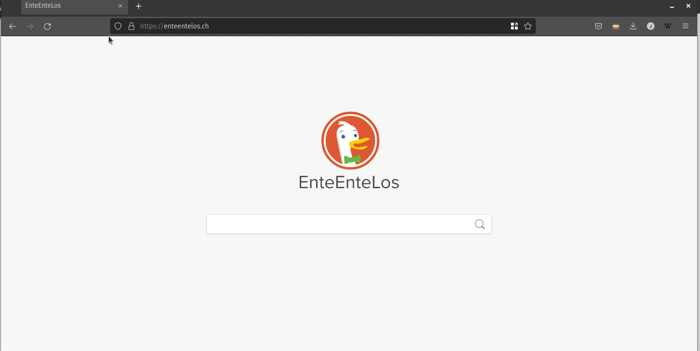

# Übungen Thema 6

## Aufgaben

Aufgaben zum Thema.

### Aufgabe 6.1: Vereinfachen mit Funktion

Für die Ansage von Zugabfahrten wurde ein Programm erstellt.

```python
print("Der nächste Zug fährt nach Bern.")
print("Der nächste Zug fährt nach Luzern.")
print("Der nächste Zug fährt nach Zürch.")
print("Der nächste Zug fährt nach Genf.")
print("Der nächste Zug fährt nach Chur.")
```

Es wird immer der gleiche Satz verwendet, nur der Name des Zuges ändert. Versuchen Sie dieses Programm mit einer Funktion zu vereinfachen.

::: tip
Erstelle Sie eine Funktion `ansage`, die als Parameter den Ort erhält und rufen Sie die Funktion wie folgt auf:

```python
ansage("Bern")
ansage("Luzern")
ansage("Zürich")
ansage("Genf")
ansage("Chur")
```
:::

⭐ [Vereinfachen mit Funktion](https://github.com/janikvonrotz/python.casa/blob/main/topic-6/Vereinfachen%20mit%20Funktion.py)

### Aufgabe 6.2: Vereinfachen mit Schleife

Unser Programm kann noch verbessert werden. Erstellen Sie eine Liste der Orte und übergeben Sie diese als Parameter an die Ansage-Funktion.

⭐ [Vereinfachen mit Schleife.py](https://github.com/janikvonrotz/python.casa/blob/main/topic-6/Vereinfachen%20mit%20Schleife.py)

### Aufgabe 6.3: Währungswechsel

Sie haben ein Programm geschrieben, welches Franken in Euro umrechnet. Dabei haben Sie für die Wechselrate und den Franken globale Variablen verwendet.

```python
rate = 0.95
input_chf = 500

def wechsel():
	return input_chf * rate

output_eur = wechsel()

print(output_eur)
```

Passen Sie das Programm so an, dass die Funktion `wechsel` den Franken als Parameter `input_chf` und die Wechselrate als `rate` entgegennimmt.

⭐ [Währungswechsel](https://github.com/janikvonrotz/python.casa/blob/main/topic-6/Währungswechsel.py)

### Aufgabe 6.3: Währungswechsel

Übernehmen Sie die Funkion aus der vorhergehenden Aufgaben und definieren Sie einen Standardwert für den Parameter `rate` mit dem Wert `0.8`.

⭐ [Standardwert](https://github.com/janikvonrotz/python.casa/blob/main/topic-6/Standardwert.py)

### Aufgabe 6.5: Parameter validieren

Wir möchten sicherstellen, dass die Ansage-Funktion nur Variablen vom Typ `str` verarbeitet. Erstellen Sie eine entsprechende Prüfung vor der Ausgabe.

```python
def ansage(ort):
	print(f"Der nächste Zug fährt nach {ort}.")
```

⭐ [Parameter berechnen](https://github.com/janikvonrotz/python.casa/blob/main/topic-6/Parameter%20validieren.py)

### Aufgabe 6.6: Freigabe

Sie haben diese Funktion geschrieben:

```python
def freigabe(kosten):
	if kosten < 2000 and kosten > 0:
		return True
	else:
		return False

betrag1 = 1000
betrag2 = 3000
print(freigabe(betrag1))
print(freigabe(betrag2))
```

Schreiben Sie die `freigabe` Funktion als Lamdba und weisen Sie die Funktion der Variable `freigabe` zu.

⭐ [Freigabe](https://github.com/janikvonrotz/python.casa/blob/main/topic-6/Freigabe.py)

### Aufgabe 6.7: Quersumme berechnen

Schreiben Sie eine Funktion `quersumme(zahl)`, welche die Quersumme von `zahl` berechnet und zurückgibt.

::: tip
Wenn man die Zahl in einen String umwandelt kann man Sie in einer Schleife verarbeiten.
:::

⭐ [Quersumme berechnen](https://github.com/janikvonrotz/python.casa/blob/main/topic-6/Quersumme%20berechnen.py)


### Aufgabe 6.8: Rekursion auf der Festplatte

Schreiben Sie eine rekursive Funktion, die als Parameter einen Ordnerpfad erwartet und alle Unterordner ausgibt.

::: tip
Dazu eine Hilfestellung. Das folgende Programm gibt alle Dateien und Ordner unterhalb eines bestimmten Ordnerpfads aus:

```python
import os

basepath = '/pfad/to/my/directory'

for entry in os.listdir(basepath):

	fullpath = os.path.join(path, entry)

    if os.path.isfile(fullpath):
        print("Datei: ", entry)
		
    if os.path.isdir(fullpath):
        print("Ordner:", entry)
```
:::

⭐ [Rekursion auf der Festplatte](https://github.com/janikvonrotz/python.casa/blob/main/topic-6/Rekursion%20auf%20der%20Festplatte.py)

### Aufgabe 6.9: Filtern mit Lambda

Kopieren Sie die Datenstruktur von <https://jsonplaceholder.typicode.com/users> nach Python.



Filter sind alle Benutzer aus der Liste, die eine Telefonnumer haben, die mit einer `1` beginnt. Verwenden Sie dazu eine Lambda-Funktion.

::: tip
Verwenden Sie die folgende Bausteine:

```python
print(user.get('email'))
```

```python
for user in users:
```

```python
filter(lambda user: user["name"] == "Leanne Graham", data)
```

```python
users = list(filter)
```
:::

⭐ [Filtern mit Lambda](https://github.com/janikvonrotz/python.casa/blob/main/topic-6/Filtern%20mit%20Lambda.py)

### Aufgabe 6.10: Chart to Code

Schreiben Sie diese Flowchart als Code:


⭐ [Chart to Code](https://github.com/janikvonrotz/python.casa/blob/main/topic-6/Chart%20to%20Code.py)

### Aufgabe 6.11: Code to Chart

Erstellen Sie einen Flowchart mit [diagrams.net](https://app.diagrams.net) anhand dieses Codes:

```python
spicyfood = input("Do you like spicy food? True or False?")
if spicyfood == "True":
    level = input("How spicy do you like it? hot, very hot, super hot ?")
    if level == "super hot":
        print(f"The user likes {level} spicy food!")
    else:
        print("The user likes spicy food!")
if spicyfood == "False":
    print("The user hates spicy food!")
```

⭐ [Code to Chart](https://github.com/janikvonrotz/python.casa/blob/main/topic-6/Code%20to%20Chart.svg)

### Aufgabe 6.11: Hangman

Entwickeln Sie das Spiel *Hangman*. Implementierung Sie dazu folgende Punkte:
* Zu Finden des Worts hat man 5 Versuche
* Das zu suchende Wort wird in Grossbuchstaben umgewandelt
* Der eingegebene Buchstabe wird in Grossbuchstaben umgewandelt
* Das zu suchende Wort wird als Liste gespeichert

::: tip

Als Anschub haben wir die folgenden Bausteine:

```python
wort = list("python".upper())
laenge = len(wort)
zensiert = list(laenge * '_')
versuche = 5
gefunden = []
gewonnen = False
```

```python
if eingabe in wort:
        gefunden.extend([eingabe])
```

```python
while versuche > 0  and not gewonnen:
    eingabe = input("Geben Sie einen Buchstaben ein: ").upper()
```

```python
for i in range(0, laenge):
	if wort[i] in gefunden:
		zensiert[i] = wort[i]
```

```python
if '_' not in zensiert:
	gewonnen = True
	print("Du hast gewonnen!")
```

```python
if not gewonnen:
    print("Du hast verloren!")
```

```python
print(f"Treffer! Der aktuelle Stand: {' '.join(zensiert)}.")
print(f"Deine Treffer: {' '.join(gefunden)}.")
```
:::

⭐ [Hangman](https://github.com/janikvonrotz/python.casa/blob/main/topic-6/Hangman.py)

## Wiederholungsfragen

**W1**: Die in Python vordefinierten Funktionen min und max ermitteln das kleinste bzw. größte Element einer Liste. Programmieren Sie die Funktion minmax, die die beiden entsprechenden Elemente als Tupel zurückgibt – natürlich, ohne auf min und max zurückzugreifen.

<details>
Die triviale Lösung zur Aufgabenstellung greift auf die vorgegebenen min- und max-Funktionen zurück und gibt die beiden Ergebnisse als Tupel zurück:
<pre>
def minmax(lst):   
    return min(lst), max(lst)
</pre>
Wenn Sie die Funktion selbst implementieren, müssen Sie in einer Schleife alle Elemente der Liste durchlaufen – das ist Ihnen vermutlich klar. Schwierig ist es, Startwerte für die beiden Ergebnisvariablen min und max zu wählen. Sie könnten für min eine sehr große und für max eine sehr kleine Zahl nehmen (min=100000 und max=-100000). Wenn die Liste dann allerdings noch kleinere oder noch größere Werte enthält, erhalten Sie ein falsches Ergebnis.
Auf der sicheren Seite sind Sie, wenn Sie als Startwerte einfach das jeweils erste Element der Liste verwenden. Wenn Sie Glück haben, ist das schon das Endergebnis. Wenn nicht, werden min bzw. max in der for-Schleife immer wieder korrigiert, bis die beiden Variablen schließlich den kleinsten bzw. größten Wert enthalten.
<pre>
# Beispieldatei minmax.py  
def minmax(lst):   
    min = lst[0]   
    max = lst[0]      
    for itm in lst:   
        if itm &lt; min:   
            min = itm   
        if itm > max:   
            max = itm   
    return (min, max)  # Tupel zurückgeben
</pre>
</details>

**W2**: Ein Palindrom ist ein Text, der von vorn und hinten gelesen den gleichen Inhalt hat – z. B. "Lagerregal" oder "Trug Tim eine so helle Hose nie mit Gurt?"". Leer- und Satzzeichen werden dabei ignoriert. Weitere Beispiele finden Sie hier: <https://de.wikipedia.org/wiki/Palindrom>. Schreiben Sie eine Funktion, die testet, ob eine Zeichenkette ein Palindrom ist. Tipp: Verwenden Sie die Funktion str.isalpha, um zu testen, ob ein Zeichen ein Buchstabe ist.

<details>
Die Lösungsfunktion wandelt die übergebene Zeichenkette zuerst in Kleinbuchstaben um und bildet daraus eine Liste. Aus dieser Liste filtert Sie nun mit isalpha alle Buchstaben heraus und eliminiert so Leer- und Satzzeichen. join bildet aus den verbliebenen Listenelementen wieder eine Zeichenkette. Als Rückgabeergebnis gilt der Test, ob diese Zeichenkette identisch ist mit einer Zeichenkette in umgekehrter Reihenfolge (Slicing-Notation [::-1]).
<pre>
# Beispieldatei palindrom.py  
def palindrom(s):          
    lst = list(s.lower())  
    plainlst = filter(str.isalpha, lst)        
    plain = ''.join(plainlst)     
    return plain == plain[::-1]
</pre>
</details>

**W3**: Die Python-Funktion sum(a, b, c) berechnet die Summe aller übergebenen Parameter. Schreiben Sie eine äquivalente Funktion prod, die alle Parameter multipliziert.

<details>
Der entscheidende Punkt bei dieser Aufgabe ist die variable Parameteranzahl, die Sie in der Schreibweise *para realisieren. Innerhalb der Funktion können Sie auf die übergebenen Elemente in Form einer Liste zugreifen. Davon ausgehend gibt es mehrere Lösungsvarianten. Am naheliegendsten ist die Programmierung einer Schleife. Dabei wird der erste Parameter in der lokalen Variablen result gespeichert und in der Folge mit allen weiteren Parametern (Slicing-Notation [:1]) multipliziert.
<pre>
# Beispieldatei prod.py  
def prod(*f):  
    result = f[0]  
    for factor in f[1:]:  
        result = result * factor  
    return result
</pre>
»Schöner« wird der Code (zumindest in Python-Denkweise), wenn Sie die reduce-Funktion anwenden. An reduce müssen Sie eine Lambda-Funktion übergeben, die die Multiplikation durchführt:
<pre>
from functools import reduce  
def prod(*f):  
    if len(f)&lt;2:  
        return f[0]  
    else:  
        return reduce(lambda x, y: x*y, f)
Auf die Lambda-Funktion können Sie verzichten, wenn Sie wissen, dass Sie alle Python-Operatoren im operator-Modul auch als Funktionen zur Verfügung stehen:
import operator  
def prod(*f):  
    if len(f)&lt;2:  
        return f[0]  
    else:  
        return reduce(operator.mul, f)
</pre>
</details>

**W4**: Schreiben Sie eine Funktion, die eine Zeichenkette nach allen Vorkommen einer anderen Zeichenkette durchsucht und die Startpositionen als Liste zurückgibt. Beispiel:

```python
print(findAll('abcefgabcxyzabcd', 'abc'))
# Ausgabe: [0, 6, 12]
```

<details>
findAll sucht zuerst nach dem ersten Vorkommen von pattern in s. Wenn es eines gibt, also pos einen Wert ungleich –1 enthält, wird dieser Wert in der while-Schleife dem Ergebnis hinzugefügt. Danach wird die Suche an der Stelle pos+1 fortgesetzt.
<pre>
# Beispieldatei findall.py  
def findAll(s, pattern):  
    matches = []  
    pos = s.find(pattern)  
    while pos != -1:  
        matches += [pos]  
        pos = s.find(pattern, pos+1)  
    return matches
</pre>
</details>