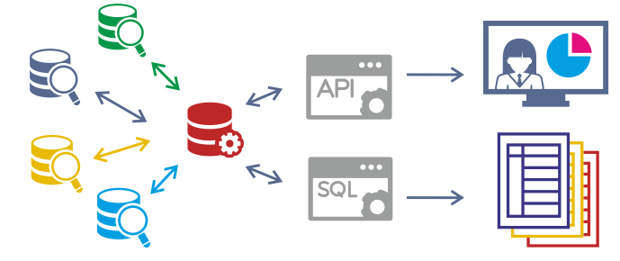
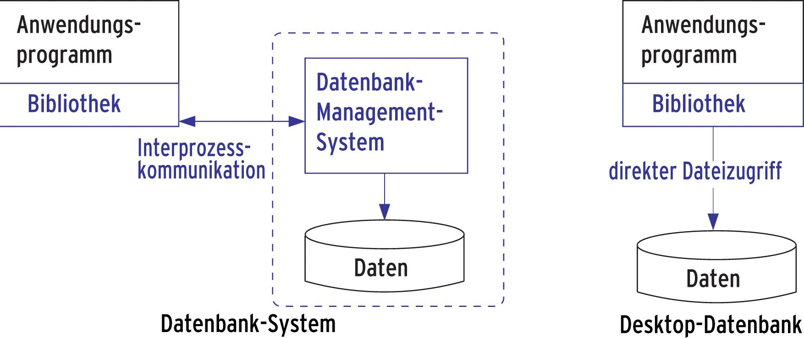
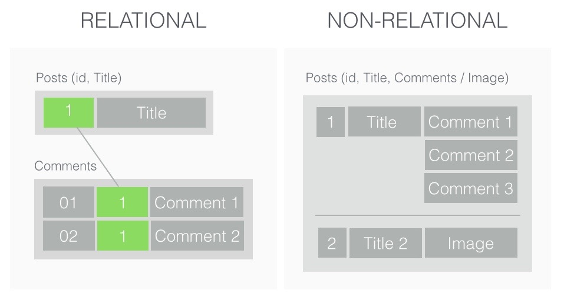
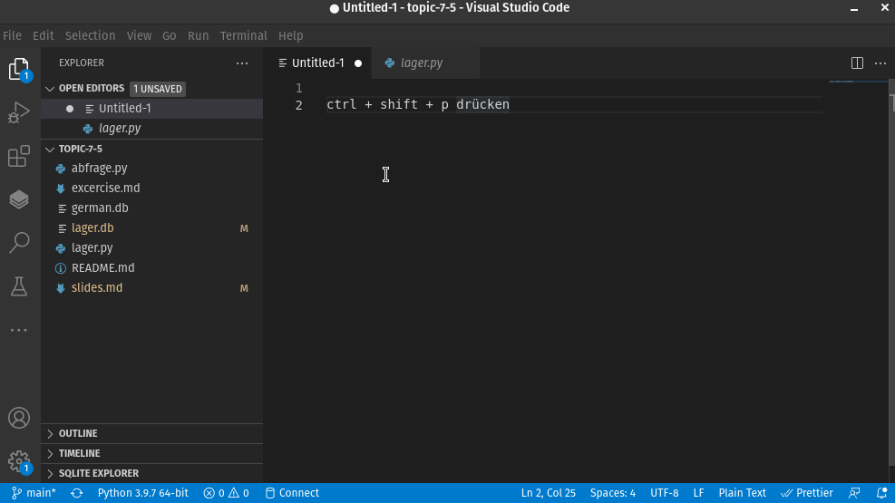

## Datenbanken

[Thema 7.5](./README.md)

⚡[Anwesenheit bestätigen](https://moodle.medizintechnik-hf.ch/mod/attendance/manage.php?id=6139)

📖 Kapitel 16.3 MySQL/MariaDB-Datenbankzugriff

---

### Program

- Unterricht durchführen
- Besprechen Wissensprüfung / Feedback
- Rückmeldung Projektvorschläge

---

### Pip Manager installieren

Mit ver VSCode-Erweiterung *Pip Manager* können sie *pip* Pakete verwalten.

🎬 Installieren sie die Erweiterung *Pip Manager* mit VSCode:


---

### Grosse Datenmengen

Wie man Text-Daten liest und speichert, wissen wir. Im Umgang mit grossen Datenmengen ergeben sie neue Fragen:
* Wie speichert man grosse Datenmengen?
* Wie stellt man sicher, dass in den Daten keine Fehler sind?
* Wie ermöglicht man den Zugriff für mehrere Programme auf dieselben Daten?

---

### Daten zentral speichern

Daten in einer Datenbank an einem Ort speichern.




---

### Was ist eine Datenbank?

>  Eine Datenbank ist ein System zur **elektronischen Verwaltung von Daten**. Die Kernaufgabe von Datenbanken liegt in der effizienten, dauerhaften und fehlerfreien Speicherung großer Datenmengen sowie in der bedarfsgerechten Bereitstellung benötigter Informationen.

ℹ️ Das Gegenteil einer Datenbank ist Excel.

---

### Datenbanken bereitstellen

Auf einem Server installiert man ein Datenbankmanagementsystem.



Auf dem Desktop kann man direkt auf die Datenbank zugreifen.

---

### Welche Datenbanktypen gibt es?

Grundtypen:
* **Relational**: Definierte Tabellen und Spalten, Abfragen und Manipulation von Daten nur in diesem Raster möglich.
* **NoSQL/Non-Relational**: Schema ist freiher, dafür Datenkonsistenz nicht gegeben.

---

### Beispiel Relational/Non-Relational



---

### Relationales Datenbankmanagementsystem

Es gibt verschiedene RDBMS. Wir interessieren uns für *PostgreSQL* und *SQLite*.

* **PostgreSQL**: Komplexes Datenbanksystem, dass auf Server installiert wird.
* **SQLite**: Ist im wesentlichen eine Datenbankdatei, die überall installiert werden kann.

---

### SQLite

Ist die meist verbreitete Datenbank-Engine[^1]. Sie ist auf jedem Smartphone vorhanden.


Wie viele andere Datenbanksysteme ist SQLite SQL-basiert. Bei SQL (Structured Query Language) handelt es sich um die am meisten verwendete Datenbanksprache.

---

### Python und SQLite

Mit Python können wir eine SQLite-Datenbank erstellen und bearbeiten. Wir wollen diese Lager-Tabelle erstellen:

| ID  | Name        | Referenz  | Barcode      | Lager | Preis |
| --- | ----------- | --------- | ------------ | ----- | ----- |
| 1   | Holztisch   | E-COM06   | 601647855633 | 3     | 147   |
| 2   | Bürostuhl   | FURN_7777 | 601647855634 | 1     | 70.50 |
| 3   | Abfalleimer | E-COM10   | 601647855649 | 5     | 43    |

---

### Vorgehen

Eine Datenbank wird in den folgenden Schritten erzeugt:
-   Anlegen der Datenbank
-   Anlegen von Datenbanktabellen durch Angabe der Struktur
-   Eingabe der Datensätze in die Datenbanktabellen

---

### Modul und Datentypen

SQLite wird über das Modul `sqlite3` direkt in Python eingebunden. Es bietet standardmäßig die folgenden Datentypen:

-   **TEXT**: Für Zeichenketten
-   **INTEGER**: Für ganze Zahlen
-   **REAL**: Für Zahlen mit Nachkommastellen
-   **BLOB**: Für _binary large objects_, also große binäre Datenmengen
-   **NULL**: Entspricht _None_ in Python

🤔  Wie ordnen sie die Datentypen der Spalten der Lager-Tabelle zu?

---

### VSCode vorbereiten

🎬 Führen sie diese Aktionen aus:
* Neuer Ordner `Thema7.5` erstellen
* Ordner mit VSCode öffnen
* Datei `lager.py` anlegen

---

### Datenbank-Datei erzeugen

Aktualisiert die Datei `lager.py` mit diesem Code:

```py
import os, sys, sqlite3

# Datei entfernen wenn existiert
if os.path.exists("lager.db"):
    os.remove("lager.db")

# Verbindung zur Datenbank erzeugen
connection = sqlite3.connect("lager.db")

# Datensatz-Cursor erzeugen
cursor = connection.cursor()
```

---

### Tabelle erstellen

🎬 Mit SQL erstellen wir nun eine Tabelle. Fügen sie diesen Code hinzu:

```py
# Datenbanktabelle erzeugen
sql = """CREATE TABLE lager(
    id INTEGER PRIMARY KEY,
    name TEXT,
    referenz TEXT ,
    barcode TEXT,
    lager INTEGER,
    preis REAL)"""
cursor.execute(sql)
```

---

### Datensatz hinzufügen

🎬 Fügen sie diesen Code an, um einen Datensatz zu erzeugen:

```py
# Datensatz erzeugen
sql = "INSERT INTO lager VALUES(1, 'Holztisch', 'E-COM06', '601647855633', 3, 147)"
cursor.execute(sql)
connection.commit()

# Verbindung beenden
connection.close()
```

🎬 Führen sie das Programm `lager.py` aus. Es wird nun eine `lager.db` Datei erstellt.

---

### Datenbank anschauen

Mit dieser VSCode-Erweiterung können sie die Datenbank-Datei anschauen:


🎬 Installieren sie diese Erweiterung.

---

### SQLite Datenbank anschauen

🎬 Zeigen sie den Inhalt von `lager.db` wie folgt an:



---

### Weitere Datensätze einfügen

🎬 Fügen wie weitere Datensätze hinzu, indem sie den Code unten an der richtigen Stelle einfügen.

```py
# Datensatz erzeugen
sql = "INSERT INTO lager VALUES(1, 'Holztisch', 'E-COM06', '601647855633', 3, 147)"
cursor.execute(sql)
sql = "INSERT INTO lager VALUES(2, 'Bürostuhl', 'E-COM06', '601647855634', 1, 70.50)"
cursor.execute(sql)
sql = "INSERT INTO lager VALUES(3, 'Abfalleimer', 'E-COM06', '601647855649', 5, 43)"
cursor.execute(sql)
connection.commit()
```

---

### Daten abfragen

Wir möchten die Daten mit SQL/Python auslesen.

🎬 Erstellen sie eine neue Datei `abfragen.py`.

---

### Alle Datensätze anzeigen

🎬 Ergänzen sie `abfragen.py` und führen sie den Code aus.

```py
import sqlite3

# Verbindung, Cursor
connection = sqlite3.connect("lager.db")
cursor = connection.cursor()

# SQL-Abfrage
sql = "SELECT * FROM lager"

# Absenden der SQL-Abfrage und Empfang des Ergebnis
cursor.execute(sql)

# Ausgabe des Ergebnis
for datensatz in cursor:
    print(datensatz[1])
    print(datensatz)

# Verbindung beenden
connection.close()
```

🤔 Wie kann man nur bestimmte Datensätze ausgeben?

---

### Daten filtern

Das Schlüsselwort heisst `WHERE`.

🎬 Ersetzen sie die SQL-Abfrage mit:

```py
sql = "SELECT * FROM lager WHERE id = 1"
```

ℹ️ SQL hat eine andere Syntax als Python.

🤔 Wie kann man bestimmte Datensätze verändern?

---

### Datensatz verändern

Das Schlüsselwort heisst `UPDATE`.

🎬 Ersetzen sie die SQL-Abfrage mit:

```py
# Datensatz aktualisieren
sql = "UPDATE lager SET preis = 71 WHERE id = 2"
cursor.execute(sql)
connection.commit()

# SQL-Abfrage
sql = "SELECT * FROM lager WHERE id = 2"
```


🤔 Wie kann man bestimmte Datensätze löschen?

---

### Datensatz löschen

Das Schlüsselwort heisst `DELETE`.

🎬 Ersetzen sie die SQL-Abfrage mit:

```py
# Datensatz löschen
sql = "DELETE FROM lager WHERE id = 3"
cursor.execute(sql)
connection.commit()

# SQL-Abfrage
sql = "SELECT * FROM lager"
```

---

### CRUD

Wir haben gerade die CRUD-Operationen angewendet:

* **C**: Create
* **R**: Read
* **U**: Update
* **D**: Delete

---

### Mehr zu SQL

SQL wird von verschiedenen Datenbanksystemen unterstützt.

Wer mehr zu SQL wissen wollt, besucht das [SQL Tutorial](https://www.w3schools.com/sql/).

---

### Aufgaben 1

Lösen sie die ersten zwei Aufgaben.

⚡Aufteilung in Gruppen/Breakout-Rooms ⏱️ 10 Minuten

Ziel: Aufgabe 7.5.1 und 7.5.2 gelöst.

---

### Ausblick

* Bioinformatik mit Python
* Experte eingeladen 🙏 Alle anwesend

---

### Restliche Zeit

* Arbeit an Leistungsnachweis
* Fragen zu Prüfung klären

---

### Referenzen

[^1]: https://www.sqlite.org/mostdeployed.html