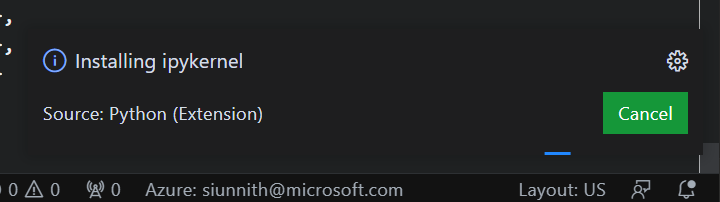

# Übungen Thema 8

## Aufgaben

Aufgaben zum Thema.

Alle Erklährungen und Aufgaben sind im [ExerciseNotebook.ipynb](ExerciseNotebook.ipynb) Jupyter Notebook. Um dieses Notebook zu öffnen und den Inhalt auszuführen wird einerseits die Visual Studio Code Jupyter Notebook Extension, sowie zwei weitere Python Pakete benötigt. 

Befolgen Sie die nächsten Schritte um die Programmierumgebung zu erweitern.

### Aufgabe 8.1:  Programmierumgebung aufsetzen

**Jupyter Notebook installieren**

* Öffne Visual Studio Code
* Öffne den Extension Manager (ctrl+shift+x)
* Suche nach `Jupyter` im Suchfeld
* Jupyter Installieren
* Visuals Studio Code neustarten

**Pandas, plotly.express und skelarn Paket installieren**

* Öffne Visual Studio Code
* Öffne den Extension Manager (ctrl+shift+x)
* Suche nach `Pip Manager` im Suchfeld
* Pip Manager Installieren
* Pip Manager öffnen (Neues Symbol auf der linken Seite in Visual Studio)
* Das in der Sidebar ersichtliche "+" Symbol klicken, `pandas` eingeben und mit Enter-Taste installiren
* Das in der Sidebar ersichtliche "+" Symbol klicken, `plotly-express` eingeben und mit Enter-Taste installiren
* Das in der Sidebar ersichtliche "+" Symbol klicken, `scikit-learn` eingeben und mit Enter-Taste installiren

### Aufgabe 8.2:  ExerciseNotebook.ipynb

Um im Jupyter Notebook fortzufahren müssen folgende Dateien aus dem Python.casa Kurs heruntergeladen werden. Diese Dateien müssen in einem Beliebiegen Ordner gespeicher werden, welcher dann in Visual Studio Code geöffnet werden kann.
* ExerciseNotebook.ipynb
* heart.csv

🎬 Nun können Sie dem gemäss dem Inhalt des Jupyter Notebooks fortfahren

::: tip
Falls VSCode nach der Erweiterung `ipykernel` fragt, kann man den Dialog mit *Installieren* bestätigen.

:::

### Alternative bei Installationsproblemen

Falls es nicht möglich ist die Programmierumgebung aufzusetzen, kann das ExerciseNotebook.ipynb in einer Browser basierten Jupyter Umgebung ausgeführt werden.

Dabei muss folgendermassen vorgegangen werden
* Öffne: https://www.kaggle.com/code
* Klicke "+ New Notebook" 
* Klicke auf "+ Add Data" 
* Suche nach "Heart Attack Analysis & Prediction Dataset Heart Attack Analysis & Prediction Dataset" im Suchfenster oben rechts
* Klick "ADD" um das Datenset hinzuzufügen, dabei schliesst sich das Fenster
* Kicken sie "File" -> "Import Notebook" -> "Browse File" und wählen sie die "ExerciseNotebook.ipynb" Datei aus (Dies muss vorher heruntergeladen werden)
* Anschliessend "Import" klicken

🎬 Nun können Sie dem gemäss dem Inhalt des Jupyter Notebooks fortfahren
