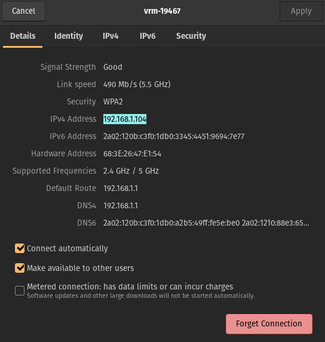

# Übungen Thema 8

## Aufgaben

Aufgaben zum Thema.

### Aufgabe 8.1: Fehler abfangen

Sie erhalten ein einfache Liste und möchten das erste und das letzte Element ausgeben:

```python
l = ['ZeroDivisionError', 'NameError', 'IndentationError', 'IOError', 'EOFError', 'IndexError']
print(l[0])
print(l[6])
```

Sie haben sicher verzählt und das Programm wirft einen Fehler. Fangen Sie den Fehler mit einen `try-catch` Bock ab

```python
try:
	
except:
	print('Es gibt einen Fehler im Code!')
```

⭐ [Fehler abfangen](https://github.com/janikvonrotz/python.casa/blob/main/topic-8/Fehler%20abfragen.py)

### Aufgabe 8.2: Datentyp-Fehler behandeln

Wir nehmen an Sie haben diese Python-Funktion:

```python
def pluszwei(zahl):
	return (zahl + 2)
```

Und verwenden sie in ihrem Programm.

```python
print(pluszwei(2))
print(pluszwei('3'))
```

Bei der Ausführung erhalten Sie einen Fehler vom Typ `TypeError`. Fangen Sie diesen Fehlertyp in ihrem Programm mithilfe von `try` and `except` ab und geben Sie einen Hinweis zur Korrektur des Programms aus.

⭐ [Datentyp-Fehler abfangen](https://github.com/janikvonrotz/python.casa/blob/main/topic-8/Datentyp-Fehler%20behandeln.py)

### Aufgabe 8.3: Datei verarbeiten

Erstellen Sie eine Datei `Limerick.txt` mit diesen Inhalt:

```txt
Python was a language for you and for me
It was simple and clean, but slow we agree.
But that was ok,
We loved it anyway.
Until it went from version 2 to version 3.
```

Im selben Verzeichnis erstellen Sie ein Programm `Limerick.py` mit diesem Inhalt

```python
with open('Limerick.txt') as f:
	for line in f:
		print(line, end='')
```

Ersetzten Sie das Wort `Python` mit `C#` in der Ausgabe von `line`.

Wenn das zu eifnach war, machen Sie das umkehrte:

* Speichern Sie den Limerick in der Variable `limerick`
* Schreiben Sie den Inhalt der Variable `limerick` in die Datei  `Limerick.txt`

⭐ [Datei verarbeiten](https://github.com/janikvonrotz/python.casa/blob/main/topic-8/Datei%20verarbeiten.py)

### Aufgabe 8.4: JSON zu CSV

Sie erhalten das folgende JSON-Dokument `people.json`:

```json
[
    {
        "name": "Jason",
        "gender": "M",
        "age": 27
    },
    {
        "name": "Rosita",
        "gender": "F",
        "age": 23
    },
    {
        "name": "Leo",
        "gender": "M",
        "age": 19
    }
]
```

Damit Sie es verarbeiten können brauche Sie es im CSV-Format.

Entwickeln Sie ein Programm, dass dieses JSON-Dokuments zu einem CSV konvertiert.

Dazu diese Inputs:

```python
import json
import csv
```

```python
with open('people.json') as f:
    data = json.load(f)
print(data)
```

```python
for person in data:
    print(f"name: {person['name']}")
```

```python
with open('people.csv', 'w') as file:
    csv_writer = csv.writer(file, delimiter=',', quotechar='"')
```

```python
    csv_writer.writerow(['Name', 'Gender', 'Age'])
    for person in data:
        csv_writer.writerow(person.values())
```

⭐ [JSON zu CSV](https://github.com/janikvonrotz/python.casa/blob/main/topic-8/JSON%20zu%20CSV.py)

### Aufgabe 8.5: Erste Website

Erstellen Sie eine persönliche Website mit einem HTML-Dokument. Nennen Sie das Dokument `mypage.html`.

Fügen Sie in der Website mithilfe des `<pre>` HTML-Tag Python-Code ein.

```html
<!DOCTYPE html>
<html>
<head>
  <title>Python-Code in HTML</title>
</head>
<body>
  <h2>Python-Code in HTML</h2>
  <pre>
with open('index.html', 'w') as file:
	file.write(html)
  </pre>
</body>
</html>
```

Öffnen Sie das Dokument im Browser und testen Sie weitere HTML-Tags.

⭐ [mypage](https://github.com/janikvonrotz/python.casa/blob/main/topic-8/mypage.html)

### Aufgabe 8.6: Dynamische Website

Sie erhalten ein Programm um eine Website zu erstellen:

```python
from datetime import datetime 

html = f"""
<!DOCTYPE html>
<html>
<head>
  <title>HTML mit Erstelldatum</title>
</head>
<body>
  <p>Erstellt am {datetime.today()}.</p>
</body>
</html>
"""

with open('website.html', 'w') as file:
	file.write(html)
```

Führen Sie das Programm aus.

Öffnen Sie das Dokument `website.html` im Browser und führen Sie abwechslungsweise das Programm aus und aktualisieren die Seite mit <kbd>F5</kbd>

⭐ [Dynamische Website](https://github.com/janikvonrotz/python.casa/blob/main/topic-8/Dynamische%20Website.py)

### Aufgabe 8.7: Webserver

Die Website von [Aufgabe 8.5: Erste Website](#Aufgabe%208.5:%20Erste%20Website) wollen wir nun publizieren. Dazu erstellen wir einen HTTP-Server. Dieser lädt unsere Website und stellt Sie für andere Computer bereit.

Führen Sie das folgende Programm `Webserver.py` aus.

```python
import http.server
import socketserver

class HttpRequestHandler(http.server.SimpleHTTPRequestHandler):
    def do_GET(self):
        if self.path == '/':
            self.path = 'mypage.html'
        return http.server.SimpleHTTPRequestHandler.do_GET(self)

# Erstelle ein Objekt anhand der obigen Klasse
handler = HttpRequestHandler

server = socketserver.TCPServer(('', 1234), handler)

# Starte den Server
server.serve_forever()
```

Und öffnen Sie diesen Link <http://localhost:1234/>.

In der Python-Konsole sehen Sie nun die Website-Aufrufe.

Nun möchten wir das Programm anpassen. Ändern Sie den Port von `1234` auf den HTTP-Standardport `80` und zeigen Sie die Website unter dieser Adresse/Port an.

::: warning
Falls Sie beim Starten des Webservers aufgrund der Portänderung einen Fehler erhalten, belassen Sie den Port bei `1234`.
:::

⭐ [Webserver](https://github.com/janikvonrotz/python.casa/blob/main/topic-8/Webserver.py)

### Aufgabe 8.8: Intranet

Wenn ihr Computer und der ihrer Nachbaren im selben WLAN bzw. Netzwerk sind, sind die Voraussetzungen für ein Intranet gegeben.

Haben ihre Nachbaren die Website gestartet, können Sie anhand der IP-Adresse und der Port-Nummer anzeigen..

Zeigen Sie ihre lokale IPv4-Adresse über die Netzwerkeinstellungen des Computers an. Dazu ein Beispiel wie das auf einem Linux-Computer aussieht:



Tauschen Sie die IP-Adresse mit ihrem Nachbarn aus und rufen Sie die Website im Browser damit auf. Beispiel: <http://192.168.1.104:1234>.
