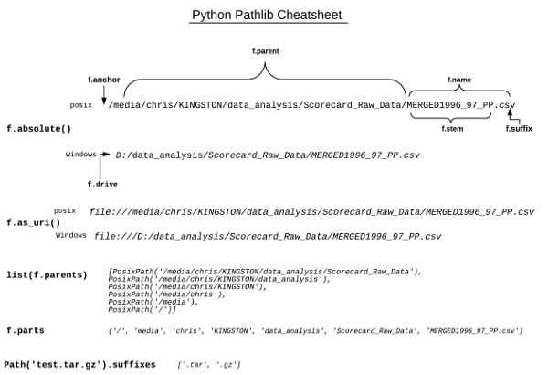
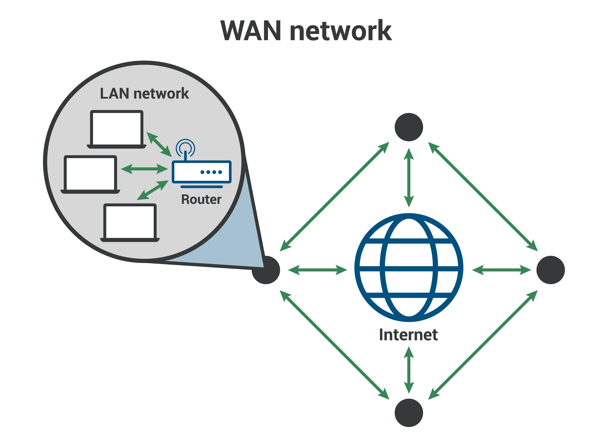
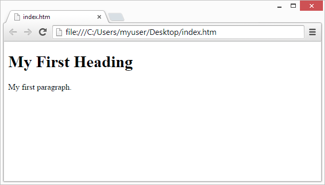
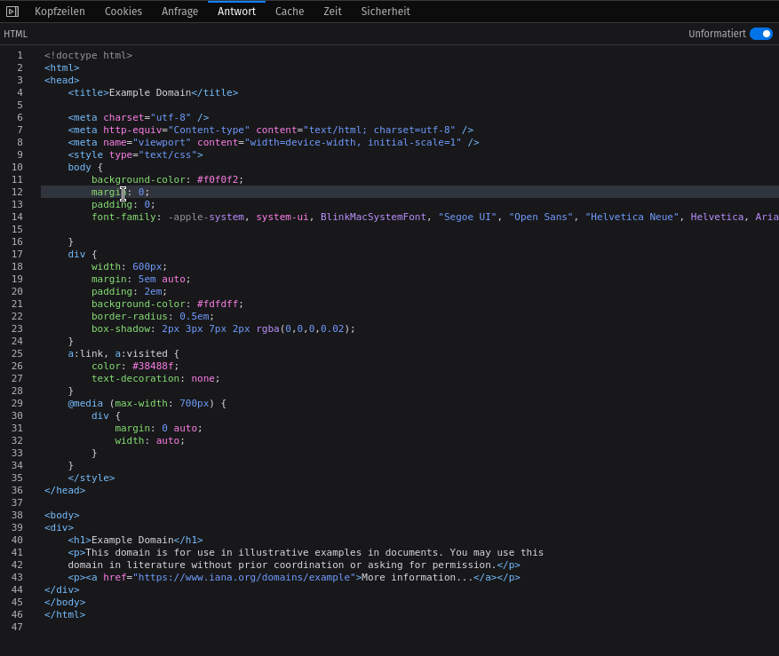

# Slides Thema 8
## Ein- und Ausgabe

[◀️ Thema 8](README.md)

⚡[Anwesenheit bestätigen](https://moodle.medizintechnik-hf.ch/mod/attendance/manage.php?id=8024)

📖 Kapitel 10 Umgang mit Fehlern (Exceptions)\
📖 Kapitel 14 Dateien lesen und schreiben\
📖 Kapitel 15 Netzwerkfunktionen

---

### Lernziele

Ich kann ...
* Fehler abfangen und behandeln.
* Text-Dateien schreiben, lesen und verarbeiten.
* HTTP-Requests mit Python senden und empfangen.
* HTML-Dokumente lesen und schreiben.

---

### Achtung

Es werden einige neue Themen angeschnitten.\
Unbedingt melden, bevor es eine Crash gibt!

<iframe src="https://giphy.com/embed/5xrkJe3IJKSze" width="280" height="280" frameBorder="0" class="giphy-embed" allowFullScreen></iframe>

---

### Dateisystem

Auf dem Computer gibt es Dateien, Ordner und Metadaten (Erstellt am, Berechtigungen, Koordinaten, etc.).

Eine Datei liegt in einem Ordner. Die Datei und Ordner haben Metdaten.

Das Dateisystem ist hierarchisch aufgebaut.

---

### Hierarchie Linux


ℹ️ Auf Linux ist der oberste Ordner der `/` *Root* und bei Windows das `C:\` Laufwerk

---

### Python Pathlib

In der Python-Biblitothek finden Sie [`pathlib`](https://docs.python.org/3/library/pathlib.html). Mit Pathlib können Sie mit dem Dateisystem interagieren.



---

### IDE vorbereiten

🎬 Führen Sie diese Aktionen aus:
* Neuer Ordner `Thema8` erstellen
* Neue Datei `Verzeichnisse.py` in Ordner erstellen

---
### Aktuelles Verzeichnis ausgeben

🎬 Diesen Code einfügen uns ausgeben.

```python
from pathlib import Path
current = Path.cwd() # cwd bedeutet Current Work Directory, sprich das aktuelle Arbeitsverzeichnis
print('Aktuelles Verzeichnis:', current.absolute())
```

ℹ️ Der Rückgabewert von `Path.cwd().absolute()` ist ein Objekt.

---

### Name des aktuellen Verzeichnis ausgeben

Erweitern Sie das Beispiel mit:

```python
print(type(current)) # Ausgabe Objekttyp
print('Aktueller Verzeichnisname:', current.name)
```

---

### Fehlerbehandlung

Wenn eine Python-Anweisung einen Fehler generiert, können Sie darauf reagieren. Damit verhindern, dass das Programm abstürtzt.

🎬 Erstellen Sie die Datei `Error.py` mit diesem Code:

```python
ergebnis = 1/0
print(ergebnis)
```

Die zweite Zeile wird nicht erreicht. Python gibt den Fehlertyp `ZeroDivisionError` aus und bricht das Programm ab.

---

### try and except

Mit den Befehlen `try` und `except` kann man versuchen eine Code-Block auszuführen (try) und wenn es ein Fehler entsteht führt man den Ausnahme-Block (catch) aus.

🎬 Ersetzen Sie den vorhergehenden Inhalt mit:

```python
try:
    ergebnis = 1/0
    print(ergebnis)
except ZeroDivisionError:
    print("Durch Null teilen ist nicht möglich.")
```

---

### Exception als Variable

🎬 Erstellen Sie die Datei `Except.py` mit diesem Code:

```python
try:
    print(z)
except NameError as error:
    print(error)
    
try:
    print(z)
except:
    print("Ein Fehler im Code.")
```

---


### Aufgaben 1

Lösen Sie die [Aufgaben](excercise8.md#aufgaben) 8.1 und 8.2.

⚡Aufteilung in Gruppen/Breakout-Rooms ⏱️ 10 Minuten

---

### Fehler beim Zugriff auf Dateisystem

Der Umgang mit Fehler ist beim Zugriff auf das Dateisystem besonders wichtig.

Es gibt viele Fehlerquellen: ungültiger Pfad, Schreibschutz, ungültiger Dateiname, etc.

---

### Vorgehen Datei schreiben

Wir möchten nun mit Python eine Datei schreiben. Ähnlich wie bei Word müssen Sie wie folgt vorgehen:
1. Datei erstellen und öffnen (open)
2. Datei bearbeiten (write)
3. Datei schliessen und speichern (close)

---

### Textdatei schreiben

🎬 Erstellen Sie die Datei `Schreiben.py` mit diesem Code:

```python
try:
    f = open('test.txt', 'w')
    f.write('Lorem ipsum dolor sit amet, ...\n')
    f.write('Unicode äöüß✅ \n')
    f.close()
  
except BaseException as err:
    print('Fehler:', err)
```

ℹ️ Der Fehlertyp `BaseException` ist die Superklasse aller Fehlertypen. Das `w` bedeute *Write*.

---

### Textdatei lesen

Die Zeilen einer existierenden Datei können Sie auslesen.

🎬 Erstellen Sie die Datei `Lesen.py` mit diesem Code:

```python
try:
    f = open('test.txt')
    for line in f:
        print(line, end='')
    f.close() 
  
except BaseException as err:
    print('Fehler:', err)
```

---

### Unstrukturiert vs. Strukturiert

Wir haben eine unstrukturierte Textdatei erstellt. Im Umgang mit Daten und Kalkulationen brauchen wir ein besseres Format.


---

### JSON-Datenformat

*  JavaScript Object Notation (JSON) 
*  Beliebtestes Format für hierarchische Datenstrukturen
*  Syntax nahezu Deckungsgleich mit Listen und Dictionaries

---
### JSON-Beispieldatei

🎬 Erstellen Sie die Datei `Bücher.json` mit diesem Inhalt:

```json
[
    {
        "title": "Raspberry Pi",
        "isbn": "978-3836265195",
        "authors": [
            "Kofler",
            "Scherbeck",
            "Kühnast"
        ]
    },
    {
        "title": "Docker",
        "isbn": "978-3836261760",
        "authors": [
            "Öggl",
            "Kofler"
        ]
    }
]
```

ℹ️ Die Datenstruktur ist ähnlich zu der von Python.

---

### with Statement

Das Lesen und Schreiben von Dateien mit Fehlerbehandlung kann mit dem `with` Statement vereinfacht werden.

```python
# Ohne with statement und ohne Fehlerbehandlung
file = open('file_path', 'w')
file.write('hello world !')
file.close()
 
# Ohne with statement mit Fehlerbehandlung
file = open('file_path', 'w')
try:
    file.write('hello world')
finally:
    file.close()

# Mit with statement 
with open('file_path', 'w') as file:
    file.write('hello world !')
```

Das `with` Statement schliesst die Datei automatisch.

ℹ️ Beim verwenden von `with` werden die Objekt-Methode `__enter__()` und `__exit__()` aufgerufen.

---

### JSON-Dateien verarbeiten

🎬 Datei `JSON.py` mit diesem Code ausführen:

```python
import json
with open('Bücher.json') as f:
    data = json.load(f)
print(data)
```

---

### JSON verabeiten

Der JSON-Inhalt kann ganz einfach verarbeitet werden.

🎬 Fügen Sie diesen Code an:

```python
for book in data:
	print(f"Titel: {book['title']}")
	for author in book['authors']:
		print(f"Author: {author}")
	print('')
```

---

### Dateiformate

Möchten Sie die Datei `Bücher.json` in einem anderen Programm, beispielsweise Excelm bearbeiten wird es schwierig. Wir brauchen ein einheitliches Dateiformat.

---

### CSV-Dateiformat

* Comma-separated values (CSV)
* Textdatei zur Speicherung strukturierter Daten
* Kann mit jeder Tabellekalkulations-Software bearbeitet werden

---

### CSV-Datei schreiben

🎬 Erstellen Sie die Datei `CSV.py` und fügen Sie diesen Code ein:

```python
import csv

with open('Mitarbeiter.csv', 'w') as file:

	# Um ein CSV zu schreiben, braucht es einen sogennanten Writer
    file_writer = csv.writer(file, delimiter=',', quotechar='"')

    # Die erste Zeile enthält die Tabellenüberschriften
    file_writer.writerow(['Name', 'Abteilung', 'Geboren im'])
    file_writer.writerow(['Peter Lustig', 'Buchhaltung', 'November'])
    file_writer.writerow(['Erika Meier', 'IT', 'März'])
```

ℹ️ Die erstellte Datei `Mitarbeiter.csv` kann mit einem Texteditor geöffnet werden.

---

### Mit Tabellenkalkulationsprogramm öffnen

Die erstellte Datei können Sie mit anderen Programmen öffnen und bearbeiten.

🎬 Öffnen Sie die Datei `Mitarbeiter.csv` mit einem Tabellenkalkulationsprogramm wie Excel.

---

### CSV-Datei lesen

Natürlich können Sie die Datei mit Python wieder auslesen.

🎬 Fügen Sie diesen Code an:

```python
with open('Mitarbeiter.csv', newline='') as file:

	# Dieses mal braucht es einen Reader
    file_reader = csv.reader(file, delimiter=',', quotechar='"')
    
    line_count = 0
    for row in file_reader:
    
        # Erste Zeile enthält Tabellenüberschriften
        if line_count == 0:
            print(f'Spaltennamen sind {", ".join(row)}')
        else:
            print(f'{row[0]} arbeitet in der Abteilung {row[1]} und ist geboren im {row[2]}.')
        line_count += 1
            
    print(f'{line_count} Zeilen wurden verarbeitet.')
```

---

### Aufgaben 2

Lösen Sie die [Aufgaben](excercise8.md#aufgaben) 8.3 und 8.4.

⚡Aufteilung in Gruppen/Breakout-Rooms ⏱️ 10 Minuten

---

### Dateien übertragen

Dateien wie wir Sie gerade erstellt und gelesen haben, können über ein Netzwerk zwischen Computer übertragen werden.

Das Internet ist ein weltumspannendes Netzwerk von Computern.



---

### Dokumente im WWW

Eine Website ist nur ein Dokument. Das World Wide Web (WWW) bezeichnet alle Websites.

Mit Kommunikationsprotokoll HTTP laden Computer Websites als Dokumente herunter und zeigen diese im Browser an. 



---

### HTTP-Protokoll

* Hypertext Transfer Protocol (HTTP)
* Kommunikationsprotokoll für das WWW
* Browser rufen Webseiten über HTTP auf


---

### HTTP-Request anzeigen

🎬 Zur Betrachtung eines HTTP-Requests führen Sie folgende Aktionen aus:
* Browser und einen leeren Tab öffnen
* Mit `F12` die Entwicklerkonsole aufrufen
* In der Konsole die Ansicht *Netzwerk* anzeigen
* In der Adressleiste `https://example.com` eingeben
* Den HTTP-Request mit Status `200` und Methode `GET` anklicken

---

### HTTP-Request Beispiel

Der HTML-Code der Webseite wird als HTTP-Response zurückgegeben.


---

### HTML-Dokument

Wird eine Website aufgerufen erhalten wir ein HTML-Dokument als Antwort.

```html
<!doctype html>
<html>
	<head></head>
	<body>
		<div>
			<h1>Example Domain</h1>
		    <p>This domain is for use in illustrative examples in documents. You may use this
		    domain in literature without prior coordination or asking for permission.</p>
		    <p><a href="https://www.iana.org/domains/example">More information...</a></p>
		</div>
	</body>
</html>
```

ℹ️ Bei HTML handelt es sich um eine Markup-Sprache.

--- 

### HTML

* Hypertext Markup Language (HTML)
* Auszeichnungssprache für strukturierte Dokumente
* Wird von Browser visuell dargestellt
* Grundlage des WWW

---

### Browser rendert HTML

HTML beschreibt wie ein Dokument aussieht und der Browser stellt es entsprechend dar. Diesen Vorgang nennt man *Rendern*.



---

### HTML-Dokument erstellen

🎬 Erstellen Sie selber ein HTML-Dokument `Dokument.html` mit diesem Inhalt:

```html
<!doctype html>
<html>
	<body>
		<div>
		    <h1>Meine Website</h1>
		    <p>Das ist ein Paragraph</p>
		    <p><a href="https://python.casa">Hier lernst du aller über Python.</a></p>
		</div>
	</body>
</html>
```

🎬 Öffnen Sie die Datei `Dokument.html` im Browser.

---

### HTML-Tag

Ein kurze Übersicht zu den HTML-Tags.


* **html**: Zeigt den Beginnt des HTML-Dokument an
* **body**: Hier beginnt der Seiteninhalt
* **div**: Ein Block zum platzieren der Inhalte
* **h1**: Überschrift auf Stufe 1
* **p**: Ein Textabsatz
* **a**: Ein Link

---

### HTTP-Request mit Python

HTML-Dokumente könen mit Python heruntergeladen werden.

🎬 Erstellen Sie die Datei `HTTP.py` und fügen Sie diesen Code ein:

```python
from urllib import request

# HTTP-Request ausführen
url = 'http://example.com'
response = request.urlopen(url)
binary = response.read() # Download durchführen
html = binary.decode('utf-8') # Dokument muss decodiert werden

with open('index.html', 'w') as file:
    file.write(html)
```

🎬 Öffnen Sie die Datei `index.html` im Browser.

---
### HTML-Paket installieren

Damit man mit Python ein HTML-Dokument erstellen kann, braucht es ein zusätzliches Python-Paket.

🎬  Öffnen Sie das Terminal und geben Sie den Befehl `pip install yattag` ein.

```bash
janikvonrotz@pop-os:~/python.casa/topic-8$ pip install yattag
Defaulting to user installation because normal site-packages is not writeable
Collecting yattag
  Downloading yattag-1.15.0.tar.gz (28 kB)
  Preparing metadata (setup.py) ... done
Building wheels for collected packages: yattag
  Building wheel for yattag (setup.py) ... done
  Created wheel for yattag: filename=yattag-1.15.0-py3-none-any.whl size=15634 sha256=5a394824217c9df6abb778e0fe0f7967a0dc36eb437dbc7898a7942ae83b6874
  Stored in directory: /home/janikvonrotz/.var/app/com.vscodium.codium/cache/pip/wheels/3f/26/73/af44f191823890a774bebcf7d472b019546e944638358cc38a
Successfully built yattag
Installing collected packages: yattag
Successfully installed yattag-1.15.0
```

Mehr zu pip und Python-Pakete erfahren Sie im [Thema 9](../topic-9/README.md).

---
### HTML-Dokument erstellen

Mit [Yattag](https://www.yattag.org/) können Sie HTML-Dokumente erstellen

🎬 Erstellen Sie die Datei `HTML.py` und fügen Sie diesen Code ein:

```python
from yattag import Doc

# HTML-Funktionen abrufen
doc, tag, text = Doc().tagtext()

# HTML-Dokument mit Elementen erstellen
with tag('html'):
    with tag('body'):
        with tag('p', id = 'main'):
            text('Beispiel')
        with tag('a', href='https://example.com'):
            text('Linktext')

# HTML-Code generieren
html = doc.getvalue()

# HTML-Dokument schreiben
with open('example.html', 'w') as file:
    file.write(html)
```

---

### HTML-Dokument im Browser öffnen

🎬 Fügen Sie diesen Code an, um die Datei direkt im Browser zu öffnen:

```python
# Die HTML-Dokument im Browser aufrufen
import webbrowser
from pathlib import Path
webbrowser.open('file://' + str(Path('example.html').absolute()))
```

---

### Aufgaben 3

Lösen Sie die [Aufgaben](excercise8.md#aufgaben) 8.5 und 8.6.

⚡Aufteilung in Gruppen/Breakout-Rooms ⏱️ 10 Minuten

---

### Review

🎯 Wurden die [Lernziele](#lernziele) erreicht?

⚡ Feedback zu den Zielen einholen.
