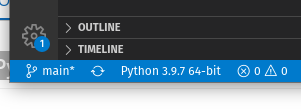
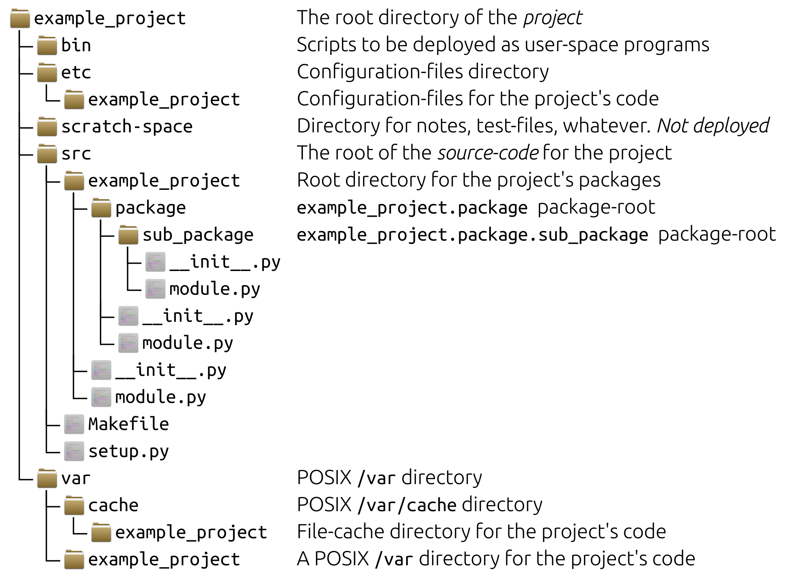

## Module und Import

[◀️ Thema 9](README.md)

⚡[Anwesenheit bestätigen](https://moodle.medizintechnik-hf.ch/mod/attendance/manage.php?id=6139)

📖 Kapitel 12 Module

---

### Python-Module

 Die `import` Anweisung importiert Code aus der Python-Bibliothek.

 Sie importieren damit Python-Module.

 Dieser modulare Ansatz von Python schauen wir uns genauer an.

---

### Python-Module auflisten

Welche Python-Module sind vorhanden?

🎬 In der Python-Konsole geben Sie den Befehl `help('modules')` ein und erhalten so eine Liste der verfügbaren Module.

🎬 Details zu den Modulen erhalten Sie beispielsweise mit `help('glob')`.

---

### VSCode Python-Erweiterung installieren

Visual Studio Code (VSCode) unterstützt verschiedene Programmiersprachen. Damit Python verwendet werden kann, muss eine Erweiterung installiert werden.

🎬 Installieren Sie die [Python extension for Visual Studio Code](https://marketplace.visualstudio.com/items?itemName=ms-python.python).

Je nach dem müssen Sie noch [Python](https://www.python.org/downloads/) installieren.

---

### Projektordner erstellen

VSCode stellt nicht nur einzelne Dateien dar, sondern ganze Verzeichnisse.

🎬 Führen Sie diese Aktionen aus:
* Neuer Ordner `Thema7` erstellen
* Ordner mit VSCode öffnen

---

### Ordner mit VSCode öffnen

Wenn Sie VSCode starten, können Sie die Aktion *Open Folder...* anwählen.


---

### Hello.py erstellen

🎬 Erstellen Sie im Ordner die Datei `Hello.py`

```
msg = "Hello World"
print(msg)
```

In VSCode sollte das so aussehen:


---

### Python Interpreter bestimmen

Stellen Sie sicher, dass VSCode den Python-Interpreter erkannt hat (siehe blaube Leiste).



---

### Python-Code ausführen

🎬 Führen Sie das Skript `Hello.py` mit dem dem *Run*-Knopf oben rechts aus.


Der Output des Skript wird im *Terminal* angezeigt.

---

### Linx-Probleme beheben

Falls Sie ein Linux-Computer haben, kann es gut sein, dass Sie eine andere Shell verwenden müssen.


---

### Wichtige Tastaturkürzel

Mit der Tastatur ist man immer schneller.

<kbd>ctrl</kbd>+ <kbd>shift</kbd> + <kbd>p</kbd>: VSCode-Befehle aufrufen

<kbd>ctrl</kbd> + <kbd>p</kbd>: Datei anzeigen

<kbd>ctrl</kbd> + <kbd>,</kbd>: Einstellungen öffnen

---

### Modul mit Funktion erstellen

Nun erstellen wir unser erstes Python-Modul.

🎬 Erzeugen Sie die Datei `lib.py` im geöffneten Ordner mit diesem Code:

```py
def world():
	print('World')
```

---

### Modul importieren

🎬 Aktualisieren Sie `Hello.py` mit diesem Inhalt und führen Sie das Skript aus.

```py
import lib

msg = "Hello "
print(msg)
lib.world()
```

ℹ️ Sie haben die Funktion `world` aus dem Modul `lib` geladen.

---

### Modul mit mehreren Funktionen

Dasselbe funktioniert für mehrere Funktionen.

🎬 Aktualisieren Sie `lib.py` mit diesem Inhalt:

```py
def world():
    print('World')

def hello():
    print('Hello')
```

ℹ️ Sie können Klassen auf dieselbe art in einem Modul bereitstellen.

---

### Nur Funktionen/Klassen importieren

🎬 Und so importieren Sie mehre Funktionen in `Hello.py`:

```py
from lib import world,hello

hello()
world()
```

---

### Mehrere Module bündeln

Mehre Module können in einem Paket-Ordner gebündelt werden.

🎬 Erstellen Sie im Projektordner ein Ordner `paket` mit zwei Dateien:

**paket/hello.py**

```py
def hello():
	return 'Hello '
```

**paket/world.py**

```py
def world():
	return 'World!'
```

**paket/__init__.py**

Datei leer lassen.

---

### Module aus Bündel importieren

🎬 Erstellen Sie eine neue Datei `main.py` mit diesem Inhalt:

```py
from paket import hello, world

print(hello.hello(), world.world())
```

---

### Pakete, Module und mehr

Python-Pakete beinhalten Module und Module beinhalten Funktionen, Klassen oder weitere Python-Module.

Mit dem modularen Ansatz können komplexe Projektstrukturen erzeugt werden.



---

### Python-Pakete

Bis anhin haben wir nur vorhandene Python-Pakete verwenden. Zusätzliche Python-Pakete können vom Internet mit dem Python-Packet-Manager `pip` installiert werden.

---

### pip-Erweiterung in VSCode installieren

Es gibt für alles eine VSCode-Erweiterung, so auch für pip.

🎬 Installieren Sie die Erweiterung *Pip Manager* mit VSCode:


🎬 Installieren Sie die Erweiterung  [`cowsay`](https://pypi.org/project/cowsay/) mit *Pip Manager*.

---

### Alternative Installation mit Terminal

Wir möchten das Python-Paket [`cowsay`](https://pypi.org/project/cowsay/) mit dem Terminal installieren.

🎬 Öffnen Sie das Terminal in VSCode und führen Sie den Befehl `pip install cowsay` aus.


---

### Python-Paket importieren

🎬 Erweitern Sie `main.py` mit:

```py
import cowsay
cowsay.cow('pip is great.')
```

Und führen Sie das Programm aus.


---

### Installationsort der Pakete

Wo Pakete von pip instaliert werden, kann je nach Entwicklungsumgebung unterschiedlich sein. Mit dem Befehl `pip show cowsay` zeigt pip wo genau das Paket installiert wurde.


---

### Aufgaben 1

Lösen Sie die ersten zwei Aufgaben.

⚡Aufteilung in Gruppen/Breakout-Rooms ⏱️ 10 Minuten

Ziel: Aufgabe 7.1 und 7.2 gelöst.

---
