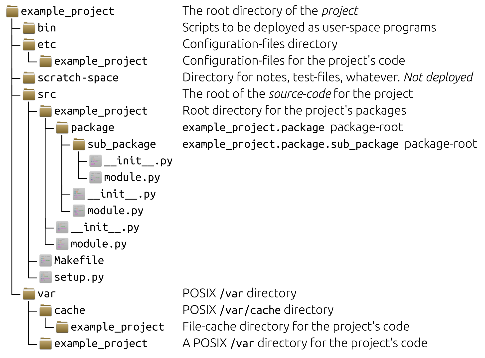

# Slides Thema 9
## Module und Import

[◀️ Thema 9](README.md)

⚡[Anwesenheit bestätigen](https://moodle.medizintechnik-hf.ch/mod/attendance/manage.php?id=8024)

📖 Kapitel 12 Module

---

### Lernziele

Ich kann ...
* die verfügbaren Python-Module auflisten und importieren.
* ein eigenes Python-Modul entwickeln.
* mit pip Python-Pakete installieren und verwenden.

---

### Python-Bibliothek

Auch für Programm-Code gibt es Bibliotheken.


---

### Python-Module

Die `import` Anweisung importiert Code aus der Python-Bibliothek.

Sie importieren damit Python-Module.

> Modul == Buch

Dieser modulare Ansatz von Python schauen wir uns genauer an.

---

### Python-Module auflisten

Welche Python-Module sind vorhanden?

🎬 In der Python-Konsole geben Sie den Befehl `help('modules')` ein und erhalten so eine Liste der verfügbaren Module.

🎬 Details zu den Modulen erhalten Sie beispielsweise mit `help('os')`.

---

### Projektordner erstellen

Im Umgang mit Modulen muss die Ordner-Struktur stimmen.

🎬 Führen Sie diese Aktionen aus:
* Neuer Ordner `Thema9` erstellen
* Ordner mit VSCode öffnen

---

### Hello.py erstellen

🎬 Erstellen Sie im Ordner die Datei `Hello.py`

```
msg = "Hello World"
print(msg)
```

In VSCode sollte das so aussehen:


---

### Code auslagern

Wir möchten nun ein Teil des Code in ein Modul namens `lib` abspalten.

Dieses Modul importieren wir in unser Hauptprogramm.

---

### Modul mit Funktion erstellen

🎬 Erzeugen Sie die Datei `lib.py` im geöffneten Ordner mit diesem Code:

```python
def world():
	print('World')
```

---

### Modul importieren

🎬 Aktualisieren Sie `Hello.py` mit diesem Inhalt und führen Sie das Skript aus.

```python
import lib

lib.world()
```

ℹ️ Sie haben die Funktion `world` aus dem Modul `lib` geladen.

---

### Funktion importieren

Sie können auch nur eine Funktion aus dem Modul importieren.

🎬 Aktualisieren Sie `Hello.py` mit diesem Inhalt und führen Sie das Skript aus.

```python
from lib import world

world()
```

---

### Modul mit mehreren Funktionen

Dasselbe funktioniert für mehrere Funktionen.

🎬 Aktualisieren Sie `lib.py` mit diesem Inhalt:

```python
def world():
    print('World')

def hello():
    print('Hello')
```

ℹ️ Sie können Klassen auf dieselbe art in einem Modul bereitstellen.

---

### Nur Funktionen/Klassen importieren

🎬 Und so importieren Sie mehre Funktionen in `Hello.py`:

```python
from lib import world,hello

hello()
world()
```

---

### Mehrere Module bündeln

Mehre Module können in einem Paket-Ordner gebündelt werden.

🎬 Erstellen Sie im Projektordner ein Ordner `paket` mit zwei Dateien:

**paket/hello.py**

```python
def hello():
	return 'Hello '
```

**paket/world.py**

```python
def world():
	return 'World!'
```

**paket/__init__.py**

Datei leer lassen.

---

### Module aus Bündel importieren

🎬 Erstellen Sie eine neue Datei `main.py` mit diesem Inhalt:

```python
from paket import hello, world

print(hello.hello(), world.world())
```

---

### Pakete, Module und mehr

Python-Pakete beinhalten Module und Module beinhalten Funktionen, Klassen oder weitere Python-Module.

Mit dem modularen Ansatz können komplexe Projektstrukturen erzeugt werden.



---

### Aufgaben 1

Lösen Sie die [Aufgaben](excercise9.md#aufgaben) 9.1 und 9.2.

⚡Aufteilung in Gruppen/Breakout-Rooms ⏱️ 10 Minuten

---

### Python-Pakete

Bis anhin haben wir nur vorhandene Python-Pakete verwenden. Zusätzliche Python-Pakete können vom Internet mit dem Python-Packet-Manager `pip` installiert werden.

---

### pip-Erweiterung in VSCode installieren

Es gibt für alles eine VSCode-Erweiterung, so auch für pip.

🎬 Installieren Sie die Erweiterung *Pip Manager* mit VSCode:


🎬 Installieren Sie die Erweiterung  [`cowsay`](https://pypi.org/project/cowsay/) mit *Pip Manager*.

---

### Alternative Installation mit Terminal

Wir möchten das Python-Paket [`cowsay`](https://pypi.org/project/cowsay/) mit dem Terminal installieren.

🎬 Öffnen Sie das Terminal in VSCode und führen Sie den Befehl `pip install cowsay` aus.


---

### Python-Paket importieren

🎬 Erweitern Sie `main.py` mit:

```python
import cowsay
cowsay.cow('pip is great.')
```

Und führen Sie das Programm aus.


---

### Installationsort der Pakete

Wo Pakete von pip instaliert werden, kann je nach Entwicklungsumgebung unterschiedlich sein. Mit dem Befehl `pip show cowsay` zeigt pip wo genau das Paket installiert wurde.


---

### Aufgaben 2

Lösen Sie die [Aufgaben](excercise9.md#aufgaben) 9.3 und 9.4.

⚡Aufteilung in Gruppen/Breakout-Rooms ⏱️ 10 Minuten

---

### Review

🎯 Wurden die [Lernziele](#lernziele) erreicht?

⚡ Feedback zu den Zielen einholen.
